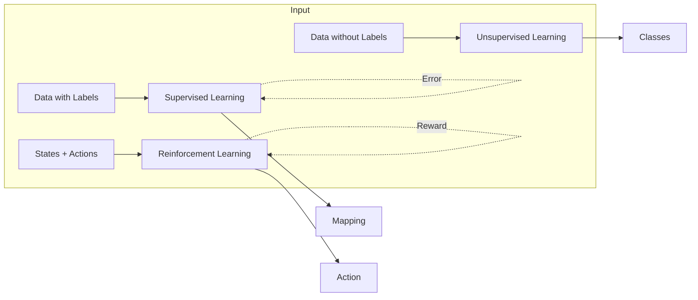
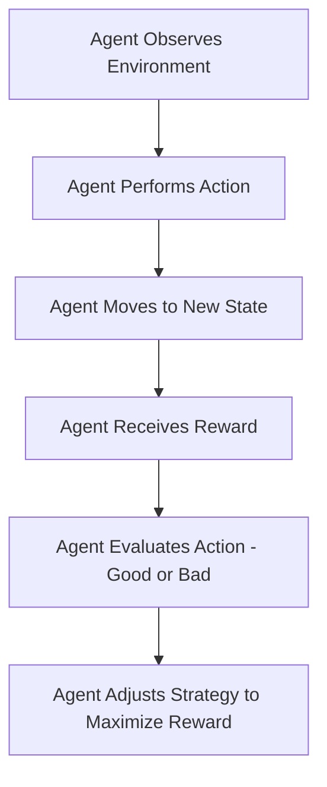

## Machine Learning Types

#### Supervised Learning
- **Input**: Labeled data (features + target labels)
- **Process**: Learning from labeled examples
- **Output**: Prediction model
- **Feedback**: Error measurement against known labels
- **Applications**: 
  - Classification (spam detection, image recognition)
  - Regression (price prediction, sales forecasting)

#### Unsupervised Learning
- **Input**: Unlabeled data
- **Process**: Pattern/structure discovery
- **Output**: Data grouping/structure
- **Feedback**: Internal validation metrics
- **Applications**:
  - Clustering (customer segmentation)
  - Dimensionality reduction (feature extraction)

#### Reinforcement Learning
- **Input**: States + possible actions
- **Process**: Trial and error learning
- **Output**: Action policy
- **Feedback**: Rewards/penalties
- **Applications**:
  - Game AI (chess, Go)
  - Robotics (navigation, control)

##### Common Algorithms
- **Supervised**: Linear Regression, Random Forest, Neural Networks
- **Unsupervised**: K-means, PCA, Autoencoders
- **Reinforcement**: Q-Learning, Policy Gradient, DQN

---
#### Reinforcement Learning:

- **What to do**
- **How to map situations to actions**
- **Maximizing a numerical reward signal**

**Reinforcement learning** is an autonomous, self-teaching system that essentially learns by trial and error. It performs actions with the aim of maximizing rewards, or in other words, it is learning by doing in order to achieve the best outcomes.

**Reinforcement Learning** is a feedback-based Machine learning technique in which an agent
learns to behave in an environment by performing the actions and seeing the results of
actions. For each good action, the agent gets positive feedback, and for each bad action, the
agent gets negative feedback or penalty

### Key Characteristics

Reinforcement Learning is inspired by how **humans and animals** learn through interactions:

- **Reward and Punishment**: Encourages repeating actions that lead to rewards and avoiding punishments.
- **Trial and Error**: Similar to trying different methods until the correct one is found.
- **Learning Over Time**: Improvement occurs through continuous experience.
- **Rewards Come from a Sequence of Actions**.

- The learner is **not told** which actions to take but must **discover** them through trial and error.
- Actions affect not only the **immediate reward** but also **future situations and rewards**.
- Works well in problems where a **sequence of decisions** is important.

RL is an **autonomous, self-teaching** system that learns by **trial and error**.
The goal is to **maximize rewards** over time.

**Example Applications**:
    - Chess
    - Maze solving
    - Industrial robot arms
    - Path planning
    - Sweeper robots

## How RL Differs from Supervised Learning

| Feature             | Supervised Learning           | Reinforcement Learning                     |
| ------------------- | ----------------------------- | ------------------------------------------ |
| **Training Data**   | Has labeled answers           | No labeled answers; learns from experience |
| **Decision Making** | Independent of past decisions | Dependent on past decisions                |
| **Learning Method** | Trained with a dataset        | Learns through trial and error             |

---

## Elements of RL

![[Pasted image 20250131000424.png|500]]
#### Agent

- **Definition**: An entity that interacts with the environment.
- **Examples**: Robot, human, software program.

#### Environment

- **Definition**: The external system in which the agent operates.
- **Examples**: Physical world, game simulation.

#### Learning Process

1. The agent moves from the **initial state** to the **goal state**.
2. The agent continually asks, _"What is the best action in each state?"_

---

## Advantages of Reinforcement Learning

✅ No need for predefined instructions or human intervention. 
✅ Can adapt to **both static and dynamic environments**. 
✅ Solves a **wide range of problems** (decision-making, prediction, optimization). 
✅ Improves with **experience** and fine-tunes over time.

## Disadvantages of Reinforcement Learning

❌ Performance depends on the **quality of the reward function**. 
❌ **Designing and tuning** RL models can be **complex**.

---

> [!NOTE]
> ###### When to Apply Reinforcement Learning?
> 
> Reinforcement Learning is most suitable when:
> - The problem environment is **complex and uncertain**, making traditional programming methods ineffective.
> - Feedback is **sparse, delayed, and dependent** on multiple decisions.
> - Decision-making (actions) follows a **feedback loop**.
> 
> ###### Why Is Reinforcement Learning Difficult?
> 
> The toughest parts of Reinforcement Learning are:
> - **Mapping the Environment**.
> - **Including All Possible Actions**.
> 
> ###### Core Concepts
> 
> - **Goal-Oriented Learning**: The agent learns by trying to achieve a goal.
> - **Learning from Consequences**: The agent learns from the consequences of its actions.
> - **Active Research Area**: RL is one of the most **active** fields in Artificial Intelligence (AI).
> 
> 

## RL Algorithm Steps

---
## Learning and Planning

#### Two Fundamental Problems in Sequential Decision Making

##### Reinforcement Learning (RL):
- The environment is initially unknown.
- The agent interacts with the environment.
	- The agent improves its policy.
##### Planning:
- A model of the environment is known.
- The agent performs computations with its model (without any external interaction).
- The agent improves its policy, also known as **deliberation, reasoning, introspection, pondering, thought, search**.

---

## Model of the Environment:

- A **model** mimics the behavior of the environment. With the help of the model, one can make inferences about how the environment will behave. For example, if a state and an action are given, the model can predict the next state and reward.
- The model is used for **planning**, providing a way to take a course of action by considering all future situations before actually experiencing those situations.
- Approaches for solving RL problems with the help of the model are termed **model-based approach**.
- An approach without using a model is called a **model-free approach**.

---
![[Pasted image 20250130232904.png]]

## Types of Reinforcement Learning Algorithms ( on the basis of model based)

There are various algorithms used in reinforcement learning such as Q-learning, policy gradient
methods, Monte Carlo method and many more. All these algorithms can be classified into two broad categories - 
#### Model-free Reinforcement Learning :
- It is a category of reinforcement learning algorithms that learns to make decisions by
- interacting with the environment directly, without creating a model of the environment's
- dynamics.
- The agent performs different actions multiple times to learn the outcomes and creates a
- strategy (policy) that optimizes its reward points. This is ideal for changing, large or complex
- environments.
- Not applicable for some scenario like self driving car.
#### Model-based Reinforcement Learning:
- This category of reinforcement learning algorithms involves creating a **model of the environment's dynamics** to make decisions and improve performance.
- Ideal for environments that are **static and well-defined**, where real-world environment testing is difficult.

---

## Key Differences Between Model-free and Model-based Reinforcement Learning

| Feature                | **Model-Free RL**                       | **Model-Based RL**                      |
|------------------------|-----------------------------------------|-----------------------------------------|
| **Learning Approach**   | Direct learning from environment        | Indirect learning through model building|
| **Efficiency**          | Requires more real-world interactions   | More sample-efficient                   |
| **Complexity**          | Simpler implementation                 | More complex due to model learning      |
| **Environment Utilization** | No internal model                     | Builds and uses a model                 |
| **Adaptability**        | Slower to adapt to changes              | Faster adaptation with accurate model   |
| **Computational Requirements** | Less intensive                    | More computational resources needed     |
| **Examples**            | Q-Learning, SARSA, DQN, PPO            | Dyna-Q, Model-Based Value Iteration     |

---

## RL Framework - The RL Process: A Loop of State, Action, Reward, and Next State

![[Pasted image 20250130232937.png]]

---

## Main Characteristics of RL

- **No supervisor** while training.
- **Environment** is generally stochastic for real-world applications.
- **Model of the environment** can be incomplete.
- **Feedback** (Negative/Positive Reward) can be delayed or partial.
- The agent uses experience from the past to improve its performance over time.
- Actions that have fetched more rewards are preferred.
- The agent tries various actions and prefers those that are best or have fetched more rewards.
- RL uses **Markov Decision Process (MDP)** framework to define the interaction between a learning agent and its environment.

---
## Reinforcement Learning (RL) Problem - Challenges in RL

### Trade-off between Exploration and Exploitation:
- To obtain rewards, an RL agent must prefer actions that it has tried in the past and found effective (**Exploit**).
- However, to discover such actions, it must try actions it has not selected before (**Explore**).
  

> [!NOTE]
> Neither exploration nor exploitation can be pursued exclusively without failing at the task.
> 

---
## Fundamental Components of RL

- **Policy**: Defines the agent’s behavior.
- **Reward Function**: Provides feedback on actions.
- **Value Function**: Evaluates future rewards.
- **Model of the Environment**: Simulates how the environment works.
##### Policy:

A **policy** is a strategy or set of rules that defines the actions the agent should take in a given state.

- The policy can be deterministic (one action for a state) or stochastic (probabilistic actions for a state).
- The **goal** is to find an optimal policy that maximizes the total expected reward.

**Example**:

- A robot navigating a maze may follow a policy that says, "Always turn left unless there's an obstacle, then turn right."

###### Human Analogy:

- A **policy** is like a person's **habit or plan of action**, such as the decision to exercise every morning or take an umbrella when it's cloudy.

#### Value function: 
Roughly speaking, the value of a state is the total amount of reward an agent can expect to accumulate over the future, starting from that state. 
- Rewards determine the **immediate, intrinsic desirability** of environmental states. 
- Values indicate the **long-term desirability** of states after considering the states likely to follow and the rewards available in those states. 
- **Example**: - A state might always yield a low immediate reward but still have a **high value** because it is followed by states that yield high rewards. 
#### Human Analog
- Rewards are somewhat like kepleasureur (if high) and ndpainai (if low). - Values correspond to a more rerefined and farsighted judgmenten of how pleased or displeased we are by the environment.nt.
##### Reward Function:

The **reward function** provides feedback on the actions the agent takes, indicating whether an action was good or bad.

- It assigns a **numeric value** to the agent's actions, which the agent uses to evaluate the desirability of its actions in a given state.
- The goal of the agent is to maximize the cumulative reward over time.

**Example**:

- In a game, winning a round might give a reward of +10, while losing gives a reward of -1.

###### Human Analogy:

- The **reward function** is like the **feedback** a person gets from their actions, such as feeling **happy** after a good deed or **guilty** after a mistake.

##### Model of the Environment:

The **model of the environment** simulates how the environment behaves, helping the agent predict the outcomes of actions.

- This model can be used for **planning** future actions by simulating potential outcomes.
- A model-free approach directly learns from experience, while a model-based approach uses a model to predict actions' results before performing them.

**Example**:

- A self-driving car may use a model to simulate various driving scenarios and plan its route accordingly.

##### Human Analogy:

- The **model of the environment** is like a **mental map** that a person forms, which helps them predict the likely outcomes of their actions, such as deciding to avoid a route with heavy traffic.

---
## Final Element of RL Systems: **Model of the Environment**
- The model **mimics the behavior of the environment**, allowing inferences to be made about how the environment will behave.
  - For example, given a state and action, the model might predict the resultant next state and next reward.
- **Models** are used for **planning**, helping the agent decide on a course of action by considering future situations before they are experienced.

- Methods for solving RL problems that use models and planning are called **model-based methods**, while simpler trial-and-error learning methods are called **model-free methods**.

---
# Types of Reinforcement Learning

There are three main types of Reinforcement Learning (RL):
- **Value-Based**
- **Policy-Based**
- **Model-Based**

Each approach has its own strengths and weaknesses, and the choice of algorithm will depend on the specific problem you are trying to solve.

---

## Value-Based Reinforcement Learning

- In this approach, the agent learns to estimate the value of each state or action based on the rewards it receives.
- This value is known as **Q-values**.
- The agent then selects the actions with the highest Q-value in each state to maximize its long-term reward.
- The most commonly used algorithm for value-based reinforcement learning is **Q-learning**.

---

## Policy-Based Reinforcement Learning

- In this approach, the agent learns an optimal policy, which is a mapping from states to actions, without calculating the value function.
- The policy is updated based on the rewards received by the agent, with the goal of maximizing the expected reward over time.
- The most common algorithm used for policy-based reinforcement learning is the **REINFORCE** algorithm.

---

## Model-Based Reinforcement Learning

- In this approach, the agent learns a model of the environment, which it can use to simulate different scenarios and plan its actions accordingly.
- The model can learn through supervised or unsupervised learning, and the agent can use it to predict the outcome of its actions before taking them.
- The most common model-based reinforcement learning algorithm is the **Dyna** algorithm.

---

