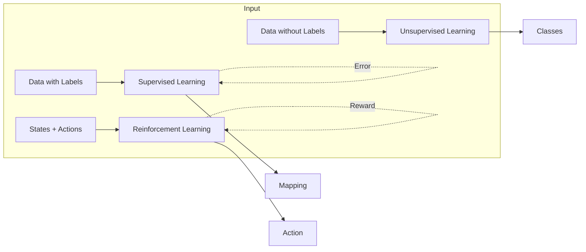
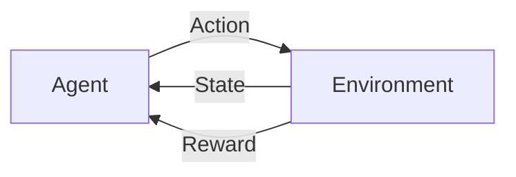
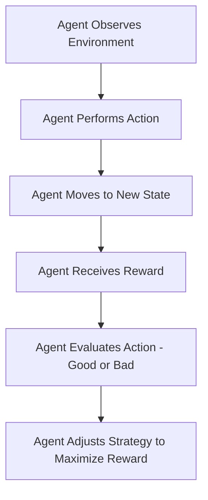

# Machine Learning Types

## Supervised Learning

**Definition:** Learning from labeled data where the model maps inputs to outputs.

- **Input:** Labeled data (features + target labels)
- **Process:** Learning from labeled examples
- **Output:** Prediction model
- **Feedback:** Error measurement against known labels

### Applications
- **Classification**: Spam detection, Image recognition
- **Regression**: Price prediction, Sales forecasting

## Unsupervised Learning

**Definition:** Learning patterns from unlabeled data.

- **Input:** Unlabeled data
- **Process:** Pattern/structure discovery
- **Output:** Data grouping/structure
- **Feedback:** Internal validation metrics

### Applications
- **Clustering**: Customer segmentation
- **Dimensionality Reduction**: Feature extraction

## Reinforcement Learning (RL)

**Definition:** Learning through trial and error to maximize rewards.

- **Input:** States + possible actions
- **Process:** Trial and error learning
- **Output:** Action policy
- **Feedback:** Rewards/penalties

### Applications
- **Game AI**: Chess, Go
- **Robotics**: Navigation, Control

---

## Common Algorithms

| Learning Type     | Algorithms |
|------------------|------------|
| **Supervised**   | Linear Regression, Random Forest, Neural Networks |
| **Unsupervised** | K-means, PCA, Autoencoders |
| **Reinforcement** | Q-Learning, Policy Gradient, DQN |

---

# Reinforcement Learning (RL)

Reinforcement learning is learning what to do—how to map situations to actions—so as to maximize a numerical reward signal. The learner is not told which actions to take, but instead must discover which actions yield the most reward by trying them. In the most interesting and challenging cases, actions may a↵ect not only the immediate
reward but also the next situation and, through that, all subsequent rewards. These two characteristics—trial-and-error search and delayed reward—are the two most important distinguishing features of reinforcement learning.

## Key Characteristics

- **Reward and Punishment:** Encourages repeating good actions and avoiding bad ones.
- **Trial and Error:** Learns by trying different methods.
- **Learning Over Time:** Improves through continuous experience.
- **Long-Term Rewards:** Actions influence future rewards.

### Example Applications
- Chess
- Maze Solving
- Industrial Robot Arms
- Path Planning
- Sweeper Robots

---

## How RL Differs from Supervised Learning

| Feature             | Supervised Learning           | Reinforcement Learning                     |
| ------------------- | ----------------------------- | ------------------------------------------ |
| **Training Data**   | Has labeled answers           | No labeled answers; learns from experience |
| **Decision Making** | Independent of past decisions | Dependent on past decisions                |
| **Learning Method** | Trained with a dataset        | Learns through trial and error             |

## Elements of RL

#### Agent

- **Definition**: An entity that interacts with the environment.
- **Examples**: Robot, human, software program.

#### Environment

- **Definition**: The external system in which the agent operates.
- **Examples**: Physical world, game simulation.

#### Learning Process

1. The agent moves from the **initial state** to the **goal state**.
2. The agent continually asks, _"What is the best action in each state?"_

---

## Advantages of Reinforcement Learning

- ✅ No need for predefined instructions or human intervention. 
- ✅ Can adapt to **both static and dynamic environments**. 
- ✅ Solves a **wide range of problems** (decision-making, prediction, optimization). 
- ✅ Improves with **experience** and fine-tunes over time.

## Disadvantages of Reinforcement Learning

- ❌ Performance depends on the **quality of the reward function**. 
- ❌ **Designing and tuning** RL models can be **complex**.

---
!!! note

    Reinforcement Learning is most suitable when:
    - The problem environment is **complex and uncertain**, making traditional programming methods ineffective.
    - Feedback is **sparse, delayed, and dependent** on multiple decisions.
    - Decision-making (actions) follows a **feedback loop**.

    Why Is Reinforcement Learning Difficult?

    The toughest parts of Reinforcement Learning are:
    - **Mapping the Environment**.
    - **Including All Possible Actions**.

    Core Concepts

    - **Goal-Oriented Learning**: The agent learns by trying to achieve a goal.
    - **Learning from Consequences**: The agent learns from the consequences of its actions.
    - **Active Research Area**: RL is one of the most **active** fields in Artificial Intelligence (AI).

## RL Algorithm Steps

---
## Learning and Planning

#### Two Fundamental Problems in Sequential Decision Making

##### Reinforcement Learning (RL):
- The environment is initially unknown.
- The agent interacts with the environment.
	- The agent improves its policy.
##### Planning:
- A model of the environment is known.
- The agent performs computations with its model (without any external interaction).
- The agent improves its policy, also known as **deliberation, reasoning, introspection, pondering, thought, search**.

---

## Model of the Environment:

- A **model** mimics the behavior of the environment. With the help of the model, one can make inferences about how the environment will behave. For example, if a state and an action are given, the model can predict the next state and reward.
- The model is used for **planning**, providing a way to take a course of action by considering all future situations before actually experiencing those situations.
- Approaches for solving RL problems with the help of the model are termed **model-based approach**.
- An approach without using a model is called a **model-free approach**.

---

## Types of Reinforcement Learning Algorithms ( on the basis of model based)

There are various algorithms used in reinforcement learning such as Q-learning, policy gradient
methods, Monte Carlo method and many more. All these algorithms can be classified into two broad categories - 
#### Model-free Reinforcement Learning :
- It is a category of reinforcement learning algorithms that learns to make decisions by interacting with the environment directly, without creating a model of the environment's dynamics.
- The agent performs different actions multiple times to learn the outcomes and creates a strategy (policy) that optimizes its reward points. This is ideal for changing, large or complex environments.
- Not applicable for some scenario like self driving car.

#### Model-based Reinforcement Learning:
- This category of reinforcement learning algorithms involves creating a **model of the environment's dynamics** to make decisions and improve performance.
- Ideal for environments that are **static and well-defined**, where real-world environment testing is difficult.

---

## Key Differences Between Model-free and Model-based Reinforcement Learning

| Feature                | **Model-Free RL**                       | **Model-Based RL**                      |
|------------------------|-----------------------------------------|-----------------------------------------|
| **Learning Approach**   | Direct learning from environment        | Indirect learning through model building|
| **Efficiency**          | Requires more real-world interactions   | More sample-efficient                   |
| **Complexity**          | Simpler implementation                 | More complex due to model learning      |
| **Environment Utilization** | No internal model                     | Builds and uses a model                 |
| **Adaptability**        | Slower to adapt to changes              | Faster adaptation with accurate model   |
| **Computational Requirements** | Less intensive                    | More computational resources needed     |
| **Examples**            | Q-Learning, SARSA, DQN, PPO            | Dyna-Q, Model-Based Value Iteration     |

---

## RL Framework - The RL Process: A Loop of State, Action, Reward, and Next State

---

## Main Characteristics of RL

- **No supervisor** while training.
- **Environment** is generally stochastic for real-world applications.
- **Model of the environment** can be incomplete.
- **Feedback** (Negative/Positive Reward) can be delayed or partial.
- The agent uses experience from the past to improve its performance over time.
- Actions that have fetched more rewards are preferred.
- The agent tries various actions and prefers those that are best or have fetched more rewards.
- RL uses **Markov Decision Process (MDP)** framework to define the interaction between a learning agent and its environment.

---
## Reinforcement Learning (RL) Problem - Challenges in RL

### Trade-off between Exploration and Exploitation:
- To obtain rewards, an RL agent must prefer actions that it has tried in the past and found effective (**Exploit**).
- However, to discover such actions, it must try actions it has not selected before (**Explore**).
  
!!! note

    Neither exploration nor exploitation can be pursued exclusively without failing at the task.

---

## Fundamental Components of RL

- **Policy**: Defines the agent’s behavior.
- **Reward Function**: Provides feedback on actions.
- **Value Function**: Evaluates future rewards.
- **Model of the Environment**: Simulates how the environment works.
##### Policy:

A **policy** is a strategy or set of rules that defines the actions the agent should take in a given state.

- The policy can be deterministic (one action for a state) or stochastic (probabilistic actions for a state).
- The **goal** is to find an optimal policy that maximizes the total expected reward.

**Example**:

- A robot navigating a maze may follow a policy that says, "Always turn left unless there's an obstacle, then turn right."

!!! note
    A **policy** is like a person's **habit or plan of action**, such as the decision to exercise every morning or take an umbrella when it's cloudy.

#### Value function: 
Roughly speaking, the value of a state is the total amount of reward an agent can expect to accumulate over the future, starting from that state. 
- Rewards determine the **immediate, intrinsic desirability** of environmental states. 
- Values indicate the **long-term desirability** of states after considering the states likely to follow and the rewards available in those states. 
- **Example**: - A state might always yield a low immediate reward but still have a **high value** because it is followed by states that yield high rewards. 

!!! note
    Rewards are somewhat like **pleasure** (if high) and **pain** (if low). - Values correspond to a more **refined and farsighted judgment** of how pleased or displeased we are by the environment.

##### Reward Function:

The **reward function** provides feedback on the actions the agent takes, indicating whether an action was good or bad.

- It assigns a **numeric value** to the agent's actions, which the agent uses to evaluate the desirability of its actions in a given state.
- The goal of the agent is to maximize the cumulative reward over time.

**Example**:

- In a game, winning a round might give a reward of +10, while losing gives a reward of -1.

!!! note
    The **reward function** is like the **feedback** a person gets from their actions, such as feeling **happy** after a good deed or **guilty** after a mistake.

##### Model of the Environment:

The **model of the environment** simulates how the environment behaves, helping the agent predict the outcomes of actions.

- This model can be used for **planning** future actions by simulating potential outcomes.
- A model-free approach directly learns from experience, while a model-based approach uses a model to predict actions' results before performing them.

**Example**:

- A self-driving car may use a model to simulate various driving scenarios and plan its route accordingly.

!!! note
    The **model of the environment** is like a **mental map** that a person forms, which helps them predict the likely outcomes of their actions, such as deciding to avoid a route with heavy traffic.

---
# Types of Reinforcement Learning

There are three main types of Reinforcement Learning (RL):
- **Value-Based**
- **Policy-Based**
- **Model-Based**

Each approach has its own strengths and weaknesses, and the choice of algorithm will depend on the specific problem you are trying to solve.

---

## Value-Based Reinforcement Learning

- In this approach, the agent learns to estimate the value of each state or action based on the rewards it receives.
- This value is known as **Q-values**.
- The agent then selects the actions with the highest Q-value in each state to maximize its long-term reward.
- The most commonly used algorithm for value-based reinforcement learning is **Q-learning**.

---

## Policy-Based Reinforcement Learning

- In this approach, the agent learns an optimal policy, which is a mapping from states to actions, without calculating the value function.
- The policy is updated based on the rewards received by the agent, with the goal of maximizing the expected reward over time.
- The most common algorithm used for policy-based reinforcement learning is the **REINFORCE** algorithm.

---

## Model-Based Reinforcement Learning

- In this approach, the agent learns a model of the environment, which it can use to simulate different scenarios and plan its actions accordingly.
- The model can learn through supervised or unsupervised learning, and the agent can use it to predict the outcome of its actions before taking them.
- The most common model-based reinforcement learning algorithm is the **Dyna** algorithm.

---

## **Formal Presentation of RL Fundamentals**

### 1. State ($s$) and Action ($a$)

- **Current state**: $s_t$
- **Next state**: $s_{t+1}$
- **Action**: $a$, an action performed by the agent to move from state $s_t$ to $s_{t+1}$.
- **State space**: The set of all possible states the agent can be in.

### 2. Reward ($r$ or $R(s, a)$)

- The result of taking action $a$ at state $s$.
- Actions affect not only the **immediate reward** but also the **next states** and all **subsequent rewards**.

### 3. Episode

- A sequence of states and actions until reaching a terminal state.

### 4. Transition Probability ($P(s' | s, a)$)

- The probability of reaching state $s'$ when taking action $a$ at state $s_t$.

### 5. Policy ($\pi(s, a)$)

- A mapping of each state to an action, determining how the agent acts at each state.
- **Types of Policies**:
    - **Deterministic**: Always selects the same action for a given state.
    - **Stochastic**: Selects actions based on probability distribution.
    - $\pi(a | s) = P(A_t = a | S_t = s)$.

### 6. Return ($G_t$)

- The total future reward from state $s_t$.
- $Gt=rt+γrt+1+γ2rt+2+⋯+γT−1rTG_t = r_t + \gamma r_{t+1} + \gamma^2 r_{t+2} + \dots + \gamma^{T-1} r_T$
- **Discount factor ($\gamma$)**:
    - Determines the importance of future rewards.
    - **Higher $\gamma$** → more focus on long-term rewards.
    - **Lower $\gamma$** → more focus on immediate rewards.

### 7. Value Function ($V(s)$)

- The expected return from starting at state $s$.
- Also called the **State-Value Function**:  
!!! formula

    $V(s)=E[Gt∣st=s]=E[rt+γrt+1+γ2rt+2+⋯+γT−1rT∣st=s]V(s) = \mathbb{E}[G_t | s_t = s] = \mathbb{E} \left[ r_t + \gamma r_{t+1} + \gamma^2 r_{t+2} + \dots + \gamma^{T-1} r_T \mid s_t = s \right]$
- **Breakdown**:
    - **Immediate reward**: $r_t$.
    - **Discounted value of successor states**.
    - Represents the **long-term desirability** of state $s$.

### 8. Optimal Policy ($\pi^*(s)$)

- The best possible policy for a given state, maximizing expected future rewards.

### 9. Optimal Value Functions

- **Optimal State-Value Function**:
    - Maximum value function over all policies:  
        $V∗(s)=max⁡πVπ(s)V^*(s) = \max_{\pi} V_{\pi}(s)$
- **Optimal Action-Value Function ($Q^*(s, a)$)**:
    - Maximum action-value function over all policies:  
        $Q∗(s,a)=max⁡πQπ(s,a)Q^*(s, a) = \max_{\pi} Q_{\pi}(s, a)$
    - Represents the **best possible expected return** for taking action $a$ in state $s$.

### **Two Fundamental Tasks of Reinforcement Learning**

#### 1. Prediction Task

- We have a policy:
    - The goal is to evaluate the policy by estimating the **state-value** or **Q-value** of running actions within a given policy.
    - **Evaluate the future**.

#### 2. Control Task

- We don't know the policy, and the goal is:
    - To find the **optimal policy** aiming to collect maximum rewards.
    - **Optimize the future**.

---

### Tabular Solution Methods

#### Core Idea

- In their simplest form, **RL algorithms** assume that the **state and action spaces** are small enough for approximate **value functions** to be represented as **arrays or tables**.
- These methods can often find **exact solutions** (i.e., optimal value function and optimal policy).

#### Fundamental Classes of Methods for Solving Finite MDPs

1. **Dynamic Programming (DP)**
    
    - Requires a **complete and accurate model** of the environment.
    - Mathematically well-developed.
2. **Monte Carlo Methods**
    
    - No model required and conceptually simple.
    - Not well suited for step-by-step incremental computation.
3. **Temporal Difference (TD) Learning**
    
    - Requires no model and is fully incremental.
    - More complex to analyze but efficient.
    - Differences exist in **efficiency** and **speed of convergence**.

Each method has its own **strengths and weaknesses**.
#### Immediate Reinforcement Learning vs. Full Reinforcement Learning

### Immediate Reinforcement Learning (Immediate RL)

- **Policy Update Frequency**
    - Updates the **policy or value function** after every action.
    - The agent **learns and adapts in real time** as it interacts with the environment.
- **Learning Approach**
    - **Online Learning**: Updates are made continuously and incrementally after each interaction.

### Immediate RL vs. Full RL

| Feature             | Immediate RL                                | Full RL                                             |
| ------------------- | ------------------------------------------- | --------------------------------------------------- |
| **Reward Timing**   | Immediate rewards after each action.        | Delayed rewards, requiring long-term strategy.      |
| **Decision Making** | Faster, as actions are evaluated instantly. | Requires profound understanding of the environment. |
| **Example**         | Bandit Problem                              | Chess, Go, or strategic planning tasks.             |

### Explore-Exploit Dilemma in Immediate RL

- The agent must **explore** different actions to identify near-optimal actions.
- Once enough exploration is done, it **exploits** the best-known action.
- The challenge: **How much to explore before exploiting?**

---

## Examples of Reinforcement Learning in Real Life

### Immediate RL Examples

- Giving treats for homework completion.
- Earning points in a game.
- Receiving applause after a performance.
- Receiving praise for completing a task.
- Getting paid directly after work.
- Eating immediately after feeling hungry.
- Social media notifications.

### Delayed Reinforcement Examples`

- Saving money for future goals.
- Completing a degree for career advancement.
- Physical fitness and exercise.
- Learning a musical instrument.
- Learning a new language.

### Suitability of Immediate RL

- **Real-time applications**: Suitable where quick decision-making is needed, such as:
    - **Tic-Tac-Toe**: The agent updates its strategy after each move.
    - **Self-driving cars**: The control system updates the driving policy in real time.

---

## General Reinforcement Learning (RL

- **Policy Update Frequency**
    
    - Updates can be made **after accumulating a batch of experiences** or **at the end of an episode**.
- **Learning Approach**
    
    - **Online and Offline Learning**
        - **Online RL**: Updates occur during interaction with the environment.
        - **Offline RL**: The agent gathers experience first and updates the policy afterward.

---

## State-Action Value Function ($Q(s, a)$)

- The **state-action value function** (or **Q-function**) specifies how good it is for an agent to take a particular action $a$ in a given state $s$ under a policy $\pi$.
- Denoted as:  
    $Q(s,a)=E[Gt∣St=s,At=a]Q(s, a) = \mathbb{E}[G_t | S_t = s, A_t = a]$
- Represents the **expected cumulative reward** of taking action $a$ in state $s$.

### **Reinforcement Learning (RL) Fundamentals**

#### **Temporal Difference (TD) Learning**

- A simple rule to explain complex behaviors.
- **Intuition**: Prediction of the outcome at time t+1t+1t+1 is better than at time ttt. The later prediction is used to adjust the earlier prediction.
- Has had a profound impact on **behavioral psychology** and **neuroscience**.

---

#### **Optimal Control**

- A branch of **mathematical optimization**.
- **Goal**: Design a controller that maximizes or minimizes an objective function.
- **Key Concept**: Finding a control policy that **optimizes** the cumulative reward or **minimizes** the cost over time.
- Deals with **dynamical systems**, determining the best sequence of actions to achieve an optimal outcome.

#### **Dynamic Programming (DP) in RL**

- A mathematical approach to solving optimization problems by **breaking them down into simpler subproblems**.
- In **Markov Decision Processes (MDPs)**, DP methods help find **optimal policies** by solving **Bellman equations**.

###### **Two Primary DP Methods**

1. **Policy Iteration**:
    - Alternates between **evaluating** a policy and **improving** it.
2. **Value Iteration**:
    - Iteratively updates the **value function** directly to find the **optimal policy**.

---

## **On-Policy vs. Off-Policy Reinforcement Learning**  

In **Reinforcement Learning (RL)**, learning strategies can be classified into **on-policy** and **off-policy** methods. These approaches define how an agent interacts with the environment and learns optimal behavior.  

---

### **On-Policy Learning**  
- The agent **learns while following its own policy**.  
- **Explores and exploits simultaneously**.  
- Typically used in **algorithms like SARSA (State-Action-Reward-State-Action)**.  

✅ **Example:**  
- Learning to ride a bike **by trial and error**—adjusting balance while practicing.  

---

### **Off-Policy Learning**  
- The agent **learns from data generated by other policies** (not just its own).  
- **More flexible** as it allows learning from past experiences.  
- Used in **algorithms like Q-learning**, where the agent updates its policy using the best-known actions.  

✅ **Example:**  
- Learning to ride a bike **by watching others** rather than directly practicing.  

---

