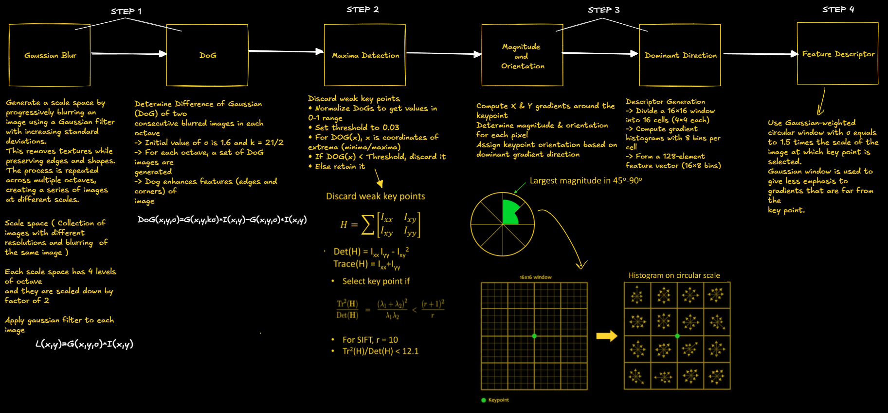

    <a href="https://rishikeshvadodaria.github.io/mkdocs/computer-vision-unit 1/" class="nav-item mobile-computing" data-title="Unit 1">Unit 1</a>
    <a href="https://rishikeshvadodaria.github.io/mkdocs/computer-vision-unit 2/" class="nav-item mobile-computing" data-title="Unit 2">Unit 2</a>
    <a href="https://rishikeshvadodaria.github.io/mkdocs/computer-vision-unit 3/" class="nav-item mobile-computing" data-title="Unit 3">Unit 3</a>
    <a href="https://rishikeshvadodaria.github.io/mkdocs/computer-vision-unit 4/" class="nav-item mobile-computing" data-title="Unit 4">Unit 4</a>
   

# Feature Extraction

## Unit 2

### Image Features in Computer Vision
🔹 **Image features** are key elements that help in **object recognition, segmentation, and analysis**.

#### Types of Image Features
✅ **Edges** – Identifies boundaries between objects.
✅ **Color** – Extracts information based on pixel intensity.
✅ **Texture** – Analyzes surface patterns and structures.
✅ **Object Boundaries** – Detects outlines and contours of objects.
✅ **Object Shape** – Defines geometric properties of an object.

🔹 **Good Features Should Be:**
- ✅ **Unique & Distinctive** – Helps differentiate between objects.
- ✅ **Non-redundant** – Avoids duplicate or unnecessary information.
- ✅ **Robust** – Works well under noise and illumination changes.
- ✅ **Global Representation** – Captures scene-wide characteristics, not just local details.

### Gradient-Based Features
Gradient-based techniques detect **changes in pixel intensity**, which highlight object edges and textures.

🔹 **Popular Techniques:**
- **DoG (Difference of Gaussian)**
- **LoG (Laplacian of Gaussian)**
- **HoG (Histogram of Oriented Gradients)**
- **SIFT (Scale-Invariant Feature Transform)**
- **SURF (Speeded-Up Robust Features)**

📌 **Advantages:**
✅ **Invariant to small shifts & rotations** – Ensures stability under transformations.
✅ **Localized histograms** – Offers better spatial information compared to global histograms.
✅ **Contrast normalization** – Reduces the impact of variable illumination.

### Difference of Gaussian (DoG)
📌 **A feature enhancement technique used for blob detection & SIFT descriptors**.

#### How DoG Works:
1️⃣ **Apply Gaussian Blur** – Smoothens the image using **two Gaussian filters** with different sigma values (**σ₁ & σ₂**).
2️⃣ **Subtract the Two Blurred Images** – Enhances regions with specific frequency details.
3️⃣ **Suppress High-Frequency Details** – Reduces random noise but preserves important structures.

🔹 **Mathematical Representation:**
$$ DoG = G_{\sigma_1} * I - G_{\sigma_2} * I $$

where:
- \( I \) = Original grayscale image
- \( G_{\sigma_1}, G_{\sigma_2} \) = Gaussian filters with different standard deviations

📌 **Pros & Cons:**
✅ **Reduces noise while preserving edges**
✅ **Enhances spatial features**
❌ **Reduces overall image contrast**

### Laplacian of Gaussian (LoG) – Edge Detection & Feature Enhancement
🔹 **Laplacian of Gaussian (LoG)** is a feature detection technique that combines:
1️⃣ **Gaussian Smoothing** – Reduces noise in the image.
2️⃣ **Laplacian Operator** – Detects **edges and blobs** by identifying intensity changes.

#### How LoG Works:
1. **Apply a Gaussian filter** to smooth the image and suppress noise.
2. **Compute the second derivative (Laplacian)** to highlight regions with rapid intensity changes (edges).
3. **Detect zero-crossings** in the Laplacian response to identify edges.

#### Mathematical Representation:
The **LoG function** is given by:
$$ LoG(x, y) = \nabla^2 G_{\sigma} (x, y) * I(x, y) $$
where:
- \( G_{\sigma} (x, y) \) = **Gaussian filter** with standard deviation \( \sigma \)
- \( \nabla^2 \) = **Laplacian operator** (second derivative)
- \( I(x, y) \) = **Input image**

#### Key Features of LoG:
✅ **Combines smoothing & edge detection** in one step.
✅ **Detects both fine and coarse details** depending on \( \sigma \).
✅ **Useful for blob detection** in feature descriptors like **SIFT**.
❌ **Sensitive to noise** – Requires pre-smoothing for better results.

🚀 **LoG is commonly used in edge detection pipelines like the Marr-Hildreth operator and as a preprocessing step in Computer Vision applications!** 🔍

### Histogram of Oriented Gradients (HoG) – Feature Descriptor for Object Detection
🔹 **Histogram of Oriented Gradients (HoG)** is a feature descriptor used for **object detection** and **image classification** by analyzing **gradient orientations** in localized regions of an image.

### Step-by-Step HoG Computation
✅ **Step 1: Resize Image**
- Resize the image to an **integer multiple of 8** (nearest to the original size).
- Ensures uniform cell division and efficient computation.

✅ **Step 2: Divide Image into Cells**
- Split the image into **small patches of equal size** (e.g., **8×8 pixels per cell**).
- Each cell will have its own **gradient histogram**.

✅ **Step 3: Compute Gradients**
- Calculate the **gradient magnitude** and **orientation** using **Sobel filters**:
  \[
  M = \sqrt{G_x^2 + G_y^2}, \quad \theta = \tan^{-1} \left(\frac{G_y}{G_x} \right)
  \]
  where \( G_x, G_y \) are gradients along horizontal and vertical directions.

✅ **Step 4: Compute Gradient Histograms (Per Cell)**
- For **each 8×8 cell**, create a **histogram of gradients** (e.g., 9 bins for 0°-180°).
- Assign gradient magnitudes to their corresponding **orientation bins**.

✅ **Step 5: Construct Feature Vector**
- Normalize the histograms **across neighboring blocks** (e.g., **2×2 cells per block**) for better illumination invariance.
- Flatten the computed HoG features into a **single feature vector** for classification.

✅ **Step 6: Visualize HoG**
- HoG features are often **visualized as a grid of arrows**, where the **length and direction** represent gradient strength and orientation.

✅ **Step 7: Classify Images**
- Use machine learning models (**SVM, Deep Learning**) to classify objects using the extracted **HoG feature vector**.

#### Mathematical Representation:
- **Gradient Magnitude ($M$):**
$$   M = \sqrt{G_x^2 + G_y^2} $$

- **Gradient Orientation ($\theta$):**
$$   \theta = \tan^{-1} \left(\frac{G_y}{G_x} \right) $$
where:
- \( G_x, G_y \) = Gradients in horizontal & vertical directions.
- \( M \) = Strength of edge response.
- \( \theta \) = Edge direction (0°–180° or 0°–360° bins).

#### Key Features of HoG:
✅ **Invariance to Illumination & Shadows** – Normalization removes intensity variations.
✅ **Captures Local Shape Information** – Focuses on **edges and textures** rather than pixel intensity.
✅ **Robust to Small Translations & Rotations** – Uses **histograms** instead of raw gradients.
✅ **Widely Used in Object Detection** – Forms the basis of **Dalal-Triggs pedestrian detection** and is used in **SVM-based image recognition**.
❌ **Computationally Expensive** – Requires **dense gradient computations** across the entire image.

🚀 **HoG is widely used in Human & Object Detection (e.g., Pedestrian Detection in self-driving cars) and Machine Learning-based Image Classification!** 🔍

### Feature Descriptors in Computer Vision
🔹 **Feature descriptors** help identify **key points, edges, and corners** in an image.
🔹 These descriptors are used for **object detection, image matching, and recognition**.

### Types of Feature Descriptors
#### 1. Global Descriptors 🌍
- Represent the **entire image**.
- Examples:
  ✅ **Histogram of Oriented Gradients (HoG)**
  ✅ **Difference of Gaussian (DoG)**
  ✅ **Histogram of Optical Flow (HOF)**
- **Limitations**: Struggle with **occlusions and profile variations** since they analyze the **whole image**.

#### 2. Local Descriptors 🔍
- Describe **small patches** within an image.
- More **accurate & robust** for **object detection, matching, and occlusion handling**.
- Examples:
  ✅ **SIFT (Scale-Invariant Feature Transform)**
  ✅ **SURF (Speeded-Up Robust Features)**
  ✅ **LBP (Local Binary Pattern)**
  ✅ **BRISK (Binary Robust Invariant Scalable Keypoints)**
  ✅ **MSER (Maximally Stable Extremal Regions)**
  ✅ **FREAK (Fast Retina Keypoint)**

📌 **Local descriptors outperform global ones in real-world applications like facial recognition and object tracking!** 🚀

### How to Define an Interest Point?
🔹 **Interest points** are key locations (e.g., edges, corners) where **features can be extracted**.

✅ **Repeatability**:
- A feature should be detected **consistently across multiple images**, despite **geometric & photometric transformations**.

✅ **Saliency**:
- Features should be **distinct and unique** to avoid mismatches.

✅ **Compactness**:
- Fewer features than the number of image pixels should **effectively represent the image**.

✅ **Efficiency**:
- **Fast computation** is essential for **real-time applications** like tracking & detection.

✅ **Locality**:
- Features should **occupy a small area** and remain **robust to clutter & occlusion**.

✅ **Covariance**:
- Features should be **detectable despite geometric & photometric variations** (e.g., rotation, lighting changes).

### SIFT Algorithm – Scale-Invariant Feature Transform
SIFT is a **feature detection** algorithm that extracts **scale and rotation-invariant keypoints** for object recognition, tracking, and image matching.

## Step 1: Construct a Scale Space
📌 **Why?**
- Real-world objects appear different at **various distances (scales)**.
- A feature must be **detectable at multiple scales** to be useful in recognition.

🔹 **How it Works:**
1. The **original image** is repeatedly **blurred using a Gaussian filter**.
2. **Octaves** are created by **downsampling** the image (reducing its size by half).
3. Within each octave, multiple blurred images are generated with increasing **sigma values (σ)**.
4. This **scale-space representation** ensures features are **scale-independent**.

🔹 **Mathematical Formulation (Gaussian Blur):**
\[
G(x, y, \sigma) = \frac{1}{2\pi\sigma^2} e^{-\frac{x^2 + y^2}{2\sigma^2}}
\]
where:
- \( G(x, y, \sigma) \) = Gaussian function.
- \( \sigma \) = Standard deviation (controls blurring).
- \( x, y \) = Pixel coordinates.

🔹 **Example:**
- **Octave 1**: Original image + multiple blurred versions.
- **Octave 2**: Image resized to **half** and blurred again.
- **Repeats** for multiple octaves (typically **4-5** octaves).

📌 **Outcome:**
- A collection of images at **different scales and resolutions**.

## Step 2: Compute Difference of Gaussian (DoG)
📌 **Why?**
- Identifies keypoints by enhancing **edges and texture features**.
- The **Gaussian Blur removes noise**, and the **DoG highlights changes in intensity**.

🔹 **How it Works:**
1. **Compute DoG images** by subtracting two consecutive Gaussian-blurred images:
   \[
   DoG(x, y, \sigma) = G(x, y, k\sigma) - G(x, y, \sigma)
   \]
   where \( k \) is a constant (typically \( k = \sqrt{2} \)).
2. This process is repeated across all octaves.
3. The resulting **DoG images** enhance edges, blobs, and texture details.

📌 **Outcome:**
- A set of **DoG images** that highlight regions of interest (potential keypoints).

## Step 3: Keypoint Localization
📌 **Why?**
- Identify **stable keypoints** while removing weak or false detections.

🔹 **How it Works:**
1. Each pixel in the **DoG images** is compared with **26 neighboring pixels** (8 in the same image, 9 in the scale above, and 9 in the scale below).
2. If a pixel is the **local maximum or minimum**, it is marked as a **potential keypoint**.
3. **Low-contrast keypoints** are discarded using a **threshold (typically 0.03)**.
4. **Edges are removed** using the Hessian matrix determinant to avoid unstable keypoints.

🔹 **Mathematical Filtering (Hessian Matrix):**
\[
H = \begin{bmatrix} I_{xx} & I_{xy} \\ I_{xy} & I_{yy} \end{bmatrix}
\]
- Compute **corner response**:
  \[
  \frac{(\text{Trace}(H))^2}{\text{Det}(H)} < 12.1
  \]
  If the value is **greater than 12.1**, the keypoint is rejected.

📌 **Outcome:**
- A set of **highly stable, contrast-rich keypoints** that can be used for further processing.

## Scale-Invariant Feature Transform (SIFT)
SIFT is an algorithm used to detect distinct key points or features in an image.
These key points are **robust to changes** in **scale, rotation, and affine transformations**, making SIFT widely used in object recognition, image stitching, and 3D reconstruction.

## Advantages of SIFT Detector
!!! note
    SIFT provides a **highly distinctive** feature descriptor, making it useful for matching objects in large databases.

| **Advantage**      | **Description**  |
|--------------------|-----------------|
| **Locality**      | Features are local and robust to **occlusion**. Does not require **segmentation** of objects. |
| **Distinctiveness** | Features can be **matched** to a **large database** of objects. |
| **Quantity**      | Generates **many features**, even for small objects. |
| **Efficiency**    | Close to **real-time performance**. |
| **Extensibility** | Easily extends to **various feature types**. |

_The image above illustrates SIFT algorithm._

## Integral Image
An **integral image** is a technique that allows for the **fast computation** of the sum of pixel values over a rectangular region.

### Key Properties
- **Speeds up** sum calculations for **box-type filters**.
- **Reduces computational cost** for large-scale image processing.

### Mathematical Representation
For an input image \( I(x,y) \), the integral image \( I_{Int}(x,y) \) at a location \( (x,y) \) is computed as:

\[
I_{Int}(x, y) = \sum_{i=0}^{x} \sum_{j=0}^{y} I(i, j)
\]

### Use of Integral Image
The sum of all pixel values in a region can be quickly computed using four values:

\[
S = A - B - C + D
\]

where:
- \( A, B, C, \) and \( D \) are elements of the **integral image** at the corners of the selected region.

!!! note
    Even if size of filter increases, number of computations (3 additions/subtractions) does not increase

### Comparison of SIFT and SURF
| Feature            | **SIFT (Scale-Invariant Feature Transform)** | **SURF (Speeded-Up Robust Features)** |
|--------------------|-------------------------------------------|--------------------------------------|
| **Dimensionality** | High-dimensional feature descriptor       | Lower dimensional, more compact descriptor |
| **Accuracy**      | Reduction in dimensionality decreases accuracy | More efficient without significant accuracy loss |
| **Keypoint Detection** | Approximates **Laplacian of Gaussian (LoG)** using **Difference of Gaussian (DoG)** | Approximates **LoG** using **Box Filters** |
| **Computation**   | Uses **determinant and trace** of the Hessian matrix | Uses **only determinant** of Hessian matrix |
| **Speed**        | Computationally expensive | Faster due to **integral images and parallel convolution** |
| **Real-Time Applications** | Not optimized for real-time processing | Suitable for **real-time tracking & object recognition** |

!!! tip
    **SURF is a faster alternative to SIFT, making it suitable for real-time applications while maintaining robustness.**

## Speeded-Up Robust Features (SURF) Algorithm
### 1. Detector
1. **Construct Hessian matrix** using box filters at each pixel to determine keypoints.
2. **Increase the size of box filters** and repeat step 1.
3. For each keypoint, **select points** within a radius of **6σ** (where **σ** is the standard deviation of the keypoint's filter).
4. **Apply a Gaussian filter** of **2.5σ** on the keypoint.
5. Use a **Haar wavelet of size 4σ** to determine the **magnitude** and **direction** of points.
6. Draw a **histogram with 6 bins** to identify the **orientation** of the keypoint.

### 2. Descriptor
1. Around each keypoint, **select a square region** of size **(20σ × 20σ)**.
2. **Divide the region** into **16 sub-regions**.
3. For each sub-region, **determine a vector** of length **4**.
4. The **final descriptor vector** has a total length of **64**.

!!! tip
    **SURF is significantly faster than SIFT** due to its use of **box filters and integral images**, making it suitable for **real-time applications**.

## Speeded Up Robust Features (SURF) algorithm

### Applications of Feature Descriptors
Feature descriptors are powerful tools in computer vision for identifying and describing local features in images. They enable a wide range of applications:

1. Image Matching
   - Matches keypoints between different images of the same scene or object.
   - Essential for applications like panorama stitching, where multiple images are combined into a wide-angle view.
2. Object Recognition
   - Identifies and locates objects within images by matching features between a known object and a scene.
   - Widely used in robotics and automated inspection systems.
3. 3D Reconstruction
   - Matches images taken from different viewpoints to reconstruct 3D models of objects or environments.
   - Essential for applications in augmented reality (AR) and virtual reality (VR).
4. Image Retrieval
   - Enables content-based image retrieval by searching for and retrieving images based on visual content rather than metadata.
5. Scene Recognition
   - Analyzes the spatial arrangement of features to recognize and categorize scenes or environments.
   - Useful in autonomous navigation and contextual AI systems.
6. Robotic Vision
   - Helps robots navigate, identify objects, and interact with their environment more effectively.
7. Video Tracking
   - Tracks objects or people in video sequences by matching keypoints frame-to-frame.
   - Important for surveillance and motion analysis.
8. Forgery Detection
   - Used in digital forensics to detect tampered or forged images by identifying inconsistencies in local features.

## 2D Gabor Filter – Parameters & Properties
### Overview
The **Gabor filter** is a powerful tool used for feature extraction, especially in **texture and edge detection**. It is a **bandpass filter** that operates in both the **spatial and frequency domains**, mimicking the way the human visual system perceives textures.

### Key Characteristics
✅ **Localized in both space & frequency** – Helps capture patterns effectively.
✅ **Combination of Gaussian & Sinusoidal components** – Provides smooth feature extraction.
✅ **Mimics human vision** – Recognizes textures similar to human eyes.

### Mathematical Representation
A **2D Gabor filter** is defined as:

\[
G(x,y) = \exp\left( -\frac{x'^2 + \gamma^2 y'^2}{2\sigma^2} \right) \cos\left( \frac{2\pi x'}{\lambda} + \psi \right)
\]

where:
- \( x' = x \cos\theta + y \sin\theta \)
- \( y' = -x \sin\theta + y \cos\theta \)

### Core Parameters of Gabor Filter
| **Parameter** | **Symbol** | **Description** |
|--------------|------------|-----------------|
| **Wavelength** | \( \lambda \) | Controls the width of the stripes in the Gabor function. |
| **Orientation** | \( \theta \) | Defines the **angle** of the normal to the parallel stripes of the Gabor function. |
| **Phase Offset** | \( \psi \) | Determines the **position** of the sinusoidal function, affecting edge detection. |
| **Standard Deviation** | \( \sigma \) | Defines the **spread** of the Gaussian envelope, controlling the extent of localization. |
| **Aspect Ratio** | \( \gamma \) | Specifies the **ellipticity** of the Gabor function's support. |
| **Bandwidth** | \( B \) | Controls the **range of spatial frequencies** covered by the filter. |

### How Parameters Affect the Gabor Filter
#### 1️⃣ Wavelength (λ) – Stripe Width
- Controls the width of the sinusoidal pattern.
- Larger **λ** → Wider stripes → Detects coarse textures.
- Smaller **λ** → Narrower stripes → Detects fine textures.

#### 2️⃣ Orientation (θ) – Direction of Features
- Determines the **angle** at which the filter responds best to edges.
- Example: A **horizontal edge** detector has \( \theta = 90^\circ \).

#### 3️⃣ Phase Offset (ψ) – Sinusoidal Shift
- **\( \psi = 0 \)** → Cosine Gabor (Even filter) → Detects **bar-like** structures.
- **\( \psi = \frac{\pi}{2} \)** → Sine Gabor (Odd filter) → Detects **line-like** structures.

#### 4️⃣ Standard Deviation (σ) – Gaussian Spread
- Determines the **size of the receptive field**.
- Large \( \sigma \) → More **blurred** edges.
- Small \( \sigma \) → More **sharp** edges.

#### 5️⃣ Aspect Ratio (γ) – Ellipticity
- Specifies the **shape** of the filter.
- Larger \( \gamma \) → More elongated filter (stretches in one direction).
- Smaller \( \gamma \) → More circular response.

## Gray Level Co-occurrence Matrix (GLCM) – Texture Analysis
### Overview
The **Gray Level Co-occurrence Matrix (GLCM)** is a powerful **statistical method** used in **image processing** and **computer vision** to analyze texture features by examining the spatial relationships between pixel intensities.

🔹 **Key Applications:**
✅ **Texture Analysis** – Identifies patterns in images.
✅ **Feature Extraction** – Helps in classification tasks.
✅ **Medical Imaging** – Detects abnormalities in scans.
✅ **Remote Sensing** – Analyzes satellite imagery.

### GLCM – How It Works
GLCM computes how often pairs of **gray-level intensities** occur at a specific **spatial relationship** (distance & direction) within an image. This helps extract meaningful **texture features**.

### Statistical Features Derived from GLCM
| **Feature**     | **Formula**                                          | **Description** |
|---------------|------------------------------------------------------|----------------|
| **Contrast** | \( \sum_{i,j} (i - j)^2 p(i, j) \) | Measures intensity **variation** (higher contrast = more difference in pixel values). |
| **Dissimilarity** | \( \sum_{i,j} |i - j| p(i, j) \) | Similar to contrast but **less sensitive to large variations**. |
| **Energy** | \( \sum_{i,j} p(i, j)^2 \) | Sum of squared elements → Measures **uniformity**. |
| **Homogeneity** | \( \sum_{i,j} \frac{p(i, j)}{1 + |i - j|} \) | Measures **closeness** of distributed elements to the diagonal. |
| **Entropy** | \( \sum_{i,j} -p(i, j) \log_2(p(i, j)) \) | Measures randomness → **Higher entropy = more complex textures**. |
| **Correlation** | \( \sum_{i,j} \frac{(i - \mu_i)(j - \mu_j) p(i, j)}{\sigma_i \sigma_j} \) | Measures **linear dependency** between pixel intensities. |

### GLCM Mean & Variance
- **GLCM Mean**: Represents the **average occurrence** of a pixel intensity based on spatial relationships.
 $$ \mu_i = \sum_{i,j} i p(i, j), \quad \mu_j = \sum_{i,j} j p(i, j) $$

- **GLCM Variance**: Measures **spread (dispersion)** of pixel intensities around the mean.
  $$   \sigma_i^2 = \sum_{i,j} p(i, j)(i - \mu_i )^2, \quad \sigma_j^2 = \sum_{i,j} p(i, j)(j - \mu_j )^2  $$