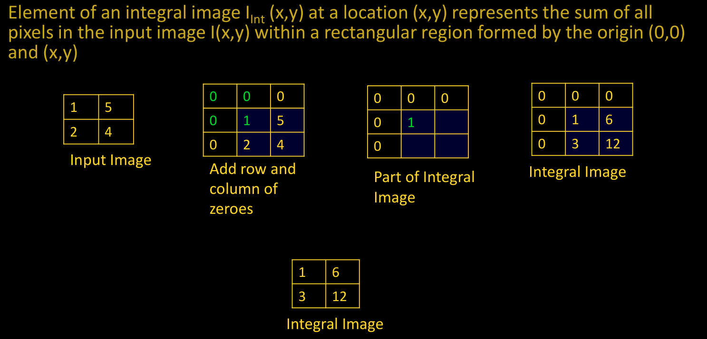
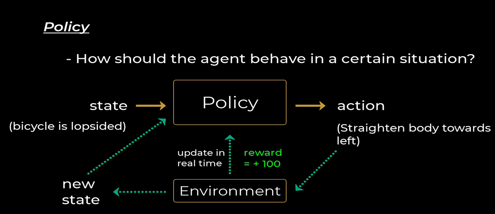

# Scale-Invariant Feature Transform (SIFT)

SIFT is an algorithm used to detect distinct key points or features in an image.  
These key points are **robust to changes** in **scale, rotation, and affine transformations**, making SIFT widely used in object recognition, image stitching, and 3D reconstruction.

---
## Advantages of SIFT Detector

!!! note  
    SIFT provides a **highly distinctive** feature descriptor, making it useful for matching objects in large databases.

| **Advantage**      | **Description**  |
|--------------------|-----------------|
| **Locality**      | Features are local and robust to **occlusion**. Does not require **segmentation** of objects. |
| **Distinctiveness** | Features can be **matched** to a **large database** of objects. |
| **Quantity**      | Generates **many features**, even for small objects. |
| **Efficiency**    | Close to **real-time performance**. |
| **Extensibility** | Easily extends to **various feature types**. |

  

_The image above illustrates SIFT algorithm._

---

## Integral Image

An **integral image** is a technique that allows for the **fast computation** of the sum of pixel values over a rectangular region.

### **Key Properties**
- **Speeds up** sum calculations for **box-type filters**.
- **Reduces computational cost** for large-scale image processing.

### **Mathematical Representation**
For an input image \( I(x,y) \), the integral image \( I_{Int}(x,y) \) at a location \( (x,y) \) is computed as:

\[
I_{Int}(x, y) = \sum_{i=0}^{x} \sum_{j=0}^{y} I(i, j)
\]

### **Use of Integral Image**
The sum of all pixel values in a region can be quickly computed using four values:

\[
S = A - B - C + D
\]

where:
- \( A, B, C, \) and \( D \) are elements of the **integral image** at the corners of the selected region.

---

!!! note 
    Even if size of filter increases, number of computations (3 additions/subtractions) does not increase

### **Comparison of SIFT and SURF**  

| Feature            | **SIFT (Scale-Invariant Feature Transform)** | **SURF (Speeded-Up Robust Features)** |
|--------------------|-------------------------------------------|--------------------------------------|
| **Dimensionality** | High-dimensional feature descriptor       | Lower dimensional, more compact descriptor |
| **Accuracy**      | Reduction in dimensionality decreases accuracy | More efficient without significant accuracy loss |
| **Keypoint Detection** | Approximates **Laplacian of Gaussian (LoG)** using **Difference of Gaussian (DoG)** | Approximates **LoG** using **Box Filters** |
| **Computation**   | Uses **determinant and trace** of the Hessian matrix | Uses **only determinant** of Hessian matrix |
| **Speed**        | Computationally expensive | Faster due to **integral images and parallel convolution** |
| **Real-Time Applications** | Not optimized for real-time processing | Suitable for **real-time tracking & object recognition** |

!!! tip  
    **SURF is a faster alternative to SIFT, making it suitable for real-time applications while maintaining robustness.**

---

## **Speeded-Up Robust Features (SURF) Algorithm**  

## **1. Detector**  
1. **Construct Hessian matrix** using box filters at each pixel to determine keypoints.  
2. **Increase the size of box filters** and repeat step 1.  
3. For each keypoint, **select points** within a radius of **6σ** (where **σ** is the standard deviation of the keypoint's filter).  
4. **Apply a Gaussian filter** of **2.5σ** on the keypoint.  
5. Use a **Haar wavelet of size 4σ** to determine the **magnitude** and **direction** of points.  
6. Draw a **histogram with 6 bins** to identify the **orientation** of the keypoint.  

## **2. Descriptor**  
1. Around each keypoint, **select a square region** of size **(20σ × 20σ)**.  
2. **Divide the region** into **16 sub-regions**.  
3. For each sub-region, **determine a vector** of length **4**.  
4. The **final descriptor vector** has a total length of **64**.  

---

!!! tip  
    **SURF is significantly faster than SIFT** due to its use of **box filters and integral images**, making it suitable for **real-time applications**.  

## Speeded Up Robust Features (SURF) algorithm

### Applications of Feature Descriptors
Feature descriptors are powerful tools in computer vision for identifying and describing local features in images. They enable a wide range of applications:

1. Image Matching
Matches keypoints between different images of the same scene or object.
Essential for applications like panorama stitching, where multiple images are combined into a wide-angle view.
2. Object Recognition
Identifies and locates objects within images by matching features between a known object and a scene.
Widely used in robotics and automated inspection systems.
3. 3D Reconstruction
Matches images taken from different viewpoints to reconstruct 3D models of objects or environments.
Essential for applications in augmented reality (AR) and virtual reality (VR).
4. Image Retrieval
Enables content-based image retrieval by searching for and retrieving images based on visual content rather than metadata.
5. Scene Recognition
Analyzes the spatial arrangement of features to recognize and categorize scenes or environments.
Useful in autonomous navigation and contextual AI systems.
6. Robotic Vision
Helps robots navigate, identify objects, and interact with their environment more effectively.
7. Video Tracking
Tracks objects or people in video sequences by matching keypoints frame-to-frame.
Important for surveillance and motion analysis.
8. Forgery Detection
Used in digital forensics to detect tampered or forged images by identifying inconsistencies in local features.

# **2D Gabor Filter – Parameters & Properties**  

## **Overview**  
The **Gabor filter** is a powerful tool used for feature extraction, especially in **texture and edge detection**. It is a **bandpass filter** that operates in both the **spatial and frequency domains**, mimicking the way the human visual system perceives textures.  

## **Key Characteristics**  
✅ **Localized in both space & frequency** – Helps capture patterns effectively.  
✅ **Combination of Gaussian & Sinusoidal components** – Provides smooth feature extraction.  
✅ **Mimics human vision** – Recognizes textures similar to human eyes.  

---

## **Mathematical Representation**  
A **2D Gabor filter** is defined as:  

\[
G(x,y) = \exp\left( -\frac{x'^2 + \gamma^2 y'^2}{2\sigma^2} \right) \cos\left( \frac{2\pi x'}{\lambda} + \psi \right)
\]

where:  
- \( x' = x \cos\theta + y \sin\theta \)  
- \( y' = -x \sin\theta + y \cos\theta \)  

---

## **Core Parameters of Gabor Filter**  

| **Parameter** | **Symbol** | **Description** |
|--------------|------------|-----------------|
| **Wavelength** | \( \lambda \) | Controls the width of the stripes in the Gabor function. |
| **Orientation** | \( \theta \) | Defines the **angle** of the normal to the parallel stripes of the Gabor function. |
| **Phase Offset** | \( \psi \) | Determines the **position** of the sinusoidal function, affecting edge detection. |
| **Standard Deviation** | \( \sigma \) | Defines the **spread** of the Gaussian envelope, controlling the extent of localization. |
| **Aspect Ratio** | \( \gamma \) | Specifies the **ellipticity** of the Gabor function's support. |
| **Bandwidth** | \( B \) | Controls the **range of spatial frequencies** covered by the filter. |

---

## **How Parameters Affect the Gabor Filter**  

### **1️⃣ Wavelength (λ) – Stripe Width**  
- Controls the width of the sinusoidal pattern.  
- Larger **λ** → Wider stripes → Detects coarse textures.  
- Smaller **λ** → Narrower stripes → Detects fine textures.  

### **2️⃣ Orientation (θ) – Direction of Features**  
- Determines the **angle** at which the filter responds best to edges.  
- Example: A **horizontal edge** detector has \( \theta = 90^\circ \).  

### **3️⃣ Phase Offset (ψ) – Sinusoidal Shift**  
- **\( \psi = 0 \)** → Cosine Gabor (Even filter) → Detects **bar-like** structures.  
- **\( \psi = \frac{\pi}{2} \)** → Sine Gabor (Odd filter) → Detects **line-like** structures.  

### **4️⃣ Standard Deviation (σ) – Gaussian Spread**  
- Determines the **size of the receptive field**.  
- Large \( \sigma \) → More **blurred** edges.  
- Small \( \sigma \) → More **sharp** edges.  

### **5️⃣ Aspect Ratio (γ) – Ellipticity**  
- Specifies the **shape** of the filter.  
- Larger \( \gamma \) → More elongated filter (stretches in one direction).  
- Smaller \( \gamma \) → More circular response.  

---

## **Gray Level Co-occurrence Matrix (GLCM) – Texture Analysis**  

## **Overview**  
The **Gray Level Co-occurrence Matrix (GLCM)** is a powerful **statistical method** used in **image processing** and **computer vision** to analyze texture features by examining the spatial relationships between pixel intensities.  

🔹 **Key Applications:**  
✅ **Texture Analysis** – Identifies patterns in images.  
✅ **Feature Extraction** – Helps in classification tasks.  
✅ **Medical Imaging** – Detects abnormalities in scans.  
✅ **Remote Sensing** – Analyzes satellite imagery.  

---

## **GLCM – How It Works**  
GLCM computes how often pairs of **gray-level intensities** occur at a specific **spatial relationship** (distance & direction) within an image. This helps extract meaningful **texture features**.

### **Statistical Features Derived from GLCM**  

| **Feature**     | **Formula**                                          | **Description** |
|---------------|------------------------------------------------------|----------------|
| **Contrast** | \( \sum_{i,j} (i - j)^2 p(i, j) \) | Measures intensity **variation** (higher contrast = more difference in pixel values). |
| **Dissimilarity** | \( \sum_{i,j} |i - j| p(i, j) \) | Similar to contrast but **less sensitive to large variations**. |
| **Energy** | \( \sum_{i,j} p(i, j)^2 \) | Sum of squared elements → Measures **uniformity**. |
| **Homogeneity** | \( \sum_{i,j} \frac{p(i, j)}{1 + |i - j|} \) | Measures **closeness** of distributed elements to the diagonal. |
| **Entropy** | \( \sum_{i,j} -p(i, j) \log_2(p(i, j)) \) | Measures randomness → **Higher entropy = more complex textures**. |
| **Correlation** | \( \sum_{i,j} \frac{(i - \mu_i)(j - \mu_j) p(i, j)}{\sigma_i \sigma_j} \) | Measures **linear dependency** between pixel intensities. |

---

## **GLCM Mean & Variance**  

- **GLCM Mean**: Represents the **average occurrence** of a pixel intensity based on spatial relationships.  
 $$ \mu_i = \sum_{i,j} i p(i, j), \quad \mu_j = \sum_{i,j} j p(i, j) $$  

- **GLCM Variance**: Measures **spread (dispersion)** of pixel intensities around the mean.  
  $$   \sigma_i^2 = \sum_{i,j} p(i, j)(i - \mu_i )^2, \quad \sigma_j^2 = \sum_{i,j} p(i, j)(j - \mu_j )^2  $$

---
