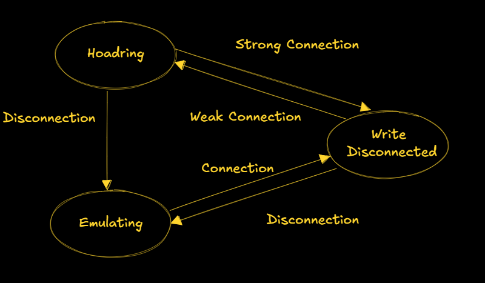
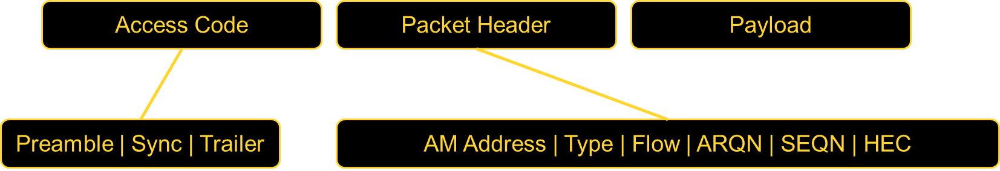

# Unit 4: IPv6


## Understanding IPv4

An **IP address (Internet Protocol address)** is a unique identifier assigned to each device connected to a network using the Internet Protocol. It serves two main purposes:

- **Identification**: Uniquely identifies a device on a network.
- **Location Addressing**: Indicates where a device is located within a network, enabling data routing.

!!! note
    IP addresses are essential for devices to communicate over the internet, ensuring proper identification and data transmission.

---

## IPv4 Format

IPv4 (**Internet Protocol Version 4**) is the most widely used system for identifying devices on a network. It uses a **32-bit addressing scheme**, represented as four numbers separated by periods.

### Example:

```plaintext
192.168.0.1
```

Each number (octet) can range from **0 to 255**.

!!! tip
    IPv4 supports approximately **4.3 billion** unique addresses, which is why IPv6 was introduced to handle the growing number of devices.

---

## Mobile IPv4

Mobile IPv4 is a protocol that enables devices to **maintain their IP address and network connectivity** while moving between different networks.

### Key Benefits:

- Ensures continuous network connections when a device changes its network (e.g., switching from Wi-Fi to cellular data).
- Maintains seamless communication for mobile users.

!!! warning
    Without Mobile IPv4, devices would lose their network sessions when changing networks, leading to dropped connections and data loss.

---

## Agent Advertisement

Agent Advertisement is a process where **Home Agents (HA) and Foreign Agents (FA)** periodically send advertisement messages into their physical subnets.

### How It Works:

- **HA/FA broadcast advertisement messages** (ICMP messages) into the subnet.
- These messages act as beacons to notify Mobile Nodes (MN) of available networks.
- **Packet Details:**
  - **TTL (Time To Live):** Set to `1` to prevent forwarding.
  - **Destination Address:**
    - `224.0.0.1` (Multicast Address) or
    - `255.255.255.255` (Broadcast Address)
- **Mobile Node (MN) Actions:**
  - Listens for advertisement messages.
  - Detects if it's in a home or foreign network.
  - Reads a **Care-of Address (COA)** from FA advertisement messages.

| Field               | Value                         |
| ------------------- | ----------------------------- |
| TTL                 | 1 (Prevents forwarding)       |
| Destination Address | `224.0.0.1` (Multicast)       |
| Destination Address | `255.255.255.255` (Broadcast) |

!!! note
    The **Care-of Address (COA)** allows the mobile device to register its new location while roaming, ensuring uninterrupted communication.


---

## Mobile IP: Basic Operation

### Agent Solicitation

If no agent advertisements are present, or if the time between two advertisements is too high, the mobile node must send an **Agent Solicitation** message.

- The solicitation message **should not flood the network**.
- A mobile node can send up to **three solicitations per second** upon entering a foreign network.
- If no response is received, the solicitation rate **decreases exponentially** to avoid network congestion.
- **Agent discovery** allows the mobile node to establish a better connection.
- Once an agent is discovered, the mobile node obtains a **Care-of Address (COA)**.

---

## Registration Request

Registration requests use **UDP packets** with the following structure:

- **Source Address**: Mobile Node (MN) IP address.
- **Destination Address**: Home Agent (HA) or Foreign Agent (FA) IP address (depending on COA location).
- **Type Field**: Set to `1` to indicate a registration request.
- **Flags:**
  - `S` – Request Home Agent to retain previous mobility binding.
  - `B` – Request to receive broadcast packets from the home network.
  - `D` – Mobile Node will handle decapsulation at the tunnel (if COA is located at MN).
  - `M/G` – Defines encapsulation type.
  - `T` – Enables reverse tunneling.
- **Lifetime**: Defines the validity of the registration (in seconds).
- **Home Address**: Fixed IP address of the Mobile Node.
- **Home Agent**: IP address of the Home Agent.
- **COA (Care-of Address)**: Represents the tunnel endpoint.
- **Identification**: 64-bit identifier generated by MN to match registration requests and replies, preventing replay attacks.


---

## Registration Reply

Once a registration request is processed, a **registration reply** is sent back using **UDP packets**:

- **Type Field**: Set to `3` to indicate a registration reply.
- **Code Field**: Specifies the result of the registration request.

!!! tip
    Registration replies confirm whether a Mobile Node's registration was successful and provide status codes for troubleshooting.

---

I've refined and structured this section to align with the rest of your document for better readability and clarity:

---

## Types of Encapsulation

Encapsulation is essential in **Mobile IP** to ensure packets reach the **Care-of Address (COA)**. The **Home Agent (HA)** takes the original packet (with the **Mobile Node (MN)** as the destination), places it inside the data portion of a new packet, and sets a new IP header so that it is correctly routed to the COA. 

The newly added IP header is called the **outer header**.

### **Encapsulation Methods:**
There are three primary types of encapsulation:

1. **IP-in-IP Encapsulation**
2. **Minimal Encapsulation**
3. **Generic Routing Encapsulation (GRE)**

---

### **1. IP-in-IP Encapsulation**
- **Defined in RFC 2003 (Mandatory)**
- Creates a **tunnel** between the **Home Agent (HA)** and the **COA**.
- The entire original **IP packet** is encapsulated within a new **IP header**.
- Used when the MN is using a **foreign agent COA**.


---

### **2. Minimal Encapsulation**
- Reduces redundancy present in **IP-in-IP encapsulation**.
- Only essential fields from the original header are included.
- Helps in reducing overhead, improving efficiency.


---

### **3. Generic Routing Encapsulation (GRE)**
- Unlike **IP-in-IP** and **Minimal Encapsulation**, which work only for **IP packets**, **GRE** supports **other network layer protocols**.
- Allows encapsulation of **different protocol suites** into the payload portion of a packet.
- Uses an **outer IP header**, with **TTL and TOS values copied** from the original header.
- Provides flexibility for **non-IP protocols** to be transported over an IP network.

!!! note
GRE is widely used in **VPNs** and **multicast routing** to carry non-IP traffic efficiently over an IP-based network.


---

## **Mobile IP and IPv6**  

### **Key Features of Mobile IP in IPv6**  
- **Integrated Security**: Unlike IPv4, security is built into IPv6 rather than being an add-on. Authentication for registration is included.  
- **Auto-Configuration of COA**:  
  - IPv6 supports automatic configuration of the **Care-of Address (COA)**.  
  - **DHCPv6** can be used for dynamic COA assignment.  
  - Every IPv6 node has built-in address auto-configuration.  
- **No Need for a Foreign Agent (FA)**:  
  - In IPv6, **all routers** perform **router advertisements**, eliminating the need for a dedicated **Foreign Agent**.  
- **Direct COA Signaling (Route Optimization)**:  
  - The **Mobile Node (MN)** can directly inform a sender of its COA, bypassing the **Home Agent (HA)**.  
  - This enables **automatic path optimization**, reducing latency.  
- **Soft Handovers (Seamless Mobility)**:  
  - IPv6 supports smooth handovers **without packet loss** between subnets.  
  - The MN sends its **new COA** to the old router.  
  - The **old router** encapsulates and forwards packets to the new COA.  
  - Authentication remains intact throughout the process.  

---

## **Dynamic Host Configuration Protocol (DHCP)**  

### **Overview of DHCP**  
- **DHCP** is a standardized **networking protocol** used by servers to dynamically allocate **IP addresses** to computers in a network.  
- **Primary Purpose**: Automates IP configuration without requiring a network administrator.  

### **How DHCP Works**  
1. **IP Address Allocation**  
   - DHCP assigns IP addresses from a **predefined range** stored in a **server database**.  
   - Each IP is assigned for a **lease period**, after which the device must renew or acquire a new address.  

2. **Full Network Integration**  
   - DHCP provides additional configuration details:  
     - **DNS Server Address**  
     - **Default Gateway (Router)**  
     - **Subnet Mask**  
     - **Domain Name**  
     - **IP Address**  

### **DHCP Client-Server Model**  
- DHCP follows a **client/server model** where clients request IP configurations from servers.  
- Clients send **broadcast requests** using MAC addresses to find available DHCP servers.  
- A **DHCP relay agent** forwards requests if servers are in a different network segment.  


### **DHCP Process**  
1. **Client broadcasts a DHCPDISCOVER** to find available DHCP servers.  
2. **DHCP servers respond with DHCPOFFER**, listing available configurations.  
3. **Client sends a DHCPREQUEST** to accept one configuration and reject others.  
4. **Selected server sends a DHCPACK**, confirming the lease.  
5. **If the client leaves the subnet**, it sends a **DHCPRELEASE** to free the assigned IP.  

### **DHCP in Mobile IP**  
- DHCP is a strong candidate for **Care-of Address (COA) assignment** in Mobile IP.  
- **Security Concern**: Without authentication, neither the **Mobile Node (MN)** nor the **DHCP server** can trust each other.  

---

## **Mobile Transport Layer**  

### **Why Transport Layer Support is Needed for Mobility**  
- Mobile networks introduce challenges beyond just network-layer mobility.  
- The **Transport Layer** plays a critical role in:  
  - **Checksumming** over user data.  
  - **Multiplexing/Demultiplexing** data to and from applications.  

### **UDP (User Datagram Protocol)**  
- **Simple addressing mechanism**.  
- **Connectionless** (No established connection).  
- **No reliability guarantees** (No retransmission, no in-order delivery).  

### **UDP vs. TCP in Mobile Networks**  

| Feature | **UDP** | **TCP** |
|---------|--------|--------|
| **Connection Type** | Connectionless | Connection-oriented |
| **Reliability** | No reliability | Reliable (retransmissions, acknowledgments) |
| **Congestion Control** | None | Reduces speed in case of network congestion |
| **Order of Delivery** | No guarantee | Ensures in-order delivery |
| **Usage in Mobility** | Suitable for real-time applications | Requires adaptation for mobile networks |

### **Challenges of TCP in Mobile Networks**  
- TCP assumes **packet loss** is due to **network congestion**, reducing the transmission rate unnecessarily.  
- Mobile networks require **optimized TCP** for **3G, 4G, and 5G** environments.  

---

## Traditional TCP and Congestion Control

TCP was originally designed for **fixed networks** with **stable end-systems** where:

- Hardware introduces minimal transmission errors.  
- Packet loss typically occurs due to network congestion.  
- Routers **drop packets** when overloaded.  

### How Does the Sender Detect Packet Loss?
- **Missing Acknowledgements (ACKs).**

#### Incorrect Approach:
Simply retransmitting the missing packet **without adjusting the transmission rate**.

#### Correct Approach:
TCP **slows down** dramatically using congestion control mechanisms.

---

## TCP Slow Start

After detecting congestion, TCP enters **Slow Start** mode:

- The **congestion window** (`cwnd`) begins at **1 segment**.
- For every **successful ACK**, `cwnd` **doubles** (exponential growth).
- Growth continues **until** reaching a **threshold (ssthresh)**.
- After reaching `ssthresh`, TCP switches to **linear increase**.

### Conditions for Stopping Growth:
1. **Time-out due to missing ACK.**  
2. **Multiple ACKs for the same packet (duplicate ACKs).**

### TCP Congestion Control Steps
| Condition                      | Action Taken               |
|---------------------------------|----------------------------|
| First packet drop detected     | Reduce `ssthresh` to half  |
| Restart slow start             | Reset `cwnd` to 1 segment |
| Continue with linear increase  | Until new loss occurs      |

---

## Fast Retransmit and Fast Recovery

### Fast Retransmit:
- If multiple duplicate ACKs are received **before a timeout**, the sender **immediately retransmits** the lost packet.
- Avoids waiting for the retransmission timer.

### Fast Recovery:
- Instead of **resetting to slow start**, TCP **continues with the current congestion window**.
- This prevents **unnecessary performance degradation**.

!!! tip
    Fast retransmit helps avoid unnecessary delays and ensures smoother TCP performance.

---

## Implications of TCP on Mobility

TCP **performs poorly** in **mobile environments** due to incorrect assumptions.

### Incorrect Assumptions:
- **Packet loss = Network congestion** (but mobile networks lose packets due to handovers).
- **Wireless error rates = Wired error rates** (wireless links are more error-prone).

### Mobile IP Issue:
- Packets **in transit** to the old Foreign Agent (FA) are lost when the Mobile Node (MN) **moves**.
- **TCP cannot differentiate** between congestion-based and mobility-based packet losses.

!!! warning
    TCP uses **error control mechanisms** to handle **network congestion**, which is **not ideal** for mobile networks.

---

## TCP Improvements: Indirect TCP (I-TCP)

### How I-TCP Works:
- Keeps **standard TCP** for fixed networks.
- Uses an **optimized TCP** for mobile devices.
- **Splits the TCP connection** at the **Foreign Agent (FA)** into **two separate connections**.

### Process:
1. **Correspondent host** sends a packet.  
2. **Foreign Agent acknowledges** and forwards it to the **Mobile Node**.  
3. Any **packet loss** in the wireless network is handled by the **Foreign Agent**.  
4. If handover occurs, **socket state (sequence numbers, ports, etc.)** is migrated.  

---

## Advantages of I-TCP

- **No changes needed** in existing TCP implementations.  
- Wireless **errors don’t affect fixed networks**.  
- Faster **packet loss recovery** (shorter wireless delays).  
- Allows **different transport protocols** between FA and MN.  

!!! note
    I-TCP enhances TCP performance in wireless environments **without altering** fixed-network implementations.

---

## Disadvantages of I-TCP

- **Loses TCP’s end-to-end reliability** if FA crashes.  
- **Increased handover latency** due to buffering at FA.  
- **Security risks**: FA must be **trusted**, especially for encrypted data.  

!!! warning
    If the **Foreign Agent crashes**, the entire session **might fail**, causing disruptions.

---

## Summary of TCP Enhancements

| Feature            | Standard TCP | Fast Retransmit | I-TCP |
|--------------------|-------------|----------------|-------|
| Handles congestion | Yes | Yes | Yes |
| Works in mobile networks | No | No | Yes |
| Requires protocol changes | No | No | Yes |
| Improves packet loss recovery | No | Yes | Yes |
| Preserves end-to-end connection | Yes | Yes | No |

!!! tip
    I-TCP is a **powerful improvement** for mobile networks, but it **compromises end-to-end reliability**.

## TCP Improvements

### Snooping TCP

One of the drawbacks of I-TCP is the segmentation of the TCP connection, which **violates end-to-end TCP semantics**. Snooping TCP offers a **transparent extension** of TCP at the **Foreign Agent (FA)** to mitigate this issue.

### How Snooping TCP Works
- **The Foreign Agent (FA) buffers packets** sent to the mobile host (MH) until an **ACK is received**.
- FA **monitors (snoops) the packet flow** in both directions.
- If a packet is lost on the **wireless link**, FA **immediately retransmits it** (local retransmission).
- The FA **filters duplicate ACKs** and prevents unnecessary congestion control actions in the fixed network.

### Data Transfer Mechanism
- **To the Mobile Host**:  
  - FA buffers data until it receives an **ACK from MH**.  
  - If a **duplicate ACK or timeout** occurs, FA quickly retransmits the packet.
- **From the Mobile Host**:  
  - FA detects lost packets via **sequence numbers**.  
  - FA sends a **Negative Acknowledgment (NACK)** to MH for quick retransmission.  

### Integration with MAC Layer
- The **MAC layer** already detects **duplicate packets** due to retransmissions.
- This prevents redundant retransmissions by TCP.

### Advantages of Snooping TCP
- **Preserves end-to-end semantics** (FA does not acknowledge data on behalf of MH).
- **Reduces packet loss impact** on wireless links.
- **No changes required in the fixed network**.

---

## Mobile TCP (M-TCP)

### Why M-TCP?
M-TCP improves **overall TCP performance** in mobile environments by:
- **Maintaining end-to-end TCP semantics**.
- **Reducing delay** in case of handovers.
- **Enhancing throughput** and handling frequent disconnections.

### How M-TCP Works
Like I-TCP, **M-TCP splits the TCP connection**, but with key differences:
- Uses a **Supervisory Host (SH)** instead of a Foreign Agent.
- **SH does not cache or retransmit packets**.
- If **disconnection is detected**, SH **sets sender window size to 0**.
- The sender **goes into persistent mode**, preventing unnecessary retransmissions.
- When **connectivity is restored**, SH **restores the sender window** to its original value.

### Advantages of M-TCP
- **Preserves end-to-end TCP semantics** (SH does not modify ACKs).
- **Handles disconnections efficiently** without slow starts.
- **No buffering at SH**, reducing memory usage.

### Disadvantages of M-TCP
- **Packet loss on wireless links affects the fixed network**.
- **Requires modifications** to both **MH protocol stack** and **network infrastructure**.

---

## Fast Retransmit / Fast Recovery

This approach forces TCP’s **Fast Retransmit** mechanism to **handle handovers efficiently**.

### How It Works
- When the **mobile host (MH) moves to a new Foreign Agent (FA)**, it **immediately sends duplicate ACKs** to the Correspondent Host (CH).
- Sending **three duplicate ACKs** triggers **Fast Retransmit** at CH.
- This prevents **Slow Start**, improving handover performance.

### Advantages
- **Simple to implement**.
- **Faster recovery from handover-related losses**.

### Disadvantages
- Retransmitted packets **still travel through the entire network**.
- If **handover takes too long**, CH **may initiate retransmissions prematurely**.
- This approach **does not address wireless link issues**.

---

## Transmission / Timeout Freezing

TCP performance **degrades in long interruptions** (e.g., tunnels, no coverage areas). **Timeout Freezing** prevents unnecessary retransmissions.

### How It Works
- **The MAC layer detects connection loss early**.
- TCP **pauses timers** and **freezes the congestion window**.
- Once connectivity **is restored**, TCP **resumes from the exact point it was stopped**.

### Advantages
- **Prevents unnecessary retransmissions** during **long disconnections**.
- **Maintains TCP state** without requiring modifications in the fixed network.
- Works **independently of acknowledgments or sequence numbers**.

### Disadvantages
- **Relies on MAC layer** to detect interruptions accurately.
- **Encryption mechanisms with time-dependent keys** may cause issues.

---

## Selective Retransmission

### Why It’s Needed
Standard TCP **cumulatively acknowledges packets**. If a single packet is lost, TCP **retransmits all subsequent packets**, **wasting bandwidth**.

### How Selective Retransmission Works
- The receiver **requests only the lost packets**.
- The sender **sends the missing packets** instead of retransmitting everything.

### Advantages
- **Minimizes retransmission overhead**, especially in wireless networks.
- **Improves efficiency** on low-bandwidth connections.

### Disadvantages
- **Requires additional buffer space** at the receiver.
- **More complex implementation** compared to standard TCP.

---

## Transaction-Oriented TCP

### Problem with Traditional TCP
For **short-lived requests**, such as a **mobile host sending a single request to a server**, TCP’s **connection setup overhead** is too high.

### Issues with Standard TCP for Transactions
- **Three-way handshake** for connection setup.
- **Multiple packets needed** for transmission.
- **Three more packets** for connection teardown.
- If the data fits in **one packet**, TCP still **requires seven packets**.

### Solution: Transaction-Oriented TCP
- Reduces **TCP overhead** for **short transactions**.
- Uses **minimal packet exchanges**.


- T/TCP can combine packets for connection establishment and connection release with user data packets. 
= This can reduce the number of packets down to two instead of seven.
### Advantage for certain applications is the reduction in the overhead which standard TCP has for connection setup and connection release.
- T/TCP is not the original TCP anymore, so it requires changes in the mobile host and all correspondent hosts, which is a major disadvantage. 

---

## **TCP Enhancements for Wireless and Mobile Networks**

## **Introduction**  
Transmission Control Protocol (TCP) was originally designed for wired networks, where packet loss is primarily due to congestion. However, in **wireless and mobile networks**, factors such as **high latency, jitter, and packet loss due to handovers or signal interference** significantly degrade TCP performance. This document explores various TCP improvements tailored for wireless environments.

---

## **1. Snooping TCP**  

!!! note  
    **Snooping TCP** is a **transparent extension** of TCP within the **foreign agent (FA)** to optimize performance in mobile networks.

### **How It Works**  
- The **foreign agent (FA)** buffers packets **destined for the mobile host (MH)** until an acknowledgment (ACK) is received.  
- If a **packet is lost** on the wireless link, the FA retransmits it **locally** instead of relying on the original sender.  
- The FA **snoops** acknowledgments and filters duplicate ACKs, reducing unnecessary retransmissions.  

### **Advantages**  
- **Preserves end-to-end TCP semantics** by acknowledging only when the MH responds.  
- **Faster retransmissions** as lost packets are handled locally.  
- **Works transparently** without modifications to the TCP sender.  

### **Limitations**  
- Requires **modifications at the foreign agent**.  
- Does **not work with encrypted TCP headers** (e.g., IPsec).

---

## **2. Mobile TCP (M-TCP)**  

!!! tip  
    M-TCP **improves throughput** while maintaining **end-to-end TCP semantics** and ensuring **efficient handovers**.

### **How It Works**  
- **Supervisory Host (SH)** monitors TCP traffic but **does not cache or retransmit packets**.  
- If the **mobile host disconnects**, the SH sets the **sender’s TCP window size to zero**, preventing unnecessary retransmissions.  
- Once connectivity is restored, the window is **reopened** at the previous value, resuming normal data transfer.  

### **Advantages**  
✅ Supports **long disconnections** without breaking connections.  
✅ **Prevents slow start** by maintaining the sender’s state.  
✅ **No buffering** at the supervisory host, reducing overhead.  

### **Limitations**  
❌ Packet loss on the **wireless link affects the fixed network**.  
❌ Requires **modifications to the mobile host’s TCP stack**.  

---

## **3. Fast Retransmit & Fast Recovery**  

!!! warning  
    This method **artificially triggers** fast retransmission to prevent slow start during handovers.

### **How It Works**  
- When a **mobile host moves to a new foreign agent**, it **sends three duplicate ACKs** to the correspondent host.  
- This **forces the correspondent host into fast retransmit mode** without triggering slow start.  

### **Advantages**  
- **Reduces delay during handovers.**  
- **Simple to implement** with minor modifications.  

### **Limitations**  
- **Inefficient** for networks with **high latency**.  
- If the **handover is slow**, the retransmitted packets may arrive too late.  

```plaintext
Example: Mobile host sends 3 duplicate ACKs -> Fast retransmit triggered
```

---

## **4. Transmission Timeout Freezing**  

!!! note  
    When a **long disconnection** (e.g., moving through a tunnel) is detected, TCP **freezes** its state to prevent timeouts.

### **How It Works**  
- The **MAC layer detects a connection issue** before TCP is interrupted.  
- TCP **pauses** timers and stops retransmissions, maintaining the congestion window state.  
- Once connectivity is restored, TCP resumes **without triggering slow start**.  

### **Advantages**  
✅ Ideal for **long interruptions** (e.g., tunnels, network congestion).  
✅ **Independent of TCP mechanisms** like sequence numbers and acknowledgments.  

### **Limitations**  
❌ **Requires MAC layer awareness** of connection issues.  
❌ Does **not work with encryption** methods that rely on timestamps.  

---

## **5. Selective Retransmission**  

!!! tip  
    Instead of retransmitting **all unacknowledged packets**, TCP resends **only the lost ones** using **Selective Acknowledgment (SACK)**.

### **How It Works**  
- The receiver **informs the sender** exactly **which packets were lost**.  
- The sender **only retransmits** those specific packets.  

### **Advantages**  
✅ **Reduces bandwidth consumption**, especially on wireless links.  
✅ **Speeds up recovery** from packet loss.  

### **Limitations**  
❌ Requires **more complex receiver logic**.  
❌ **Buffering overhead** for out-of-order packets.  

```plaintext
Example: Lost packet #4 detected -> Only #4 is retransmitted
```

---

## **6. TCP Over 2.5G/3G Networks**  

!!! warning  
    TCP performance in **2.5G/3G networks** is affected by **high latency, jitter, and bandwidth fluctuations**.

### **Challenges in 2.5G/3G**  
| **Factor**        | **Impact on TCP**                                | **Mitigation**                        |
|------------------|---------------------------------|--------------------------------|
| **Latency**       | Increases **RTT** due to error correction | Use **timestamp option** for better RTT estimation |
| **Jitter**        | Causes **random delay spikes** | Enable **Explicit Congestion Notification (ECN)** |
| **Packet Loss**   | Occurs during handovers        | Use **Selective Acknowledgment (SACK)** |
| **Bandwidth Oscillations** | Reduces throughput unpredictably | Use **large windows and limited transmit** |

### **Recommended TCP Optimizations**  
- **Large TCP Window Size** to adapt to higher latency.  
- **Limited Transmit (RFC 3042)** to improve performance for small data transmissions.  
- **Explicit Congestion Notification (ECN)** to signal congestion without dropping packets.  
- **Selective Acknowledgment (SACK)** for efficient retransmission.  
- **Avoid TCP Header Compression (RFC 1144)** as it performs poorly with packet loss.  

---

## **7. Performance-Enhancing Proxies (PEP)**  

!!! note  
    **Proxies** are used to improve TCP performance in wireless networks by handling retransmissions locally.

### **How It Works**  
- **Splits the connection** between sender and mobile host.  
- **Optimizes data flow** by caching and retransmitting lost packets **at the proxy level**.  

### **Advantages**  
✅ **Reduces delay** by handling retransmissions locally.  
✅ **Improves throughput** in high-latency wireless networks.  

### **Limitations**  
❌ **Breaks end-to-end TCP semantics**.  
❌ **Not compatible with IPsec encryption**.  

---

# Unit 5: Mobile Databases  

## Introduction to Mobile Databases  

Mobile databases are specialized data management systems designed for mobile devices. They address unique challenges such as:  

- **Limited device resources** – Optimizing power and storage usage.  
- **Intermittent network connectivity** – Ensuring seamless synchronization.  
- **Data distribution** – Managing access across multiple locations.  

These databases enable:  

- Efficient data querying.  
- Offline operations.  
- Secure data handling.  
- Synchronization between mobile devices and central servers.  

!!! note  
    Mobile databases allow devices to function independently while staying connected to a broader data ecosystem.  

---

## Need for Mobile Databases  

Users require seamless access to their data and the ability to perform transactions securely on mobile devices.  

### Key requirements:  
- **Transaction handling** – Making secure payments, updating records.  
- **Everyday convenience** – Sending money, booking seats, trading stocks.  
- **Continuous access** – Uninterrupted availability of information.  

!!! tip  
    The demand for "anytime, anywhere" access makes mobile databases essential in modern applications.  

---

## Uses of Mobile Databases  

Mobile databases empower developers to build and deploy applications for handheld devices.  

### Common use cases:  
- **Corporate Access:**  
  - Employees connect to their company's network.  
  - Data is downloaded for offline work.  
  - Updates sync back when connected.  

- **Real-world example:**  
  A **food delivery app rider** using mobile databases can:  
  - Accept new orders while on the move.  
  - Track delivery locations and customer details offline.  
  - Update delivery status in real-time.  
  - Sync all completed deliveries to the restaurant’s system.  

!!! note  
    Mobile databases ensure real-time tracking and offline functionality for critical applications.  

---

## Mobile Databases: Design Issues  

Mobile databases must be **built for mobility** rather than adapted from traditional database systems.  

### Key challenges:  

| Challenge              | Description |
|------------------------|-------------|
| **Query Optimization** | Users move constantly, making it hard to determine the best way to process data requests.  |
| **Time Management**   | Mobile networks often charge based on connection time and data usage, requiring efficient retrieval.  |
| **Power Efficiency**  | Limited battery life demands minimal energy consumption for database operations.  |

!!! warning  
    Poor optimization can lead to high costs, battery drain, and slow performance.  

---

## Problems in Mobile Databases  

### Routing  
One of the biggest costs in wireless communication is connection time. Efficient routing reduces this expense.  

### Query Processing  
- Mobile devices often disconnect for extended periods.  
- Users may issue queries or updates on cached data while offline.  

### Recoverability  
- If a disconnected device **fails**, all locally stored updates may be **lost** permanently.  

### Consistency  
- Cached data can become outdated, and devices won’t detect inconsistencies until they reconnect.  
- No updates can sync until the device is back online.  

!!! tip  
    Using synchronization mechanisms and conflict resolution strategies can mitigate these issues.  

---


## **Introduction to CODA**  
CODA is a distributed file system designed for **high availability, scalability, and fault tolerance**. It was developed as an extension of the **Andrew File System (AFS)** at Carnegie Mellon University. CODA ensures continuous data access even in the presence of network failures or server disconnections by using **client-side caching, replication, and disconnected operation**.  

## **Mechanisms of the CODA File System**  

### **1. Server Replication**  
Server replication ensures that data remains accessible by storing multiple read-write replicas across different servers.  

- Volumes have **read-write replicas** stored on multiple servers, forming a **Volume Storage Group (VSG)**.  
- Clients track available servers through an **Accessible Volume Storage Group (AVSG)**.  
- **Venus (cache manager)** ensures consistency by implementing a coherence protocol.  
- Servers notify clients whenever cached copies become **stale or invalid**.  
- Modifications are propagated **simultaneously** across all AVSG sites and later synced to missing VSG sites.  


### **2. Disconnected Operation**  
CODA supports **offline access** by allowing clients to function independently when the network is unavailable.  

- Venus handles all file system requests using **local cache data**.  
- When the client reconnects, Venus **syncs modifications** to the server and returns to replication mode.  
- Ensures uninterrupted access for mobile users.  

### **3. Client-Side Caching**  
- Uses **Venus**, the CODA client module, to cache frequently accessed files locally.  
- Improves performance by reducing the need for frequent server requests.  
- Cached files allow users to work offline and sync changes later.  

### **4. Conflict Resolution**  
- **Automatic resolution** for simple conflicts (e.g., appending to logs).  
- **Manual intervention** required for complex conflicts where two users modify the same file.  
- Uses **resolution tools** to merge conflicting versions.  

### **5. Scalability and Performance**  
- Efficient handling of large-scale distributed systems.  
- Supports large numbers of clients with minimal performance degradation.  
- Balances workload using adaptive caching and **replication strategies**.  

### **6. Security**  
- Uses **Kerberos authentication** for secure access control.  
- Encrypts data transmissions to protect sensitive information.  
- Access control lists (ACLs) manage user permissions.  

---

## **Venus States in CODA**  



Venus operates in **three distinct states**, depending on the network connection status.  

### **1. Hoarding (Preparation Phase)**  
- **Venus proactively caches** essential data before disconnection.  
- Frequently accessed files are **prefetched while online**.  
- Uses **Least Recently Used (LRU)** strategy to manage cache content efficiently.  

### **2. Emulation (Disconnected Operation)**  
- When disconnected, Venus operates as a **pseudo-server**, providing local file access.  
- **Applications access cached files** without needing server connectivity.  
- Venus tracks all changes and **assigns temporary file IDs** for new objects.  
- Conflict detection: After reconnection, **file versions are compared**, and conflicts are flagged for manual resolution.  

### **3. Reintegration (Reconnection & Syncing)**  
- Venus **propagates all changes** made during disconnection back to the server.  
- The system **updates cached files** to reflect server changes.  
- Reintegration occurs **automatically upon network reconnection**.  
- If conflicting updates exist, files are stored as separate copies for **manual integration**.  

---

## **Client Structure in CODA**  


CODA's client-side architecture is designed for **flexibility and efficiency**.  

- **Venus runs at the user level**, not the kernel level, allowing easier updates and flexibility.  
- A **mini-cache** inside the kernel filters frequent Venus-kernel interactions, improving performance.  
- **File access process**:  
  1. Applications request files via the **Vnode interface**.  
  2. If the **mini-cache** contains the file, the request is processed instantly.  
  3. If not, Venus fetches the file from the server and updates the cache.  
  4. After processing, control returns to the application.  
- Venus **periodically updates the mini-cache** to maintain consistency.  

---

## **Design Rationale of CODA File System**  

CODA was designed with **specific goals in mind** to support mobile and distributed computing.  

✅ **Standard Hardware Compatibility** → Works on commercial systems without requiring special equipment.  
✅ **Transparency** → Users do not need to know where files are stored.  
✅ **Scalability** → Handles growing networks and large data volumes efficiently.  
✅ **Mobile Computing Support** → Built for portable workstations and remote access.  
✅ **High Availability** → Ensures continuous access even during network failures.  
✅ **Strong Consistency** → Synchronizes data accurately across all replicas.  

---

# Unit 6: Wireless Communication

## Introduction

Wireless communication refers to the transfer of information between two or more devices without physical cables or wires. It uses electromagnetic waves to transmit data over the airwaves.  

Some common wireless communication technologies include:

- **Wi-Fi**: Uses radio waves to provide high-speed internet and network connections.  
- **Bluetooth**: Short-range wireless technology for connecting devices like smartphones, laptops, and headphones.  
- **Cellular Networks**: Enables voice and data communication using mobile devices.  
- **Satellite Communication**: Uses satellites to transmit data over long distances.  
- **RFID (Radio Frequency Identification)**: Employs radio waves to identify and track objects.  

Wireless communication has revolutionized connectivity and has enabled technologies like the **Internet of Things (IoT)**, which relies on wireless networks to link devices and sensors.

---

## Components of Wireless Communication Systems

### 1. Transmitters  
A **transmitter** encodes information into a modulated radio frequency signal and transmits it via an antenna. It generates an alternating current that is applied to the antenna, which then radiates radio waves.

### 2. Receivers  
A **receiver** detects transmitted signals using an antenna and demodulates them to extract the original information.

### 3. Antennas  
An **antenna** is responsible for transmitting and receiving radio frequency signals.  

- Converts electrical energy into electromagnetic waves (and vice versa).  
- Enhances signal quality and reduces interference.  
- High-gain antennas extend the range of communication.

### 4. Filters  
Filters eliminate unwanted signals, reducing noise and interference to ensure that the transmitted or received signal is within the desired frequency range.

### 5. Amplifiers  
Amplifiers **increase signal strength**, allowing transmission over longer distances while maintaining quality. They also enhance receiver sensitivity.

### 6. Mixers  
Mixers **convert signal frequency** by combining two signals to produce a new signal with a frequency that is the sum or difference of the two input frequencies. This is essential in radio communication.

!!! tip
    High-gain antennas and amplifiers can significantly extend the communication range in wireless systems.

---

## Bluetooth Technology


**Bluetooth** is a short-range wireless technology that connects devices to form a **Personal Area Network (PAN)**. It operates in the **2.4 GHz to 2.485 GHz** range using ultra-high frequency (UHF) radio waves.  

### Bluetooth Applications  
- Wireless **laptops and PCs**  
- **Mobile phones** and PDAs  
- **Printers**  
- **Wireless headsets**  
- **Personal and Local Area Networks (PANs & LANs)**  
- **Data transfer** (files, videos, images, music)  
- Wireless **peripheral devices** (mouse, keyboards)  

### Bluetooth Protocol Stack  


| **Protocol Layer** | **Description** |  
|--------------------|---------------|  
| **Radio** | Defines air interface, frequency bands, and modulation techniques. |  
| **Baseband** | Defines addressing, packet format, and power control algorithms. |  
| **LMP (Link Manager Protocol)** | Establishes and maintains logical links, handles authentication and encryption. |  
| **L2CAP (Logical Link Control and Adaptation Protocol)** | Provides adaptation between upper-layer frames and baseband format. |  
| **SDP (Service Discovery Protocol)** | Handles service-related queries for device connections. |  

!!! warning  
    Bluetooth operates on **shared frequency bands**, making it susceptible to **interference** from other wireless devices.  

---

## Protocols in the Bluetooth Protocol Stack  

### Core Protocols  
Includes essential Bluetooth layers:  
- **Bluetooth Radio**  
- **Baseband**  
- **Link Manager Protocol (LMP)**  
- **Logical Link Control and Adaptation Protocol (L2CAP)**  
- **Service Discovery Protocol (SDP)**  

### Cable Replacement Protocol  
- **RFComm (Radio Frequency Communications Protocol)** – Provides a serial interface for replacing wired connections.  

### Adopted Protocols  
Bluetooth integrates several **standard networking protocols**:  
- **Point-to-Point Protocol (PPP)**  
- **Internet Protocol (IP)**  
- **User Datagram Protocol (UDP)**  
- **Transmission Control Protocol (TCP)**  
- **Wireless Application Protocol (WAP)**  

### Additional Protocols  
- **AT Commands** – Command set for controlling Bluetooth devices.  
- **Audio Protocol** – Handles voice and sound transmission over Bluetooth.  

---

## Bluetooth Frame Structure  



Bluetooth packets consist of **three main components**: **Access Code**, **Packet Header**, and **Payload**. Each field plays a crucial role in ensuring reliable communication within a Bluetooth network.  

| **Field**          | **Size (bits)** | **Description** |  
|--------------------|---------------|-----------------|  
| **Access Code**   | 72            | Used for timing synchronization, piconet identification, and error detection. |  
| **Packet Header** | 54            | Contains essential control information such as device address, type of packet, flow control, acknowledgment, sequence numbers, and error detection. |  
| **Payload**       | 0-2744        | Carries actual data or voice, depending on the type of communication. |  

---

### 🔹 **Access Code (72 bits)**  
The **Access Code** field is the **first part** of a Bluetooth packet and is primarily used for **device identification** and **synchronization**.  

| **Subfield**       | **Size (bits)** | **Description** |  
|--------------------|---------------|-----------------|  
| **Preamble**      | 4             | Helps receivers synchronize with the incoming packet. It consists of alternating bits (1010 or 0101). |  
| **Synchronization** | 64            | Uniquely identifies the piconet and is derived from the master's Bluetooth address. It allows a slave to recognize packets from its master. |  
| **Trailer**       | 4             | Ensures correct signal detection and packet alignment. |  

!!! note  
    - The **Synchronization** field is crucial for filtering out unwanted Bluetooth signals from other nearby piconets.  
    - The **Access Code** helps maintain **collision avoidance** and **packet integrity**.  

---

### 🔹 **Packet Header (54 bits)**  
The **Packet Header** carries control and management information necessary for maintaining Bluetooth connections. It contains **six subfields**:  

| **Subfield**       | **Size (bits)** | **Description** |  
|--------------------|---------------|-----------------|  
| **AM_ADDR (Active Member Address)** | 3 | Identifies one of the seven active slaves in a piconet (0 is reserved for broadcast). |  
| **Type**          | 4             | Specifies the type of Bluetooth packet (e.g., data, control, or voice packet). |  
| **Flow**          | 1             | Flow control bit used for managing buffer overflow conditions. |  
| **ARQN (Acknowledgment Number)** | 1 | Acknowledges successful receipt of the last packet (1 = ACK, 0 = NACK). |  
| **SEQN (Sequence Number)** | 1 | Ensures correct packet order and detects duplicates in retransmission. |  
| **HEC (Header Error Check)** | 8 | Provides error detection for the header. It helps in identifying corrupt headers. |  

!!! tip  
    - The **SEQN** and **ARQN** fields work together to enable Bluetooth’s **Automatic Repeat reQuest (ARQ)** mechanism for reliable transmission.  
    - The **HEC** ensures that header corruption is detected before processing further.  

---

### 🔹 **Payload (0-2744 bits)**  
The **Payload** is the **data-carrying** part of the packet. Its size varies based on the type of packet:  

| **Payload Type** | **Size (bits)** | **Purpose** |  
|------------------|---------------|-------------|  
| **Voice Data**  | Fixed 240     | Used for real-time audio communication. No retransmission occurs. |  
| **Asynchronous Data (ACL)** | 0-2744 | Used for file transfer and general data communication. Supports error correction and retransmission. |  
| **Synchronous Data (SCO/eSCO)** | 0-240 | Used for streaming applications like audio calls, with limited retransmission. |  

!!! warning  
    - **Voice packets** (SCO) have **no retransmission** due to real-time constraints.  
    - **Data packets** (ACL) support **error correction and retransmission** for reliability.  

---

### 🔹 **Error Handling in Bluetooth Packets**  
Bluetooth implements **several error detection and correction mechanisms**:  

1. **Header Error Check (HEC)** – Detects corruption in the packet header.  
2. **Cyclic Redundancy Check (CRC)** – Applied to payload data for error detection.  
3. **Forward Error Correction (FEC)** – Helps correct errors in weak signals (1/3 and 2/3 FEC schemes).  
4. **Automatic Repeat reQuest (ARQ)** – Retransmits packets when errors are detected.  

!!! tip  
    **Bluetooth’s robust error correction techniques ensure a balance between reliability and efficiency, making it suitable for both voice and data applications.**  

---

### **Wi-Fi Standards (IEEE 802.11 Family) – Summary Notes**  

#### **Introduction**  
Wi-Fi standards (IEEE 802.11) define wireless communication protocols, improving speed, frequency bands, and features over time.  

---

### **Major Wi-Fi Standards and Their Features**  

| **Standard**  | **Year** | **Frequency Band**  | **Max Speed** | **Key Features** | **Also Known As** |
|--------------|---------|-------------------|-------------|----------------|----------------|
| **802.11 (Original)** | 1997  | 2.4 GHz  | 1-2 Mbps  | First wireless LAN standard using FHSS or DSSS | - |
| **802.11a**  | 1999  | 5 GHz  | 54 Mbps  | Uses OFDM encoding scheme | - |
| **802.11b**  | 1999  | 2.4 GHz  | 11 Mbps  | Uses DSSS, widely adopted first-gen Wi-Fi | **Wi-Fi (Original)** |
| **802.11g**  | 2003  | 2.4 GHz  | 54 Mbps  | Combines features of 802.11a/b, backward compatible | - |
| **802.11e**  | 2005  | 2.4 GHz & 5 GHz  | Up to 54 Mbps | Quality of Service (QoS) for better multimedia & VoIP support | **WMM (Wi-Fi Multimedia)** |
| **802.11n**  | 2009  | 2.4 GHz & 5 GHz  | 600 Mbps  | Introduced MIMO for better speed & range | - |
| **802.11ac**  | 2013  | 5 GHz only  | 3.5 Gbps  | Improved 802.11n with wider channels & better performance | **Wi-Fi 5** |
| **802.11ac Wave 2** | ~2016  | 5 GHz only  | 6.93 Gbps  | Added MU-MIMO technology & enhancements | - |
| **802.11ad**  | 2012  | 60 GHz  | 7 Gbps  | High-speed, short-range (WiGig) | **WiGig** |
| **802.11ah**  | 2017  | Below 900 MHz  | Lower  | Extended range, better wall penetration | **Wi-Fi HaLow** |
| **802.11r**  | -  | -  | -  | Fast BSS transition for VoIP handoff between access points | **Fast Roaming** |
| **802.1X**  | -  | -  | -  | Security standard for network access control | - |

---

### **Key Takeaways**  
✅ **Higher Frequencies (5 GHz, 60 GHz)** → Higher speeds but shorter range  
✅ **Lower Frequencies (2.4 GHz, Below 900 MHz)** → Better range and penetration but lower speed  
✅ **Newer Standards (802.11ac, 802.11ax, etc.)** → Improved speed, efficiency, and multi-device support  
✅ **Wi-Fi 5 (802.11ac)** → Popular high-speed standard used today  
✅ **Wi-Fi 6 (802.11ax - Not in table)** → Next-gen standard improving speed, efficiency, and congestion handling  


### **Wireless LAN (WLAN)**  

#### **What is WLAN?**  
- **WLAN (Wireless Local Area Network)** allows mobile users to connect to a **Local Area Network (LAN)** wirelessly.  
- Also known as **LAWN (Local Area Wireless Network)**.  
- Defined by **IEEE 802.11 standards**.  
- Uses **Ethernet protocol** and **CSMA/CA (Carrier Sense Multiple Access with Collision Avoidance)** for communication.  
- Implements **WEP (Wired Equivalent Privacy)** encryption for security.  
- Provides **high-speed data communication** in small areas (offices, buildings, etc.).  
- Used to **reduce costs** and **avoid cable installation**, especially in public areas.  

---

### **Advantages of WLANs**  

1. **Flexibility** 🛜  
   - Devices can communicate **without physical connections**.  
   - Radio waves **penetrate walls**, allowing hidden placements.  

2. **Easy Planning** 🏗️  
   - **Wireless ad-hoc networks** do not require pre-planning like wired networks.  

3. **Compact Design** 📱  
   - Allows development of **small, portable devices** (laptops, tablets, PDAs).  

4. **Disaster Resilience** 🌪️  
   - Works **even in natural disasters** where wired infrastructure might fail.  

5. **Cost Efficiency** 💰  
   - Cheaper **installation and maintenance** than traditional wired LANs.  
   - **No extra cost** for adding users after initial setup.  

6. **Ease of Use** 🎯  
   - **Simple setup** for users, requiring minimal technical knowledge.  

---

### **Disadvantages of WLANs**  

1. **Quality of Service (QoS) Issues** ⚠️  
   - **Lower bandwidth** due to radio transmission limitations.  
   - **Higher error rates** from interference.  
   - **Increased latency** due to error correction.  

2. **Proprietary Solutions** 🔏  
   - Slow **standardization** leads to different vendor-specific solutions.  
   - Most systems adhere to **IEEE 802.11a/b**.  

3. **Regulatory Restrictions** 🚦  
   - Governments impose **frequency restrictions** to avoid interference.  

4. **Global Operation Issues** 🌍  
   - Frequency regulations differ across countries.  
   - Devices must comply with **international standards**.  

5. **High Power Consumption** 🔋  
   - Wireless devices **consume more power** than wired ones.  
   - Requires **power-saving modes** for efficiency.  

6. **Licensing Requirements** 📜  
   - Operators prefer **license-free bands** like **2.4 GHz ISM band** for easier deployment.  

---

### **Conclusion**  
✔ **WLANs** provide **mobility, flexibility, and cost-effectiveness**.  
❌ They **suffer from QoS issues, power constraints, and regulatory challenges**.  
💡 **IEEE 802.11** continues to evolve, improving performance and security.  

Would you like me to summarize any specific aspect further? 😊