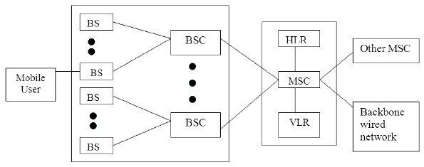

### Summary of Mobile Generations

| **Generation** | **Technology Used** | **Speed** | **Key Features** |
|--------------|------------------|----------|--------------|
| **1G** | AMPS (Analog) | 2.4 kbps | Voice calls, poor quality, no data |
| **2G** | GSM & CDMA | 144 kbps | Digital voice, SMS, MMS, basic internet |
| **2.5G** | GPRS | 64 – 144 kbps | Always-on internet, emails, camera phones |
| **2.75G** | EDGE | Up to 384 kbps | Faster browsing, video streaming |
| **3G** | WCDMA, HSPA | Up to 2 Mbps | Video calls, multimedia, web-based apps |
| **4G** | LTE, WiMAX | 10 Mbps – 1 Gbps | HD streaming, VoLTE, broadband connectivity |
| **5G** | mmWave, MIMO | Up to 20 Gbps | Ultra-fast speeds, IoT, AI-powered networks |

### Mobile Architecture

### Experiment 1 

#### 1. How will user interfaces evolve beyond touch and voice? Could thought-based interaction become a reality? What role might augmented reality play in the future of mobile computing interfaces?

**Thought-Based Interaction** includes Brain-Computer Interfaces (BCIs), which are a promising area of research. Advances in neural decoding and wearable EEG devices suggest that thought-based interactions could become a reality, allowing users to control devices directly with their thoughts. Early applications might include accessibility tools for people with disabilities, gaming, and hands-free control in AR/VR environments.

**Augmented Reality (AR)** could revolutionize interfaces by overlaying contextual information onto the real world. With AR glasses and contact lenses, mobile computing might seamlessly blend physical and digital spaces, enabling hands-free interactions, holographic displays, and real-time guidance for tasks.

---

#### 2. Could we develop a truly decentralized mobile network that operates without any central infrastructure?

A fully decentralized mobile network is conceivable using technologies like:

- **Mesh Networking**: Devices communicate directly with each other, forming a peer-to-peer network without relying on centralized infrastructure.
- **Blockchain**: Securely manage identity, transactions, and bandwidth sharing in a decentralized system.
- **Edge Computing**: Offload processing to local devices or micro-data centers, reducing dependence on centralized servers.

---

#### 3. How could mobile networks be designed to remain functional during major disasters or in extreme environments like underwater or in space?

### **Mobile Networks for Extreme Conditions**
- **Disaster Scenarios**: Networks like FirstNet and mesh-based systems can provide emergency communication during disasters. Deployable base stations and satellite uplinks are critical.
- **Underwater Communication**: Acoustic and optical communication technologies are being developed for underwater mobile networks, albeit with limited range and speed compared to terrestrial systems.
- **Space Communication**: Inter-satellite communication networks (ISL) and high-throughput satellites like Starlink can create reliable networks in space.

---

#### 4. How might 6G technology evolve beyond 5G, and what new applications could emerge from its potential capabilities?

Beyond 5G, **6G** aims to deliver terabit-level speeds, ultra-low latency (<1ms), and high energy efficiency. 6G could offer speeds up to 100 times faster than 5G.

##### **Features and Potential Applications:**
- **Holographic communications** for immersive telepresence.
- **High-precision IoT** for smart cities and autonomous systems.
- **Real-time, AI-driven decision-making** in sectors like healthcare and finance.
- **Advanced AR/VR experiences** with tactile feedback and ultra-high-resolution visuals.

---

#### 5. What are the potential implications of mobile computing on personal privacy, and how can we balance convenience with security in future mobile technologies?

##### **Implications:**
Increased data collection by mobile devices raises concerns about surveillance, misuse of personal information, and identity theft.

##### **Solutions:**
- **Privacy-by-Design**: Embedding privacy principles into technology development.
- **Decentralized Identity Systems**: Users retain control over their digital identities.
- **Encryption**: End-to-end encryption for all communications and data storage.
- **Regulation and Transparency**: Stronger data protection laws and transparent policies on data usage.
- **User Education**: Empower users with tools and knowledge to manage their data and privacy settings effectively.

---

### Network architecture

Questions of Curiosity:
1.	Virtualized Networks and Cloud-Native Architectures: With virtualization and cloud-native architectures, components like the Base Station Controller (BSC) and Mobile Switching Center (MSC) could be moved to the cloud, offering more flexibility, scalability, and easier management of resources without the need for dedicated physical hardware.
2.	Artificial Intelligence Integration: AI could be integrated into these components to predict traffic patterns, optimize resource allocation, automate network management, and improve decision-making, leading to more efficient and responsive network operations.
3.	Support for Emerging Technologies: To support IoT and machine-to-machine communication, these components will evolve to handle massive device connections, low-latency communication, and efficient data routing, ensuring that networks can manage a higher volume of devices and more diverse traffic.
4.	Security Challenges: The distributed nature of these components increases vulnerability to cyberattacks and data breaches. Future implementations could address this by incorporating advanced encryption, real-time monitoring, and decentralized security protocols to ensure data integrity and network protection.

### **📡 Cellular Architecture**  
The **cellular network** is structured in a **hierarchical way** to provide **efficient communication** across large geographical areas.  

🔹 **Key Components:**  
✅ **Mobile Device (User Equipment)** – Phones, tablets, or IoT devices.  
✅ **Base Transceiver Station (BTS)** – Handles wireless communication with mobile devices.  
✅ **Base Station Controller (BSC)** – Manages multiple BTS and assigns frequencies.  
✅ **Mobile Switching Center (MSC)** – Connects mobile calls and manages handovers.  
✅ **Public Switched Telephone Network (PSTN)** – Traditional wired telephone network.  
✅ **Packet Data Network (Internet)** – Allows mobile data access and browsing.  
✅ **Cell Towers** – Divides the service area into **small cells** to provide coverage.  

---

### Mode of Communications

---

### Questions of Curiosity

#### 1. Factors Affecting Call Blocking Probability
Call blocking probability (CBP) depends on network load, resource availability, user density, traffic patterns, call setup efficiency, and handover management. High congestion, inadequate spectrum, and poor mobility handling increase CBP, especially in urban areas.

#### 2. Impact of Network Slicing on CBP
Network slicing optimizes resource allocation by creating virtual networks for different use cases. It ensures priority for critical services, enhances QoS, and isolates traffic, reducing congestion and minimizing call blocking.

#### 3. Industry Benchmarks for Call Blocking
Industry standards, such as ITU and 3GPP, recommend CBP levels below 2% for quality service, with 4G networks aiming for ~1%. Newer technologies like 5G set even lower targets to ensure high reliability and low latency.

#### 4. Geographical Influence on CBP
Urban areas experience high CBP due to user density, while rural areas suffer from inadequate infrastructure. Factors like peak-hour traffic, signal obstructions, and sparse cell coverage also impact call blocking rates.

#### 5. Strategies to Reduce CBP
Minimization strategies include:
- **Cell Load Balancing:** Redistributes traffic to avoid congestion.
- **Advanced Technologies:** Carrier aggregation, MIMO, and small cells improve spectrum efficiency.
- **Alternative Networks:** Wi-Fi/5G offloading reduces macro network strain.
- **AI-Driven Optimization:** Predictive resource management mitigates congestion proactively.

---

#### 6. Hidden Node Problem and Avoidance Strategies

##### What are the ways in which hidden node problems are avoided?
- **RTS/CTS Mechanism:** The Request To Send/Clear To Send (RTS/CTS) protocol helps prevent collisions by coordinating node transmissions.
- **Increasing Transmission Power:** Extending node communication range can reduce hidden node occurrences.
- **Using Omnidirectional Antennas:** Ensures better connectivity among nodes.
- **Node Relocation:** Physically repositioning nodes enhances communication.
- **Protocol Enhancements:** Polling and token-passing strategies improve medium access management.

##### What is the exposed node problem? How can you avoid this?
- **Definition:** The exposed node problem occurs when a node refrains from sending packets due to perceived interference, even when transmission is possible.
- **Avoidance Strategies:**
  - **Carrier Sense Multiple Access (CSMA):** Helps avoid unnecessary transmission blocking.
  - **RTS/CTS Mechanism:** Coordinates transmissions to minimize interference.

##### How does the hidden node problem impact different types of network traffic?
- **Real-time Video Traffic:** Sensitive to delays and packet loss, leading to degraded quality.
- **File Transfer Traffic:** Collisions cause retransmissions, slowing down transfer rates.

##### What role does transmission power control play in mitigating hidden node problems?
- Adjusting power levels helps nodes detect each other, reducing hidden node occurrences while managing interference.

##### How do different wireless standards (802.11a/b/g/n/ac) handle the hidden node problem differently?

| Standard  | Handling Method |
|-----------|----------------|
| 802.11a   | Uses RTS/CTS; limited effectiveness due to shorter range. |
| 802.11b   | RTS/CTS implementation; better range but still vulnerable. |
| 802.11g   | RTS/CTS support with backward compatibility; performance varies. |
| 802.11n   | MIMO technology enhances range and mitigates hidden node issues. |
| 802.11ac  | Beamforming and MIMO optimize signal paths, reducing problems. |

#### 1. If we modified the simulation to include bidirectional traffic (where wireless nodes communicate with each other instead of just with Node 1), how would this affect network congestion and overall performance? Propose a test setup to compare unidirectional vs bidirectional communication patterns with the same number of nodes.
**Effect:** Bidirectional traffic would increase network congestion due to the added communication paths between nodes, leading to higher contention for bandwidth. It could also introduce delays due to more frequent collisions or retransmissions.

**Test Setup:** Compare unidirectional vs. bidirectional traffic with the same number of nodes, measuring throughput, delay, and packet loss for both configurations. Use the same traffic load and node density in both setups to ensure a fair comparison.

#### 2. How would implementing different packet sizes in the application properties affect network performance across the varying number of nodes? Design a test scenario to compare the impact of small (256 bytes) versus large (1500 bytes) packet sizes on throughput and delay.

**Effect:** Larger packet sizes (1500 bytes) would typically result in higher throughput but could cause longer delays due to increased transmission time. Smaller packets (256 bytes) result in lower throughput but might offer better responsiveness with reduced latency.

**Test Scenario:** Set up two scenarios with varying packet sizes: one with 256-byte packets and the other with 1500-byte packets. Measure throughput and delay while increasing the number of nodes to observe the impact of packet size on network performance.

#### 3. What impact would environmental factors (like walls, interference from other devices, or distance between nodes) have on the network performance if we had enabled path loss in the wireless link properties? How does this relate to real-world implementations?

**Effect:** Environmental factors like walls, interference, or distance can significantly affect signal strength, leading to higher packet loss and reduced throughput. Path loss models simulate this by weakening the signal based on distance and obstacles.

**Real-world Relation:** This mimics real-world wireless networks, where physical obstructions and interference reduce communication quality and range, thus affecting performance (e.g., in offices, homes, or urban areas).

#### 4. Why was TCP disabled in the transport layer for this experiment? How would the results differ if TCP was enabled, and what additional network characteristics would we be able to observe?

**Reason for Disablement:** TCP was likely disabled to focus on the raw performance of the network layer without the influence of transport layer reliability (e.g., retransmissions, congestion control).

**Effect of Enabling TCP:** If TCP were enabled, we would see added overhead due to retransmissions and flow control, possibly lowering throughput but improving reliability and reducing packet loss. We could also observe network congestion more clearly.

#### 5. If we enable path loss in wireless link properties, how would it affect the number of successful transmissions?

**Impact:** Path loss would result in fewer successful transmissions as the signal strength diminishes with distance and obstacles. This would likely increase packet loss and require more retransmissions, reducing overall network efficiency.

### Network Performance Analysis

#### 1. Effect of Bidirectional Traffic on Network Congestion and Performance

Effect:
Bidirectional traffic would increase network congestion due to the added communication paths between nodes, leading to higher contention for bandwidth. It could also introduce delays due to more frequent collisions or retransmissions.

Test Setup:
Compare unidirectional vs. bidirectional traffic with the same number of nodes, measuring throughput, delay, and packet loss for both configurations. Use the same traffic load and node density in both setups to ensure a fair comparison.

#### 2. Impact of Different Packet Sizes on Network Performance

Effect:
Larger packet sizes (1500 bytes) would typically result in higher throughput but could cause longer delays due to increased transmission time. Smaller packets (256 bytes) result in lower throughput but might offer better responsiveness with reduced latency.

Test Scenario:
Set up two scenarios with varying packet sizes: one with 256-byte packets and the other with 1500-byte packets. Measure throughput and delay while increasing the number of nodes to observe the impact of packet size on network performance.

#### 3. Impact of Environmental Factors with Path Loss Enabled

Effect:
Environmental factors like walls, interference, or distance can significantly affect signal strength, leading to higher packet loss and reduced throughput. Path loss models simulate this by weakening the signal based on distance and obstacles.

Real-world Relation:
This mimics real-world wireless networks, where physical obstructions and interference reduce communication quality and range, thus affecting performance (e.g., in offices, homes, or urban areas).

#### 4. Disabling TCP in the Transport Layer

Reason for Disablement:
TCP was likely disabled to focus on the raw performance of the network layer without the influence of transport layer reliability (e.g., retransmissions, congestion control).

Effect of Enabling TCP:
If TCP were enabled, we would see added overhead due to retransmissions and flow control, possibly lowering throughput but improving reliability and reducing packet loss. We could also observe network congestion more clearly.

#### 5. Effect of Path Loss on Successful Transmissions

Impact:
Path loss would result in fewer successful transmissions as the signal strength diminishes with distance and obstacles. This would likely increase packet loss and require more retransmissions, reducing overall network efficiency.

