## Unit 1 

## **Mobile Computing**  

### **What is Mobile Computing?**  
Mobile computing is a technology that enables the **wireless transmission** of **data, voice, and video** through mobile devices **without relying on fixed physical connections**.  

---

### **Main Components of Mobile Computing**  

✅ **Mobile Communication**  
- Involves **protocols, services, bandwidth, and portals** that enable seamless connectivity.  
- Supports **wireless communication** over **Wi-Fi, Cellular Networks (3G, 4G, 5G), and Bluetooth**.  

✅ **Mobile Hardware**  
- Includes **portable devices** that access mobility services:  
  - **Smartphones** 📱  
  - **Tablets**  
  - **Laptops**  
  - **Personal Digital Assistants (PDAs)**  
  - **Wearable Devices** ⌚  

✅ **Mobile Software**  
- **Operating systems and applications** that run on mobile devices.  
- Examples: **Android, iOS, Windows Mobile, Mobile Web Browsers, and Apps**.  
- Acts as the **engine** that powers mobile functionalities.  

---

### **Applications of Mobile Computing**  

✅ **Web & Internet Access** – Enables browsing, cloud computing, and real-time communication.  
✅ **Global Positioning System (GPS)** – Provides navigation, tracking, and geolocation services.  
✅ **Emergency Services** – Supports disaster response, medical alerts, and real-time rescue coordination.  
✅ **Entertainment Services** – Powers mobile gaming, streaming platforms, and digital media.  
✅ **Educational Services** – Supports **e-learning, mobile classrooms, and virtual collaboration**.  

## **Evolution of Mobile Computing**  

The evolution of **mobile generations (G)** marks advancements in **speed, technology, frequency, data capacity, and latency**, revolutionizing communication and connectivity.  

---

### **📡 First Generation (1G) – Analog Communication**  
📅 **Introduced:** 1980s – 1990s  
📌 **Technology Used:** **AMPS (Advanced Mobile Phone System)**, based on **FDMA**  
⚡ **Speed:** **2.4 kbps**  

✅ **Features:**  
- Allowed **voice calls** but limited to one country.  
- Used **analog signals**, leading to **poor voice quality** and frequent call drops.  
- **Weak battery life** and **limited network capacity**.  
- **No data services**, only voice communication.  

---

### **📲 Second Generation (2G) – Digital Communication**  
📅 **Introduced:** 1990s  
📌 **Technology Used:** **GSM & CDMA**  
⚡ **Speed:** **Up to 144 kbps**  

✅ **Features:**  
- **Digital signals** replaced analog, improving **voice clarity**.  
- Introduced **SMS & MMS** for text and picture messaging.  
- Enabled **conference calling, call hold, and international roaming**.  
- Used **circuit-switched and packet-switched networks**.  
- Introduced **GPRS (General Packet Radio Service)**, achieving speeds of **50 kbps to 1 Mbps**.  

---

### **📶 Transition from 2G to 3G: 2.5G & 2.75G**  

#### **2.5G (GPRS – General Packet Radio Service)**  
📌 **Technology Used:** **GSM with GPRS**  
⚡ **Speed:** **64 – 144 kbps**  

✅ **Improvements Over 2G:**  
- Introduced **always-on internet access**.  
- Enabled **email, basic web browsing, and multimedia messaging (MMS)**.  
- Used **packet-switched data**, improving efficiency.  
- **Lower latency** than 2G.  
- Introduction of **camera phones**.  

#### **2.75G (EDGE – Enhanced Data rates for GSM Evolution)**  
📌 **Technology Used:** **GSM with EDGE (Enhanced GPRS)**  
⚡ **Speed:** **Up to 384 kbps**  

✅ **Enhancements Over 2.5G:**  
- **Faster data transmission**, enabling **video streaming and online gaming**.  
- **More efficient spectrum usage**, improving network performance.  
- Served as a **stepping stone to 3G**, enhancing **mobile internet and multimedia communication**.  

🚀 **2.5G and 2.75G bridged the gap between traditional mobile calling and the era of high-speed mobile internet!**  

---

### **📡 Third Generation (3G) – High-Speed Mobile Data**  
📅 **Introduced:** 2000s  
📌 **Technology Used:** **WCDMA, HSPA (High-Speed Packet Access)**  
⚡ **Speed:** **Up to 2 Mbps**  

✅ **Features:**  
- Enabled **web browsing, email, video downloads, and picture sharing**.  
- Provided **support for multimedia applications**, including **video calling**.  
- Increased **bandwidth and data transfer rates** for improved web-based applications.  
- **Improved voice clarity and reduced latency** compared to 2G.  

---

### **⚡ Fourth Generation (4G) – High-Speed Broadband Connectivity**  
📅 **Introduced:** 2010s  
📌 **Technology Used:** **LTE (Long-Term Evolution), WiMAX**  
⚡ **Speed:** **10 Mbps – 1 Gbps**  

✅ **Features:**  
- **Ultra-fast data speeds** with **peak downloads of 100 Mbps**.  
- Supported **high-quality streaming** for HD video and VoIP (Voice over IP).  
- Introduced **IP-based telephony (VoLTE)** for improved call quality.  
- **Combination of Wi-Fi and WiMAX** for broader coverage.  
- **Enhanced security and reliability** in mobile communication.  

---

### **📡 Fifth Generation (5G) – The Future of Mobile Connectivity**  
📅 **Introduced:** 2020s  
📌 **Technology Used:** **mmWave, Massive MIMO, Network Slicing**  
⚡ **Speed:** **Up to 20 Gbps**  

✅ **Key Advancements Over 4G:**  
- **Higher Data Rates** – Up to **20 Gbps** for ultra-fast downloads and real-time communication.  
- **Lower Latency** – **Reduced response time**, essential for **real-time gaming, augmented reality (AR), and virtual reality (VR)**.  
- **Increased Network Capacity** – Supports **massive IoT (Internet of Things) connections**.  
- **Improved Reliability** – **Network slicing** allows dedicated networks for specific applications.  

---

📌 **Summary of Mobile Generations**  

| **Generation** | **Technology Used** | **Speed** | **Key Features** |
|--------------|------------------|----------|--------------|
| **1G** | AMPS (Analog) | 2.4 kbps | Voice calls, poor quality, no data |
| **2G** | GSM & CDMA | 144 kbps | Digital voice, SMS, MMS, basic internet |
| **2.5G** | GPRS | 64 – 144 kbps | Always-on internet, emails, camera phones |
| **2.75G** | EDGE | Up to 384 kbps | Faster browsing, video streaming |
| **3G** | WCDMA, HSPA | Up to 2 Mbps | Video calls, multimedia, web-based apps |
| **4G** | LTE, WiMAX | 10 Mbps – 1 Gbps | HD streaming, VoLTE, broadband connectivity |
| **5G** | mmWave, MIMO | Up to 20 Gbps | Ultra-fast speeds, IoT, AI-powered networks |

---

### **📡 Cellular Architecture**  
The **cellular network** is structured in a **hierarchical way** to provide **efficient communication** across large geographical areas.  

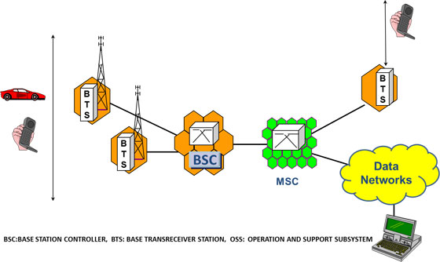
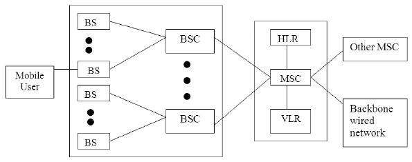

🔹 **Key Components:**  
✅ **Mobile Device (User Equipment)** – Phones, tablets, or IoT devices.  
✅ **Base Transceiver Station (BTS)** – Handles wireless communication with mobile devices.  
✅ **Base Station Controller (BSC)** – Manages multiple BTS and assigns frequencies.  
✅ **Mobile Switching Center (MSC)** – Connects mobile calls and manages handovers.  
✅ **Public Switched Telephone Network (PSTN)** – Traditional wired telephone network.  
✅ **Packet Data Network (Internet)** – Allows mobile data access and browsing.  
✅ **Cell Towers** – Divides the service area into **small cells** to provide coverage.  

---

!!! Note 
    Mode of Communications

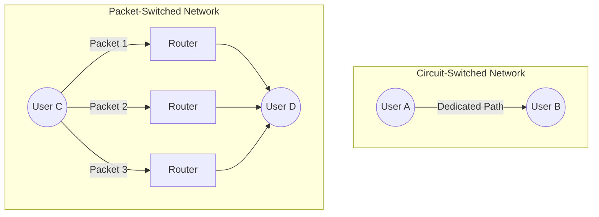

---

### **Mobile Computing Architecture**  

Mobile computing architecture ensures seamless communication, **data management, and user interaction**, making applications efficient and scalable.  

---

### **📍 Location-Based Services (LBS)**  

✅ **Location-Aware Services**  
- Identify available services like **printers, fax machines, phones, and servers** in the local environment.  

✅ **Follow-On Services**  
- **Automatic call forwarding** and **workspace transmission** to the user’s current location.  

✅ **Information Services**  
- **Push:** Automatic alerts (e.g., **special offers** in a supermarket).  
- **Pull:** User-requested data (e.g., **where can I find my favorite pastry?**).  

✅ **Support Services**  
- Maintains **cache, session state, and intermediate results**, allowing smooth mobility.  

✅ **Privacy Management**  
- Controls **who has access** to location information.  

---

## **Three-Tier Mobile Computing Architecture**  

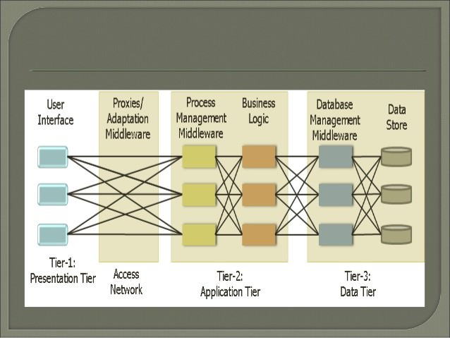

---

### **🛠 Breakdown of the Three-Tier Architecture**  

✅ **📲 Tier-1: Presentation Layer (User Interface)**  
- Where users interact with the mobile app.  
- Handles **buttons, menus, forms, and screens**.  
- Supports **multiple users simultaneously**.  

✅ **🌐 Connection Layer (Access Network)**  
- Routes traffic between **user devices and the backend system**.  
- Adapts to **different devices and network conditions**.  
- Ensures **efficient data transmission** even if one route fails.  

✅ **⚙️ Tier-2: Application Layer**  
- **Process Management** – Organizes tasks and workflows (e.g., **food ordering steps**).  
- **Business Logic** – Enforces rules and decision-making (e.g., **price calculations, discounts**).  

✅ **💾 Tier-3: Data Layer**  
- **Database Management** – Organizes data storage and retrieval (like a **librarian**).  
- **Data Store** – The actual storage where information is kept (like a **bookshelf**).  

---

### **📌 Why This Design?**  

✅ **Scalability:** More users can be handled by **expanding any layer**.  
✅ **Reliability:** If one component fails, others **continue functioning**.  
✅ **Flexibility:** Different layers can be updated or fixed **independently**.  
✅ **Adaptability:** Works well on **various devices and network conditions**.  

---

### **📍 Real-World Analogy – A Restaurant Setup 🍽️**  

| **Layer**  | **Restaurant Example**  |
|------------|------------------------|
| **Presentation Tier** | The **dining area** where customers interact with waiters. |
| **Access Network** | The **waiters** who take orders to the kitchen. |
| **Application Tier** | The **kitchen** where food is prepared based on orders. |
| **Data Tier** | The **pantry** where ingredients are stored. |

## Unit 2 

#### Concept of Multiplexing
Multiplexing is a key technique in communication systems that allows multiple users to share a single medium with minimal or no interference.

#### Real-Life Analogy
Highways as a Shared Medium:
- Multiple vehicles (users) travel on the same highway (medium) without interference.
- Space Division Multiplexing (SDM): Cars use separate lanes.
- Time Division Multiplexing (TDM): Cars use the same lane at different times.

### 🛠 Medium Access Control (MAC) Protocols

- ✅ What is MAC?

A sublayer of the Data Link Layer responsible for coordinating transmissions between multiple nodes.

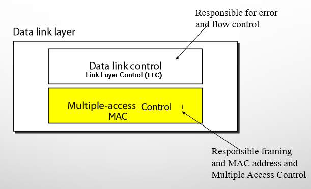

Data link layer divided into two functionality-oriented sublayers

### ⚡ The MAC Problem in Wireless Networks

📌 When multiple nodes transmit simultaneously, their signals collide, causing:

Lost data and wasted bandwidth.

Increased retransmissions, leading to higher delays and lower efficiency.

📌 Solution? Use a protocol to manage access to the shared medium.

✅ What MAC Protocols Must Do:

- Minimize Collisions to optimize bandwidth usage.
- Decide when a station can transmit to avoid conflicts.
- Handle busy channels by deciding whether to wait or retransmit.
- Resolve collisions efficiently to ensure smooth data transmission.

Here is the **Mermaid diagram** representation of **Multiple Access Protocols** along with a brief explanation for each type:  

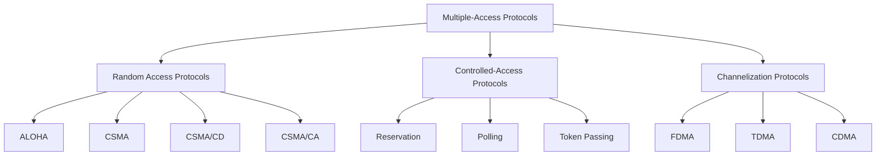

---

✅ **Random Access Protocols** (No fixed control, contention-based):  
- **ALOHA** – Transmits data randomly; high collision rate.  
- **CSMA (Carrier Sense Multiple Access)** – Senses channel before sending data to reduce collisions.  
- **CSMA/CD (Collision Detection)** – Detects collisions and retransmits (used in Ethernet).  
- **CSMA/CA (Collision Avoidance)** – Avoids collisions before transmission (used in Wi-Fi).  

✅ **Controlled-Access Protocols** (Centralized control, avoids collisions):  
- **Reservation** – Nodes reserve slots before transmission.  
- **Polling** – Central controller decides which node transmits.  
- **Token Passing** – A token circulates, granting transmission rights.  

✅ **Channelization Protocols** (Divide channel into separate logical paths):  
- **FDMA (Frequency Division Multiple Access)** – Assigns different frequencies to users.  
- **TDMA (Time Division Multiple Access)** – Allocates time slots to users.  
- **CDMA (Code Division Multiple Access)** – Uses unique codes for simultaneous transmissions.  

### **Medium Access in Wireline vs. Wireless Networks**  

### **📡 Medium Access in Wireline Networks (CSMA/CD)**  

✅ **Assumptions:**  
- **Signal strength remains constant** across the wire.  
- **Same signal strength** can be assumed throughout if the wire length is within standard limits.  
- **Collisions can be detected** by any node listening to the wire.  

✅ **CSMA/CD (Carrier Sense Multiple Access with Collision Detection) Operation:**  
1. **Carrier Sense** – Listen to the wire; if free, send data.  
2. **Collision Detection** – If a collision is detected while transmitting, stop immediately and send a **jam signal** to notify all nodes.  

🔹 **Why CSMA/CD Works Well in Wired Networks?**  
- The **signal condition is the same across the medium**.  
- **Collisions are easily detectable**, ensuring efficient retransmission.  

---

### **📶 Medium Access in Wireless Networks (CSMA/CA)**  

✅ **Challenges in Wireless Medium:**  
- **Signal strength varies** due to distance and obstacles.  
- **Attenuation** follows the inverse square law (\( 1/d^2 \)), weakening signals over distance.  
- **Collisions at the receiver cannot be detected** by simply listening to the medium.  

✅ **CSMA/CD Issues in Wireless:**  
1. **Carrier Sense** – The sender may detect an **idle medium**, but the receiver may still experience a **collision**.  
2. **Collision Detection** – The sender cannot always detect a collision at the receiver’s end.  

🔹 **Why CSMA/CD Fails in Wireless?**  
- Wireless nodes have **different perspectives of the medium**.  
- The **hidden terminal problem** causes undetected collisions.  
- Instead, wireless networks use **CSMA/CA (Collision Avoidance)** to **prevent collisions before they happen**.  

### **Wireless Medium Access Problems**  

Wireless networks face unique challenges due to signal interference, attenuation, and variable reception.  

---

### **Hidden Terminal Problem**  

**Scenario:**  
- A and C cannot hear each other but are both within B’s range.  
- A starts transmitting to B.  
- C senses the medium as free (since it cannot hear A) and starts transmitting to B at the same time.  
- A collision occurs at B, but neither A nor C detects it.  

**Cause:**  
- Other senders are hidden from the current sender, leading to undetected collisions.  

**Solution:**  
- The RTS/CTS (Request to Send / Clear to Send) mechanism helps avoid hidden terminal issues by coordinating access.  

---

### **Exposed Terminal Problem**  

**Scenario:**  
- B is transmitting to A.  
- C senses the medium as busy because B is transmitting.  
- However, C could have transmitted to D without causing a collision.  
- C unnecessarily defers its transmission, reducing network efficiency.  

**Cause:**  
- The sender mistakenly assumes the medium is in use, leading to wasted transmission opportunities.  

**Solution:**  
- Spatial reuse techniques allow simultaneous non-interfering transmissions.  

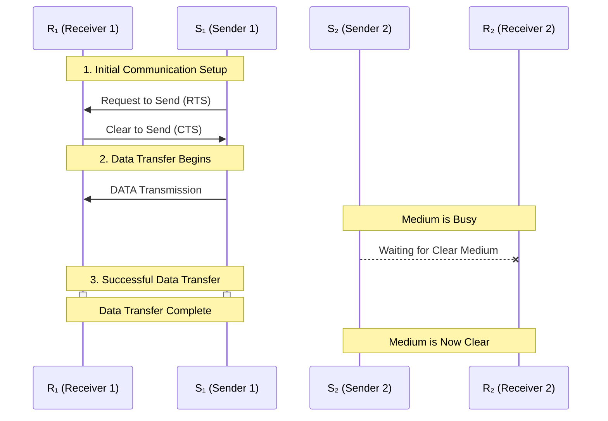

---

### **Near/Far Terminal Problem**  

**Scenario:**  
- B is closer to C than A.  
- B’s stronger signal overpowers A’s weaker signal at C.  
- C cannot receive A’s transmission properly, causing data loss.  

**Cause:**  
- Signal strength imbalance leads to weaker signals being drowned out by stronger ones.  

**Solution:**  
- Power control mechanisms ensure all terminals are detectable at the base station.  
- GSM avoids the problem by using time slots (TDMA), preventing simultaneous transmission.  
- CDMA uses power control so all signals arrive at the receiver with equal strength.  

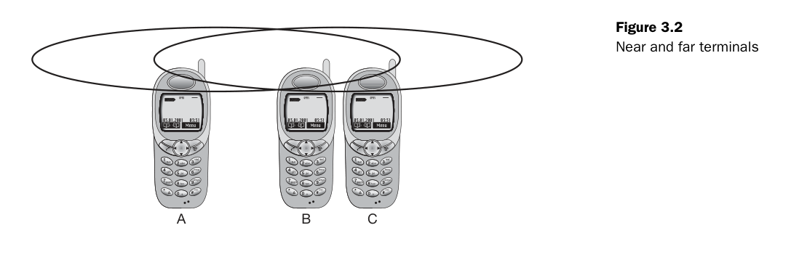

---

# Multiplexing

Wireless channels can be multiplexed in four key dimensions:

1. **Time (t)**: A channel occupies the entire frequency spectrum for a specific time period.
2. **Space (s)**: The same frequency can be reused if base stations are sufficiently separated.
3. **Frequency (f)**: The spectrum is divided into smaller frequency bands.
4. **Code (c)**: Each channel is assigned a unique code for transmission.

## Space Division Multiplexing (SDM)

- SDM involves separating channels in three dimensions: **Code**, **Time**, and **Frequency**.
- The **Space** dimension is represented by circles indicating interference ranges.
- To prevent overlap, channels are mapped to separate spaces (s1 to s3). This creates "guard space" between channels.
- **Channels k1 to k3** are clearly separated, while additional spaces are needed for **channels k4 to k6**.
- This principle is similar to how old analog phone systems provided separate copper wires for each subscriber.

### Example: FM Radio
- Multiple radio stations can use the same frequency without interference, as long as they are separated geographically.

## Key Takeaways:
- **Guard space**: Needed in all multiplexing schemes to prevent interference.
- **SDM**: Effective for localized transmissions like FM radio but not scalable for dense urban areas.

!!! Note
    If several radio stations want to broadcast in the same city - Solution?
    
    SDM not suitable 

    Solution:

    Multiplexing through

    Frequency

    Time
    
    Code

### Frequency Division Multiplexing (FDM)

Frequency Division Multiplexing (FDM) divides the frequency dimension into several non-overlapping frequency bands. Each channel \(k_i\) is assigned a specific frequency band, which can be used continuously by the sender.

- **Guard Spaces**: Essential to prevent frequency band overlap (also called adjacent channel interference).
- **Example**: Used by radio stations within the same region, where each station broadcasts on its own frequency.

---

### How FDM Works

- **Simple Scheme**: The receiver only needs to tune into the specific frequency assigned to the sender.
- **Usage**: Common in systems like radio broadcasting, where multiple stations use different frequencies to avoid interference.

---

### Advantages of FDM

- **Simplicity**: Very simple to implement, as it requires minimal coordination between the sender and receiver.
- **Continuous Use**: Each sender can use its frequency band continuously, making it suitable for applications like radio broadcasting.

---

### Disadvantages of FDM

- **Frequency Resource Waste**: In mobile communication, where communication is short-term, dedicating an entire frequency band to each scenario would waste valuable frequency resources.
- **Limited Flexibility**: The fixed assignment of frequencies to senders makes the system inflexible, limiting the number of senders that can be supported.

---

### Time Division Multiplexing (TDM)

In **Time Division Multiplexing (TDM)**, each channel \(k_i\) is allocated the entire bandwidth for a specific time period. Multiple senders use the same frequency but at different points in time.

- **Guard Space**: Time gaps between transmissions are required to prevent overlap.
- **Co-channel Interference**: Occurs if transmissions overlap in time, similar to cars colliding on a highway.

---

### How TDM Works

- **Precise Synchronization**: Senders must be precisely synchronized, which requires clocks or a method to distribute synchronization signals.
- **Receiver Tuning**: The receiver must not only adjust the frequency but also tune to the exact time slot for receiving data.
- **Flexibility**: TDM is flexible, allowing more time for senders with heavy traffic and less time for those with lighter loads.

---

### Disadvantages of TDM

- **Synchronization Requirement**: All senders need to be synchronized, which adds complexity.
- **Time Slot Coordination**: A receiver must adjust both the frequency and the correct time slot.
- **Co-channel Interference**: If multiple senders choose the same frequency at the same time, interference occurs.

---

### Time + Frequency Division Multiplexing (TDMA + FDMA)

A combination of both **TDM** and **FDM** can be used, where each channel is allotted a specific frequency for a set time period.

- **Guard Spaces**: Required in both time and frequency dimensions.
- **Example**: **GSM** uses TDMA + FDMA for communication between mobile phones and base stations.

---

### Advantages of TDMA + FDMA

- **Robustness**: Provides some protection against frequency selective interference.
- **Protection Against Tapping**: The sequence of frequencies must be known to intercept data, providing some protection.

---

### Disadvantages of TDMA + FDMA

- **Coordination**: Coordination between senders is required for frequency and time management.
- **Interference**: If two senders use the same frequency at the same time, interference occurs. Frequency hopping can minimize this, reducing interference time.

---

### Key Takeaways

- **TDM**: Simple but requires precise synchronization, making it suitable for scenarios where each sender needs to transmit in defined time slots.
- **TDMA + FDMA**: Offers better robustness and protection, but requires complex coordination and management of both time and frequency.

### Code Division Multiplexing (CDM)

**Code Division Multiplexing (CDM)** is a relatively new scheme used in commercial communication systems, having been initially used in military applications due to its built-in security features.

- **Working Principle**: All channels \(k_i\) use the same frequency at the same time. Separation is achieved by assigning each channel its own unique "code."
- **Guard Space**: This is ensured by using codes with a sufficient "distance" in the code space, such as orthogonal codes.

---

### Example: Party with Global Participants

Imagine a party with many participants from different countries who communicate using the same frequency range (approx. 300–6000 Hz):

- **Same Language (SDM)**: If everyone speaks the same language, space division multiplexing (SDM) is required to separate groups.
- **Different Languages (CDM)**: As soon as another language is used, a new code (language) can be tuned into, clearly separating communication in different languages. Other languages appear as background noise.

---

### CDM Security

- **Built-in Security**: If the receiver doesn’t know the code (or language), the signals are received but are essentially useless. This creates a secure channel in a potentially "hostile" environment, much like using a secret language at the party.
  
- **Guard Space**: Codes must be sufficiently distinct (e.g., Swedish and Finnish are orthogonal enough, but Swedish and Norwegian are too similar for separation).

---

### Advantages of CDM

- **Interference Protection**: CDM provides strong protection against interference and tapping. The huge code space allows for easy assignment of unique codes to different senders without significant issues.
  
- **Security**: A secret code can create a secure channel, as only those with the correct code can decode the message.

---

### Disadvantages of CDM

- **Complex Receiver**: The receiver must know the code and be able to decode the signal amidst background noise. This increases the complexity of the receiver.
  
- **Synchronization Requirement**: The receiver must be precisely synchronized with the transmitter for accurate decoding.

- **Power Control**: Signals must reach the receiver with equal strength. If signals are uneven, such as someone speaking too loudly near the receiver, the loud signal could drain the others, making it difficult for the receiver to decode other channels.

---

### Key Takeaways

- **CDM**: Provides secure and interference-resistant communication but requires precise synchronization and power control.
- **Security**: Built-in security by using unique codes (or languages) for each communication channel.
- **Complexity**: High complexity due to the need for the receiver to decode signals accurately and maintain synchronization.

### Comparison of Multiplexing Techniques

| Approach  | SDMA (Space Division) | TDMA (Time Division) | FDMA (Frequency Division) | CDMA (Code Division) |
|-----------|----------------------|----------------------|--------------------------|----------------------|
| **Idea**  | Segment space into cells/sectors | Segment sending time into disjoint time-slots | Divide the frequency band into sub-bands | Spread the spectrum using orthogonal codes |
| **Terminals** | Only one terminal active per cell/sector | All terminals share the same frequency but transmit in time slots | Each terminal has its own dedicated frequency | All terminals can be active simultaneously using unique codes |
| **Signal Separation** | Cell structure with directed antennas | Synchronization in the time domain | Filtering in the frequency domain | Codes and special receivers |
| **Advantages** | Simple, increases capacity per km² | Fully digital, very flexible | Simple, robust, and well-established | Highly flexible, less planning needed, supports soft handover |
| **Disadvantages** | Inflexible, fixed antennas required | Guard space needed, synchronization is complex | Inflexible, limited by available frequencies | Complex receivers, requires precise power control |
| **Comment** | Used in combination with TDMA, FDMA, or CDMA | Standard in fixed networks, often combined with FDMA/SDMA in mobile networks | Often combined with TDMA (frequency hopping patterns) and SDMA (frequency reuse) | Used in 3G systems, requires integration with TDMA/FDMA |

---

## Unit 3 

### Logical Mobility

**Logical Mobility** refers to the ability to transfer software components, code, or computational elements between different systems or devices.

#### Types of Logical Mobility:
- **Software Programs & Applications**: Moving entire applications between devices.
- **Code Segments & Modules**: Transferring scripts or functions dynamically.
- **Objects & Data Structures**: Migrating serialized objects or database entries.
- **Computational Processes**: Shifting active processing tasks to another system.

#### Examples:
- **App Downloads**: Installing an application from an app store.
- **Web Execution**: A browser fetching and executing JavaScript from a server.

---

### Process Migration

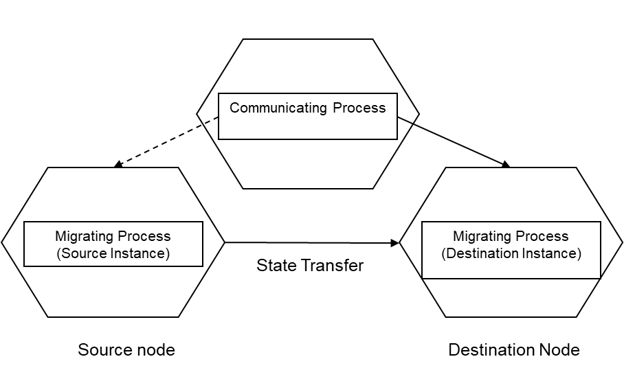

**Process Migration** is the transfer of an executing process from one computing system to another while maintaining its state.

#### Key Aspects of Process Migration:
- **Process = Program Under Execution**
- **State Transfer Includes**:
  - **Address Space**: Memory and allocated resources.
  - **Execution Point**: CPU register contents.
  - **Communication State**: Open files, message channels.
  - **OS-dependent States**: Any system-specific data.

#### Migration Process:
1. **Two Instances Exist**: A source and destination process.
2. **Final Handoff**: The destination instance takes over as the migrated process.
3. **Remote Execution**: A process running on another machine is called a **remote process**.

#### Example:
- Watching a movie on a **smart TV**, then continuing playback on a **tablet** while traveling.

### **Procss Migration**:

### **Step 1: Migration Request Issued**
- A migration request is sent to a remote node.
- After negotiation, the migration is accepted.

#### **Diagram:**
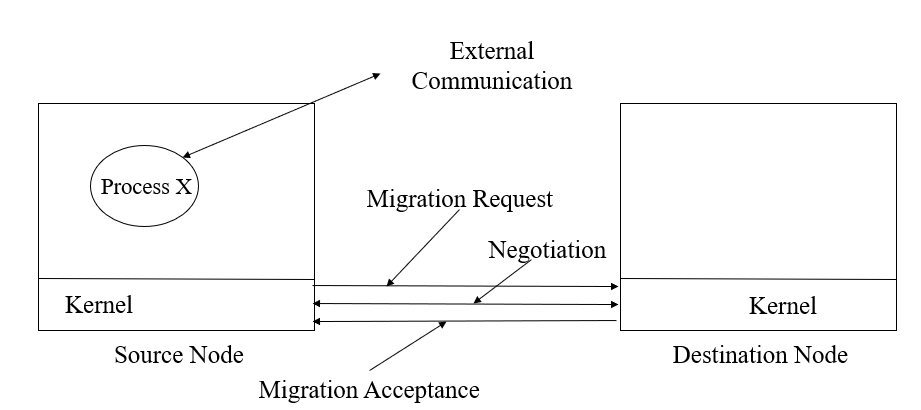

---

### **Step 2: Process Detachment**
- The process is suspended on the source node.
- It is marked as "migrating."
- Communication is temporarily redirected.

#### **Diagram:**

---

### **Step 3: Temporary Communication Redirection**
- Incoming messages are queued.
- Messages are delivered after migration.

#### **Diagram:**

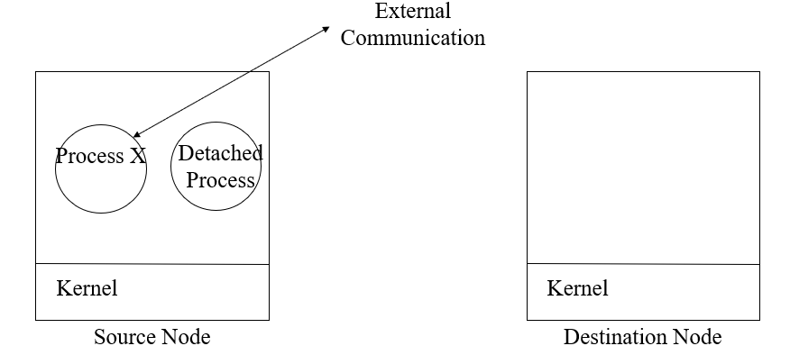

---

### **Step 4: Process State Extraction**
- The process's memory, registers, communication state, and kernel context are extracted.

#### **Diagram:**

---

### **Step 5: Destination Process Instance Created**
- A new process instance is initialized on the remote node.

#### **Diagram:**

---

### **Step 6: State Transfer**
- The extracted state is transferred to the destination node.

#### **Diagram:**

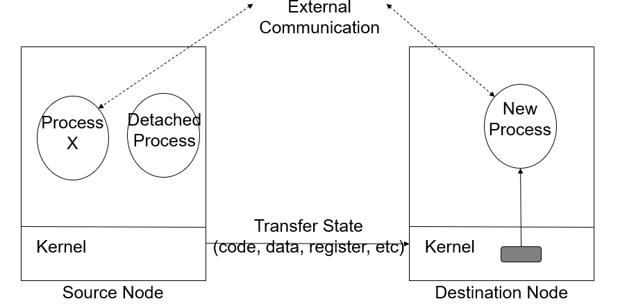

---

### **Step 7: Forwarding References**
- References (e.g., file descriptors, network sockets) are updated to point to the new process instance.

#### **Diagram:**

---

### **Step 8: Process Resumed**
- The new process instance resumes execution on the remote node.

#### **Diagram:**

--- 

### Advantages of Process Migration

1. **Dynamic Load Distribution**  
   - Balances the load by migrating processes from overloaded nodes to less loaded ones.

2. **Fault Resilience**  
   - Ensures continuity by migrating processes from nodes that have partially failed or are at risk of failure.

3. **Improved System Administration**  
   - Facilitates maintenance by moving processes from nodes that are about to be shut down or become unavailable.

4. **Data Access Locality**  
   - Enhances efficiency by migrating processes closer to the data source, especially useful in mobile environments.

5. **Resource Sharing**  
   - Allows access to specialized hardware by migrating a process to a node equipped with the required resources.

6. **Mobile Computing**  
   - Enables users to continue running applications seamlessly as they move between networks or devices.

---

### Applications of Process Migration

- **Parallelizable Applications** – Distributing computational tasks across multiple nodes.
- **Long-running Applications** – Allowing execution across different nodes without interruption.
- **Generic Multiuser Workloads** – Managing distributed workloads effectively.
- **Pre-emptable Applications** – Processes that can be temporarily suspended and resumed elsewhere.
- **Migration-aware Applications** – Applications designed to adapt to migration scenarios.
- **Network & Mobile Computing Applications** – Ensuring service continuity as devices move across networks.

---

### Alternatives to Process Migration

1. **Remote Execution**  
   - Executes code on a remote node instead of migrating the entire process.  
   - **Faster than migration** due to lower data transfer costs.

2. **Cloning**  
   - Creates a copy of the process on a different node using a **remote fork** mechanism.  
   - Unlike migration, **both instances continue running** using distributed shared state.  
   - **Higher complexity** but useful when state inheritance is required.

3. **Mobile Agents**  
   - Uses Java, Tcl/Tk, or other technologies to move objects or scripts dynamically.  
   - Achieved at the **middleware level** using frameworks like:
     - **Common Object Request Broker Architecture (CORBA)**
     - **Distributed Objects**

### 🤖 Mobile Agents

**Mobile Agents** are software entities that autonomously move between computers and continue execution on the destination machine.

- 🏃‍♂️ **Self-driven**: Can function independently, even if the user disconnects from the network.
- 🚀 **Transportable**: They move dynamically across systems.
- 🔄 **Data-Carriers**: Store information and operate without requiring continuous communication.

---

### 🛤️ Types of Mobile Agents

1. **Agents with Pre-defined Path** 🗺️  
   - Follow a specific, predetermined route across nodes.

2. **Agents with Undefined Path (Roamer) 🏞️**  
   - Wander freely across the network, dynamically choosing destinations.

---

### 🧠 Properties of Mobile Agents

A **Mobile Agent** is a software object that exists within an execution environment and possesses these key traits:

#### ✅ **Mandatory Properties**
- 🔄 **Reactive** – Responds to environmental changes.
- 🤖 **Autonomous** – Controls its own actions.
- 🎯 **Goal-Driven** – Works proactively towards objectives.
- ⏳ **Temporally Continuous** – Runs indefinitely.

#### 📡 **Optional Properties**
- 🗣 **Communicative** – Can interact with other agents.
- 🚀 **Mobile** – Can migrate between hosts.
- 📈 **Learning** – Adapts based on past experiences.

---

### 🔄 Life Cycle of Mobile Agents
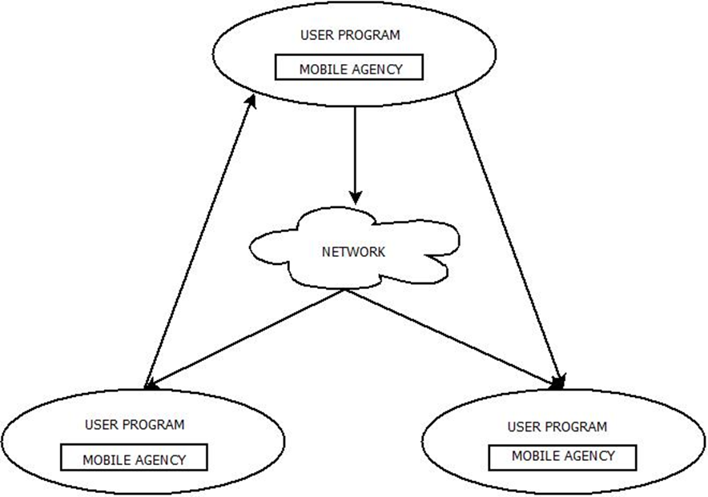

✔️ **Adapts** to both home and foreign environments.  
✔️ **Switches** between nodes as needed.  
✔️ **Focuses** on achieving the final objective.  
✔️ **Operates autonomously** without external intervention.  

---

### 🖥️ Mobile Agent Platforms

- 🛜 **Specialized Servers** interpret agent behavior and handle communication.
- 🚀 **Autonomous Navigation** – Agents can choose and request migration.
- ⚙ **Platform-Independent Execution** – Can run on any machine without pre-installation.
- ☕ **Java-Based Execution** – Uses **Java Virtual Machine (JVM)** to dynamically load code.

🧭 **Types of Mobile Agents**:  
✅ **One-hop Agents** – Migrate to a single destination.  
🌍 **Multi-hop Agents** – Roam across multiple locations dynamically.

---

### 🏗️ Components of a Mobile Agent

A **Mobile Agent** consists of **two key components**:

1. **📜 Code** – Instructions defining the agent’s behavior.
2. **🧠 Execution State** – The agent’s progress and memory.

💡 Unlike regular programs where **code is stored on disk and execution state is in RAM**, mobile agents **carry both together** when migrating!  

**Migration Process**:  
🔹 **Agent moves** → Carries both its **code** & **execution state** → Resumes seamlessly at the new host.

---

### 🌟 Characteristics of Mobile Agents

✔️ **Unique Identity** – Each agent has a distinct presence. 🔍  
✔️ **Aware of Other Agents** – Can detect and interact with other agents. 🤝  
✔️ **Message Handling** – Sends & receives structured messages. ✉️  
✔️ **Host Communication** – Can communicate with its hosting environment. 🏡  
✔️ **Concurrent Execution** – Supports multiple agents running simultaneously. 🔄  

---

#### 
Agent Architecture

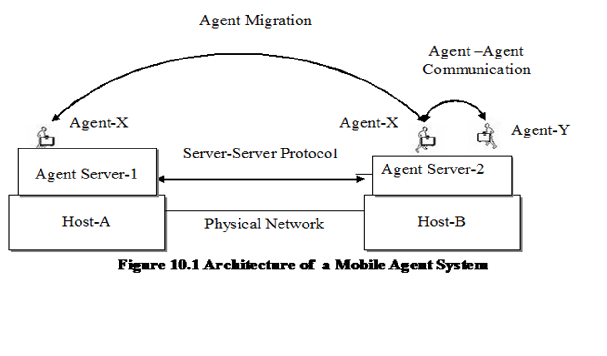

### 🤖 Mobile Agents vs. Process Migration

| Aspect            | 🚀 **Mobile Agents** | 🔄 **Process Migration** |
|------------------|----------------------|---------------------------|
| **Control**      | Autonomous decision-making; agents decide when and where to move. | System-controlled; OS or network manager decides movement. |
| **Intelligence** | Built-in intelligence to adapt behavior. | No built-in intelligence; follows system instructions. |
| **Decision Basis** | Moves based on programmed objectives and current needs. | Moves based on system load and resource availability. |
| **Flexibility**  | Can change destinations dynamically; supports multi-hop movement. | Fixed source-to-destination migration; single-hop only. |
| **State Management** | Carries both **code & state** together as a package. | State must be **captured, transferred, and reconstructed**. |
| **Interaction**  | Can communicate with other agents and systems. | No inter-process communication during migration. |

---

### 🌐 **Client/Server vs. Mobile Agent Architectures**

📡 **Traditional Client/Server Model**  
- Requires continuous communication between **client and server**.  
- Frequent request/response cycles increase **network bandwidth usage**.  

🚀 **Mobile Agent Architecture**  
- Moves **queries/transactions** from client to server, reducing repetitive requests.  
- **Works offline** and syncs results when the system is back online.  
- Handles **intermittent & unreliable networks** effectively.  

---

### ✅ **Requirements for Mobile Agent Systems**

1. **Portability** – Must run on different platforms without modifications. 💻  
2. **Ubiquity** – Should be available across multiple network environments. 🌍  
3. **Network Communication** – Needs efficient mechanisms for sending/receiving data. 📡  
4. **Server Security** – Must prevent unauthorized agent execution on a host. 🔐  
5. **Agent Security** – Protects agents from external threats or modifications. 🛡️  
6. **Resource Accounting** – Tracks resource consumption for optimization. ⚙️  

---

### 📌 Diagram: Mobile Agent vs. Client-Server Communication

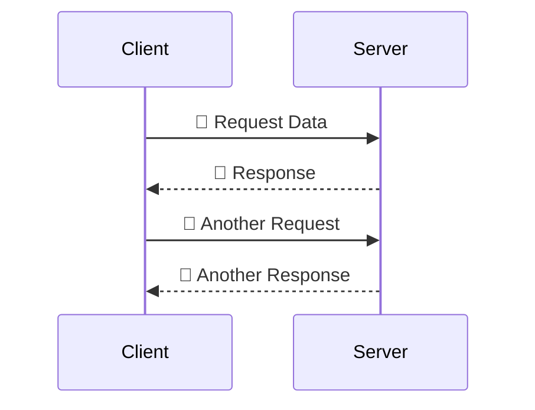

### 🚀 Aglets: Java-Based Mobile Agent Platform

**Aglets** are a **Java-based framework** for mobile agents, designed by **IBM**. They allow objects to **move between hosts** on a network while maintaining their execution state.

---

### 🔄 **How Aglets Work**
- 🏃 An **Aglet** can **pause execution**, move to a remote host, and **resume execution**.
- 📦 When an **Aglet moves**, it **carries its code and object states** to the new host.
- 🌍 Multiple **Aglets** can run on a single node within different contexts.

---
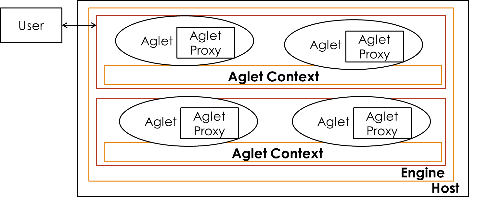

### 🏢 **Aglet Context**
An **Aglet Context** is the **workspace** where Aglets operate.

- 🏠 **Stationary Object** – Provides a **uniform execution environment**.
- 🌐 **Hosts Multiple Contexts** – A single network node can run multiple **contexts**.

#### 🛡 **Aglet Proxy**
A **proxy** is a **representative of an Aglet** that:
- **Shields** the Aglet from direct access to its public methods.
- **Hides its real location**, ensuring **location transparency**.

---

### 🔄 **Aglet Life Cycle**

| 🏗️ **Stage**        | 🔍 **Description** |
|---------------------|------------------|
| **Creation** ✨   | Aglet is **created** within a context, assigned an identifier, and initialized. Execution starts immediately. |
| **Cloning** 🧬   | Produces an **identical copy** of the Aglet in the same context, with a new identifier. |
| **Dispatching** 🚀 | Moves the Aglet **to another context**, removing it from the current one. **Execution restarts** at the destination. |
| **Retraction** 🔄  | Pulls the Aglet **back to its original context** after being dispatched. |
| **Deactivation** ⏸️ | Temporarily removes an Aglet from execution and stores it in **secondary storage**. |
| **Activation** ▶️ | Restores a **deactivated Aglet** back into a context. |
| **Disposal** 🗑️ | **Stops execution** and **removes** the Aglet from the context permanently. |

---

### 📡 Aglet Communication

**Aglets** use **messages and events** to communicate and interact within their environment.

- **📬 Message Communication**  
  - 🔄 **Synchronous** – Requires an immediate response.  
  - 📩 **Asynchronous** – Messages are sent without waiting for an immediate reply.  

- **📢 Event-Driven Communication**  
  - 🔄 Used for **reactive** or **proactive** agents.  
  - 📈 Example: An Aglet can listen for a **stock price change event** and act accordingly.

- **🛠 Aglet API** (Java-based) includes:  
  - `Aglet` – Core agent class.  
  - `Aglet Proxy` – Ensures security and location transparency.  
  - `Aglet Context` – Execution environment for Aglets.  
  - `Message` – Communication mechanism.

---

### 🏛️ **Applications of Aglets**
- 🛒 **E-commerce** – Mobile shopping assistants.  
- 🌍 **E-marketplaces** – Automated price comparison & negotiation.  
- ✈️ **Travel & Tourism** – Dynamic air-ticket booking & package tour planning.  

---

### 🔄 **Aglet Event Model**
Aglets operate in an **event-driven programming model**.  
There are **three types of listeners** that handle different events:

| 🎧 **Listener Type**       | 📌 **Function** |
|--------------------------|-------------------------------------------|
| **Clone Listener** 🧬  | Handles events **before, during, and after** an Aglet is cloned. |
| **Mobility Listener** 🚀  | Triggers actions **before dispatching, during movement, and upon arrival** at a new context. |
| **Persistence Listener** ⏳  | Manages events **before deactivation and after activation** of an Aglet. |

---

### 📌 **Diagram: Aglet Event Flow**
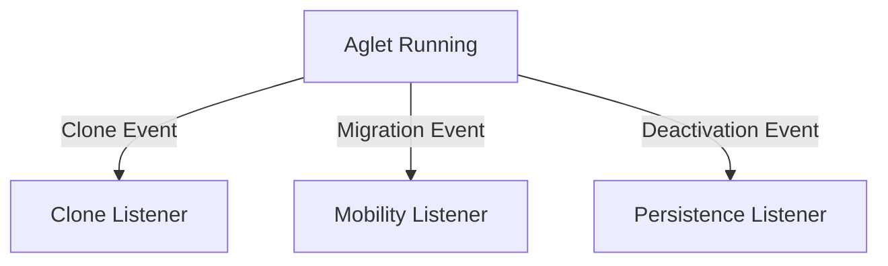

