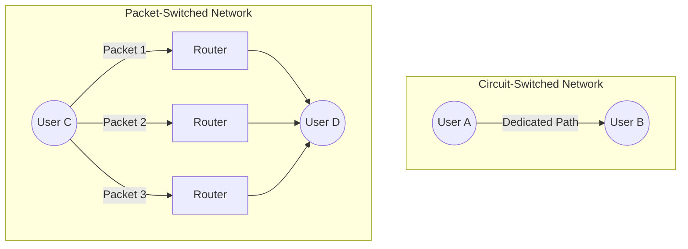

    <a href="https://rishikeshvadodaria.github.io/mkdocs/mobile-computing-unit 1/" class="nav-item mobile-computing" data-title="Unit 1">Unit 1</a>
    <a href="https://rishikeshvadodaria.github.io/mkdocs/mobile-computing-unit 2/" class="nav-item mobile-computing" data-title="Unit 2">Unit 2</a>
    <a href="https://rishikeshvadodaria.github.io/mkdocs/mobile-computing-unit 3/" class="nav-item mobile-computing" data-title="Unit 3">Unit 3</a>
    <a href="https://rishikeshvadodaria.github.io/mkdocs/mobile-computing-unit 4/" class="nav-item mobile-computing" data-title="Unit 4">Unit 4</a>
    <a href="https://rishikeshvadodaria.github.io/mkdocs/mobile-computing-unit 5/" class="nav-item mobile-computing" data-title="Unit 5">Unit 5</a>
    <a href="https://rishikeshvadodaria.github.io/mkdocs/mobile-computing-unit 6/" class="nav-item mobile-computing" data-title="Unit 6">Unit 6</a>
    <a href="https://rishikeshvadodaria.github.io/mkdocs/mobile-computing-unit 7/" class="nav-item mobile-computing" data-title="Unit 7">Unit 7</a>
    <a href="https://rishikeshvadodaria.github.io/mkdocs/mobile-computing-unit 8/" class="nav-item mobile-computing" data-title="Unit 8">Unit 8</a>
    <a href="https://rishikeshvadodaria.github.io/mkdocs/mobile-computing-unit 9/" class="nav-item mobile-computing" data-title="Unit 8">Unit 9</a>

## Mobile Computing

### What is Mobile Computing?

Mobile computing is a technology that enables the wireless transmission of data, voice, and video through mobile devices without relying on fixed physical connections.

---

### Main Components of Mobile Computing

- **Mobile Communication**

  - Involves protocols, services, bandwidth, and portals that enable seamless connectivity.
  - Supports wireless communication over Wi-Fi, Cellular Networks (3G, 4G, 5G), and Bluetooth.

- **Mobile Hardware**

  - Includes portable devices that access mobility services:
    - Smartphones
    - Tablets
    - Laptops
    - Personal Digital Assistants (PDAs)
    - Wearable Devices

- **Mobile Software**

  - Operating systems and applications that run on mobile devices.
  - Examples: Android, iOS, Windows Mobile, Mobile Web Browsers, and Apps.
  - Acts as the engine that powers mobile functionalities.

---

### Applications of Mobile Computing

- Web & Internet Access – Enables browsing, cloud computing, and real-time communication.
- Global Positioning System (GPS) – Provides navigation, tracking, and geolocation services.
- Emergency Services – Supports disaster response, medical alerts, and real-time rescue coordination.
- Entertainment Services – Powers mobile gaming, streaming platforms, and digital media.
- Educational Services – Supports e-learning, mobile classrooms, and virtual collaboration.

## Evolution of Mobile Computing

The evolution of mobile generations (G) marks advancements in speed, technology, frequency, data capacity, and latency, revolutionizing communication and connectivity.

---

### First Generation (1G) – Analog Communication

- **Introduced:** 1980s – 1990s

- **Technology Used:** AMPS (Advanced Mobile Phone System), based on FDMA

- **Speed:** 2.4 kbps

- **Features:**

  - Allowed voice calls but limited to one country.
  - Used analog signals, leading to poor voice quality and frequent call drops.
  - Weak battery life and limited network capacity.
  - No data services, only voice communication.

---

### Second Generation (2G) – Digital Communication

- **Introduced:** 1990s

- **Technology Used:** GSM & CDMA

- **Speed:** Up to 144 kbps

- **Features:**

  - Digital signals replaced analog, improving voice clarity.
  - Introduced SMS & MMS for text and picture messaging.
  - Enabled conference calling, call hold, and international roaming.
  - Used circuit-switched and packet-switched networks.
  - Introduced GPRS (General Packet Radio Service), achieving speeds of 50 kbps to 1 Mbps.

---

### Transition from 2G to 3G: 2.5G & 2.75G

#### 2.5G (GPRS – General Packet Radio Service)

- **Technology Used:** GSM with GPRS

- **Speed:** 64 – 144 kbps

- **Improvements Over 2G:**

  - Introduced always-on internet access.
  - Enabled email, basic web browsing, and multimedia messaging (MMS).
  - Used packet-switched data, improving efficiency.
  - Lower latency than 2G.
  - Introduction of camera phones.

#### 2.75G (EDGE – Enhanced Data rates for GSM Evolution)

- **Technology Used:** GSM with EDGE (Enhanced GPRS)

- **Speed:** Up to 384 kbps

- **Enhancements Over 2.5G:**

  - Faster data transmission, enabling video streaming and online gaming.
  - More efficient spectrum usage, improving network performance.
  - Served as a stepping stone to 3G, enhancing mobile internet and multimedia communication.

- 2.5G and 2.75G bridged the gap between traditional mobile calling and the era of high-speed mobile internet.

---

### Third Generation (3G) – High-Speed Mobile Data

- **Introduced:** 2000s

- **Technology Used:** WCDMA, HSPA (High-Speed Packet Access)

- **Speed:** Up to 2 Mbps

- **Features:**

  - Enabled web browsing, email, video downloads, and picture sharing.
  - Provided support for multimedia applications, including video calling.
  - Increased bandwidth and data transfer rates for improved web-based applications.
  - Improved voice clarity and reduced latency compared to 2G.

---

### Fourth Generation (4G) – High-Speed Broadband Connectivity

- **Introduced:** 2010s

- **Technology Used:** LTE (Long-Term Evolution), WiMAX

- **Speed:** 10 Mbps – 1 Gbps

- **Features:**

  - Ultra-fast data speeds with peak downloads of 100 Mbps.
  - Supported high-quality streaming for HD video and VoIP (Voice over IP).
  - Introduced IP-based telephony (VoLTE) for improved call quality.
  - Combination of Wi-Fi and WiMAX for broader coverage.
  - Enhanced security and reliability in mobile communication.

---

### Fifth Generation (5G) – The Future of Mobile Connectivity

- **Introduced:** 2020s

- **Technology Used:** mmWave, Massive MIMO, Network Slicing

- **Speed:** Up to 20 Gbps

- **Key Advancements Over 4G:**

  - Higher Data Rates – Up to 20 Gbps for ultra-fast downloads and real-time communication.
  - Lower Latency – Reduced response time, essential for real-time gaming, augmented reality (AR), and virtual reality (VR).
  - Increased Network Capacity – Supports massive IoT (Internet of Things) connections.
  - Improved Reliability – Network slicing allows dedicated networks for specific applications.

---

### Summary of Mobile Generations

| Generation | Technology Used | Speed | Key Features |
| --- | --- | --- | --- |
| 1G | AMPS (Analog) | 2.4 kbps | Voice calls, poor quality, no data |
| 2G | GSM & CDMA | 144 kbps | Digital voice, SMS, MMS, basic internet |
| 2.5G | GPRS | 64 – 144 kbps | Always-on internet, emails, camera phones |
| 2.75G | EDGE | Up to 384 kbps | Faster browsing, video streaming |
| 3G | WCDMA, HSPA | Up to 2 Mbps | Video calls, multimedia, web-based apps |
| 4G | LTE, WiMAX | 10 Mbps – 1 Gbps | HD streaming, VoLTE, broadband connectivity |
| 5G | mmWave, MIMO | Up to 20 Gbps | Ultra-fast speeds, IoT, AI-powered networks |

---

### Cellular Architecture

The cellular network is structured in a hierarchical way to provide efficient communication across large geographical areas.

- **Key Components:**
  - Mobile Device (User Equipment) – Phones, tablets, or IoT devices.
  - Base Transceiver Station (BTS) – Handles wireless communication with mobile devices.
  - Base Station Controller (BSC) – Manages multiple BTS and assigns frequencies.
  - Mobile Switching Center (MSC) – Connects mobile calls and manages handovers.
  - Public Switched Telephone Network (PSTN) – Traditional wired telephone network.
  - Packet Data Network (Internet) – Allows mobile data access and browsing.
  - Cell Towers – Divides the service area into small cells to provide coverage.

---

### Note: Mode of Communications

---

### Mobile Computing Architecture

Mobile computing architecture ensures seamless communication, data management, and user interaction, making applications efficient and scalable.

---

### Location-Based Services (LBS)

- **Location-Aware Services**

  - Identify available services like printers, fax machines, phones, and servers in the local environment.

- **Follow-On Services**

  - Automatic call forwarding and workspace transmission to the user’s current location.

- **Information Services**

  - Push: Automatic alerts (e.g., special offers in a supermarket).
  - Pull: User-requested data (e.g., where can I find my favorite pastry?).

- **Support Services**

  - Maintains cache, session state, and intermediate results, allowing smooth mobility.

- **Privacy Management**

  - Controls who has access to location information.

---

## Three-Tier Mobile Computing Architecture

---

### Breakdown of the Three-Tier Architecture

- **Tier-1: Presentation Layer (User Interface)**

  - Where users interact with the mobile app.
  - Handles buttons, menus, forms, and screens.
  - Supports multiple users simultaneously.

- **Connection Layer (Access Network)**

  - Routes traffic between user devices and the backend system.
  - Adapts to different devices and network conditions.
  - Ensures efficient data transmission even if one route fails.

- **Tier-2: Application Layer**

  - Process Management – Organizes tasks and workflows (e.g., food ordering steps).
  - Business Logic – Enforces rules and decision-making (e.g., price calculations, discounts).

- **Tier-3: Data Layer**

  - Database Management – Organizes data storage and retrieval (like a librarian).
  - Data Store – The actual storage where information is kept (like a bookshelf).

---

### Why This Design?

- Scalability: More users can be handled by expanding any layer.
- Reliability: If one component fails, others continue functioning.
- Flexibility: Different layers can be updated or fixed independently.
- Adaptability: Works well on various devices and network conditions.

---

### Real-World Analogy – A Restaurant Setup

| Layer | Restaurant Example |
| --- | --- |
| Presentation Tier | The dining area where customers interact with waiters. |
| Access Network | The waiters who take orders to the kitchen. |
| Application Tier | The kitchen where food is prepared based on orders. |
| Data Tier | The pantry where ingredients are stored. |

