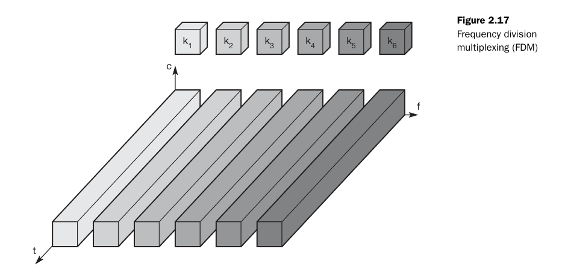
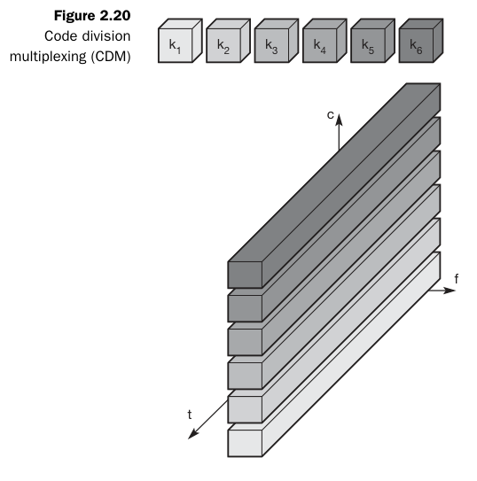

## Unit 2 

### Concept of Multiplexing
Multiplexing is a key technique in communication systems that allows multiple users to share a single medium with minimal or no interference.

### Real-Life Analogy
Highways as a Shared Medium:
- Multiple vehicles (users) travel on the same highway (medium) without interference.
- Space Division Multiplexing (SDM): Cars use separate lanes.
- Time Division Multiplexing (TDM): Cars use the same lane at different times.

### Medium Access Control (MAC) Protocols

#### What is MAC?
A sublayer of the Data Link Layer responsible for coordinating transmissions between multiple nodes.

Data link layer divided into two functionality-oriented sublayers

### The MAC Problem in Wireless Networks

When multiple nodes transmit simultaneously, their signals collide, causing:
- Lost data and wasted bandwidth.
- Increased retransmissions, leading to higher delays and lower efficiency.

Solution: Use a protocol to manage access to the shared medium.

#### What MAC Protocols Must Do:
- Minimize collisions to optimize bandwidth usage.
- Decide when a station can transmit to avoid conflicts.
- Handle busy channels by deciding whether to wait or retransmit.
- Resolve collisions efficiently to ensure smooth data transmission.

### Multiple Access Protocols
Here is the **Mermaid diagram** representation of **Multiple Access Protocols** along with a brief explanation for each type:  

#### Random Access Protocols (No fixed control, contention-based):
- **ALOHA**: Transmits data randomly; high collision rate.
- **CSMA (Carrier Sense Multiple Access)**: Senses channel before sending data to reduce collisions.
- **CSMA/CD (Collision Detection)**: Detects collisions and retransmits (used in Ethernet).
- **CSMA/CA (Collision Avoidance)**: Avoids collisions before transmission (used in Wi-Fi).

#### Controlled-Access Protocols (Centralized control, avoids collisions):
- **Reservation**: Nodes reserve slots before transmission.
- **Polling**: Central controller decides which node transmits.
- **Token Passing**: A token circulates, granting transmission rights.

#### Channelization Protocols (Divide channel into separate logical paths):
- **FDMA (Frequency Division Multiple Access)**: Assigns different frequencies to users.
- **TDMA (Time Division Multiple Access)**: Allocates time slots to users.
- **CDMA (Code Division Multiple Access)**: Uses unique codes for simultaneous transmissions.

### Medium Access in Wireline vs. Wireless Networks

#### Medium Access in Wireline Networks (CSMA/CD)

##### Assumptions:
- Signal strength remains constant across the wire.
- Same signal strength can be assumed throughout if the wire length is within standard limits.
- Collisions can be detected by any node listening to the wire.

##### CSMA/CD (Carrier Sense Multiple Access with Collision Detection) Operation:
1. **Carrier Sense**: Listen to the wire; if free, send data.
2. **Collision Detection**: If a collision is detected while transmitting, stop immediately and send a jam signal to notify all nodes.

##### Why CSMA/CD Works Well in Wired Networks?
- The signal condition is the same across the medium.
- Collisions are easily detectable, ensuring efficient retransmission.

#### Medium Access in Wireless Networks (CSMA/CA)

##### Challenges in Wireless Medium:
- Signal strength varies due to distance and obstacles.
- Attenuation follows the inverse square law (\(1/d^2\)), weakening signals over distance.
- Collisions at the receiver cannot be detected by simply listening to the medium.

##### CSMA/CD Issues in Wireless:
1. **Carrier Sense**: The sender may detect an idle medium, but the receiver may still experience a collision.
2. **Collision Detection**: The sender cannot always detect a collision at the receiver’s end.

##### Why CSMA/CD Fails in Wireless?
- Wireless nodes have different perspectives of the medium.
- The hidden terminal problem causes undetected collisions.
- Instead, wireless networks use CSMA/CA (Collision Avoidance) to prevent collisions before they happen.

### Wireless Medium Access Problems
Wireless networks face unique challenges due to signal interference, attenuation, and variable reception.

#### Hidden Terminal Problem

##### Scenario:
- A and C cannot hear each other but are both within B’s range.
- A starts transmitting to B.
- C senses the medium as free (since it cannot hear A) and starts transmitting to B at the same time.
- A collision occurs at B, but neither A nor C detects it.

##### Cause:
- Other senders are hidden from the current sender, leading to undetected collisions.

##### Solution:
- The RTS/CTS (Request to Send / Clear to Send) mechanism helps avoid hidden terminal issues by coordinating access.

#### Exposed Terminal Problem

##### Scenario:
- B is transmitting to A.
- C senses the medium as busy because B is transmitting.
- However, C could have transmitted to D without causing a collision.
- C unnecessarily defers its transmission, reducing network efficiency.

##### Cause:
- The sender mistakenly assumes the medium is in use, leading to wasted transmission opportunities.

##### Solution:
- Spatial reuse techniques allow simultaneous non-interfering transmissions.

#### Near/Far Terminal Problem

##### Scenario:
- B is closer to C than A.
- B’s stronger signal overpowers A’s weaker signal at C.
- C cannot receive A’s transmission properly, causing data loss.

##### Cause:
- Signal strength imbalance leads to weaker signals being drowned out by stronger ones.

##### Solution:
- Power control mechanisms ensure all terminals are detectable at the base station.
- GSM avoids the problem by using time slots (TDMA), preventing simultaneous transmission.
- CDMA uses power control so all signals arrive at the receiver with equal strength.

### Multiplexing
Wireless channels can be multiplexed in four key dimensions:
1. **Time (t)**: A channel occupies the entire frequency spectrum for a specific time period.
2. **Space (s)**: The same frequency can be reused if base stations are sufficiently separated.
3. **Frequency (f)**: The spectrum is divided into smaller frequency bands.
4. **Code (c)**: Each channel is assigned a unique code for transmission.

#### Space Division Multiplexing (SDM)

- SDM involves separating channels in three dimensions: Code, Time, and Frequency.
- The Space dimension is represented by circles indicating interference ranges.
- To prevent overlap, channels are mapped to separate spaces (s1 to s3). This creates "guard space" between channels.
- Channels k1 to k3 are clearly separated, while additional spaces are needed for channels k4 to k6.
- This principle is similar to how old analog phone systems provided separate copper wires for each subscriber.

##### Example: FM Radio
- Multiple radio stations can use the same frequency without interference, as long as they are separated geographically.

##### Key Takeaways:
- **Guard space**: Needed in all multiplexing schemes to prevent interference.
- **SDM**: Effective for localized transmissions like FM radio but not scalable for dense urban areas.

Note: If several radio stations want to broadcast in the same city, SDM is not suitable.  
Solution: Multiplexing through Frequency, Time, or Code.

#### Frequency Division Multiplexing (FDM)

Frequency Division Multiplexing (FDM) divides the frequency dimension into several non-overlapping frequency bands. Each channel \(k_i\) is assigned a specific frequency band, which can be used continuously by the sender.

- **Guard Spaces**: Essential to prevent frequency band overlap (also called adjacent channel interference).
- **Example**: Used by radio stations within the same region, where each station broadcasts on its own frequency.

##### How FDM Works
- **Simple Scheme**: The receiver only needs to tune into the specific frequency assigned to the sender.
- **Usage**: Common in systems like radio broadcasting, where multiple stations use different frequencies to avoid interference.

##### Advantages of FDM
- Simplicity: Very simple to implement, as it requires minimal coordination between the sender and receiver.
- Continuous Use: Each sender can use its frequency band continuously, making it suitable for applications like radio broadcasting.

##### Disadvantages of FDM
- Frequency Resource Waste: In mobile communication, where communication is short-term, dedicating an entire frequency band to each scenario would waste valuable frequency resources.
- Limited Flexibility: The fixed assignment of frequencies to senders makes the system inflexible, limiting the number of senders that can be supported.

#### Time Division Multiplexing (TDM)

In Time Division Multiplexing (TDM), each channel \(k_i\) is allocated the entire bandwidth for a specific time period. Multiple senders use the same frequency but at different points in time.

- **Guard Space**: Time gaps between transmissions are required to prevent overlap.
- **Co-channel Interference**: Occurs if transmissions overlap in time, similar to cars colliding on a highway.

##### How TDM Works
- **Precise Synchronization**: Senders must be precisely synchronized, which requires clocks or a method to distribute synchronization signals.
- **Receiver Tuning**: The receiver must not only adjust the frequency but also tune to the exact time slot for receiving data.
- **Flexibility**: TDM is flexible, allowing more time for senders with heavy traffic and less time for those with lighter loads.

##### Disadvantages of TDM
- Synchronization Requirement: All senders need to be synchronized, which adds complexity.
- Time Slot Coordination: A receiver must adjust both the frequency and the correct time slot.
- Co-channel Interference: If multiple senders choose the same frequency at the same time, interference occurs.

#### Time + Frequency Division Multiplexing (TDMA + FDMA)

A combination of both TDM and FDM can be used, where each channel is allotted a specific frequency for a set time period.

- **Guard Spaces**: Required in both time and frequency dimensions.
- **Example**: GSM uses TDMA + FDMA for communication between mobile phones and base stations.

##### Advantages of TDMA + FDMA
- Robustness: Provides some protection against frequency selective interference.
- Protection Against Tapping: The sequence of frequencies must be known to intercept data, providing some protection.

##### Disadvantages of TDMA + FDMA
- Coordination: Coordination between senders is required for frequency and time management.
- Interference: If two senders use the same frequency at the same time, interference occurs. Frequency hopping can minimize this, reducing interference time.

##### Key Takeaways
- TDM: Simple but requires precise synchronization, making it suitable for scenarios where each sender needs to transmit in defined time slots.
- TDMA + FDMA: Offers better robustness and protection, but requires complex coordination and management of both time and frequency.

#### Code Division Multiplexing (CDM)

Code Division Multiplexing (CDM) is a relatively new scheme used in commercial communication systems, having been initially used in military applications due to its built-in security features.

- **Working Principle**: All channels \(k_i\) use the same frequency at the same time. Separation is achieved by assigning each channel its own unique code.
- **Guard Space**: This is ensured by using codes with a sufficient distance in the code space, such as orthogonal codes.

##### Example: Party with Global Participants
Imagine a party with many participants from different countries who communicate using the same frequency range (approx. 300–6000 Hz):
- **Same Language (SDM)**: If everyone speaks the same language, space division multiplexing (SDM) is required to separate groups.
- **Different Languages (CDM)**: As soon as another language is used, a new code (language) can be tuned into, clearly separating communication in different languages. Other languages appear as background noise.

##### CDM Security
- Built-in Security: If the receiver doesn’t know the code (or language), the signals are received but are essentially useless. This creates a secure channel in a potentially hostile environment, much like using a secret language at the party.
- Guard Space: Codes must be sufficiently distinct (e.g., Swedish and Finnish are orthogonal enough, but Swedish and Norwegian are too similar for separation).

##### Advantages of CDM
- Interference Protection: CDM provides strong protection against interference and tapping. The huge code space allows for easy assignment of unique codes to different senders without significant issues.
- Security: A secret code can create a secure channel, as only those with the correct code can decode the message.

##### Disadvantages of CDM
- Complex Receiver: The receiver must know the code and be able to decode the signal amidst background noise. This increases the complexity of the receiver.
- Synchronization Requirement: The receiver must be precisely synchronized with the transmitter for accurate decoding.
- Power Control: Signals must reach the receiver with equal strength. If signals are uneven, such as someone speaking too loudly near the receiver, the loud signal could drain the others, making it difficult for the receiver to decode other channels.

##### Key Takeaways
- CDM: Provides secure and interference-resistant communication but requires precise synchronization and power control.
- Security: Built-in security by using unique codes (or languages) for each communication channel.
- Complexity: High complexity due to the need for the receiver to decode signals accurately and maintain synchronization.

### TDMA Overview

Time Division Multiple Access (TDMA) divides a channel into time slots, allowing multiple users to share the same frequency by transmitting in allocated slots.

### Dynamic Allocation

### Characteristics
- Sender may transmit in any slot.
- Good for dynamic loads.

### Potential Problems
- Collisions if multiple senders choose the same slot.
- Receiver must identify the sender to confirm it is the intended recipient.

### Sender Requirements
- Include sender identification in transmissions for receiver response.
- Optionally, periodically announce the allocation scheme to inform receivers.

### Receiver Requirements
- Monitor all slots to detect transmissions.
- Verify sender identification to ensure it is the intended recipient.

### Fixed Allocation

### Characteristics
- Sender transmits in fixed, pre-assigned slots.
- Good for static loads.

### Potential Problems
- Inefficient for bursty or dynamic traffic, as slots may go unused.
- Synchronization issues if timing is not maintained.

### Sender Requirements
- Transmit only in assigned slots.
- Maintain synchronization with the base station.

### Receiver Requirements
- Tune to specific slots to receive transmissions.
- Synchronization with the sender’s slot timing is required; sender identification is not necessary.

### Fixed TDM

### Characteristics
- Allocates time slots for channels in a fixed pattern.
- Provides fixed bandwidth.
- Suitable for connections with a constant data rate.
- Guarantees fixed delay (e.g., transmit every 10 ms).
- Used in digital mobile phone systems like IS-54, IS-136, GSM, DECT.

### Assignment
- Fixed pattern assigned by the base station, resolving competition between mobile stations.
- Ensures each mobile station knows its turn, preventing interference if synchronization is maintained.

### Limitations
- Inefficient for bursty, asymmetric, or dynamic traffic (e.g., web browsing, where data transfer is sporadic).
- Too static and inflexible for data communication.
- Requires connectionless, demand-oriented TDMA schemes for dynamic traffic.

### Time Division Duplex (TDD)

### Characteristics
- Assigns different uplink and downlink slots between base station and mobile station.
- Perfect for connections with constant data rates.

### Limitations
- Inefficient for bursty or asymmetric traffic patterns (e.g., web browsing, where data transfer varies between uplink and downlink).
- Needs dynamic TDMA schemes to handle demand-oriented communication.

### Dynamic TDM

### Demand-Oriented TDMA - Simple Aloha

#### Simple MAC
- **Operation**: Node sends data whenever it wants to.
- **Collision Handling**: If a collision occurs, the node resends the data, leaving problem resolution to higher layers.
- **Pros**: Simple MAC implementation.
- **Cons**: High risk of collisions.
- **Aloha Scheme**: Not strictly a MAC protocol but effective for light loads.
- **Throughput**: Achieves maximum throughput of approximately 18%.
- **Hidden/Exposed Terminal Problem**: Simple Aloha cannot handle hidden or exposed terminal problems, as it lacks mechanisms to coordinate access or detect collisions caused by hidden nodes.

### Slotted Aloha

#### Simple MAC
- **Operation**: Node sends data whenever it wants, but transmission starts at a slot boundary.
- **Collision Handling**: Slots reduce the probability of collisions compared to Simple Aloha. If a collision occurs, the node resends.
- **Pros**: Reduced collision probability due to slot boundaries.
- **Cons**: Collisions still occur, and resending is required.
- **Throughput**: Achieves maximum throughput of approximately 36%.
- **Hidden/Exposed Terminal Problem**: Slotted Aloha cannot effectively handle hidden or exposed terminal problems, as it does not include mechanisms like RTS/CTS to coordinate access or mitigate interference from hidden nodes.

### MAC Design Principles

#### Resource Allocation
- **Limited Resources**: Resources must be allocated to a set of users.
- **Dimensions**: Choose suitable dimension(s) to partition the resource (e.g., space, time, frequency, code).
- **Technique**: Decide technique for optimal allocation of resources to users in the selected dimension (e.g., time → TDMA).

#### Centralized Scheme
- **Structure**: Single base station or master controls access to the medium; all other nodes are slaves.
- **Examples**: Wireless LAN, cellular network with base station.
- **Pros**: Simple implementation.
- **Cons**: 
  - Master is a bottleneck.
  - Single point of failure.
  - Master needs to be re-elected on failure.
- **Example Mechanism**: Polling/Probing.

#### Distributed Scheme
- **Structure**: All nodes contend for the medium without a central controlling station.
- **Pros**: Lower delays due to lack of centralized coordination.
- **Cons**: Complex implementation.

#### Performance Metrics
- **Normalized Throughput**: Fraction of link capacity used to carry non-retransmitted packets.
  - **Example**: With no collisions, 1000 packets/sec; with a particular scheme and workload, 250 packets/sec → Throughput = 0.25.
- **Mean Delay**: Amount of time a station waits before successfully transmitting a packet; depends on load and medium characteristics.
- **Stability**: 
  - Unstable if heavy load leads to time spent resolving contentions.
  - Stable algorithms maintain throughput as load increases.
  - Infinite uncontrolled stations guarantee instability, but load reduction during overload can achieve stability.
- **Fairness**: 
  - No single definition.
  - ‘No-starvation’: Source eventually gets a chance to send.
  - Max-min fair share.

### Medium Access Control Review
- **Purpose**: Control user access to the medium.
- **Traffic Signal Analogy**: One vehicle passes at a time at a crossing; if a collision occurs, wait until the road is cleared and start again.
- **Types**: Can be centralized or decentralized.
- **Wireless Consideration**: Improvised MAC required for wireless networks (discussed later).

### Medium Access in Wireless Review
- **Wireline Assumptions Failure**:
  - Signal strength is not constant throughout the medium.
  - Signal attenuates with distance; conditions detected at one end differ from the other.
  - Collisions at the receiver cannot be detected by listening to the medium.
- **CSMA/CD in Wireless**:
  - Fails due to hidden/exposed terminal problems and near/far terminal problems.
- **TDMA**:
  - Supports dynamic or fixed slot allocation.
  - Aloha used as a simple MAC.

### Improving ALOHA
- **Aloha Limitations**: Low throughput due to lack of coordination.
- **What is Missing in Aloha?**: Carrier sensing is not performed; nodes transmit whenever they want.
- **How to Improve?**: Implement carrier sensing before transmission to check if the medium is free.
- **Impact of Improvement**: Carrier sensing can reduce collisions, improving throughput compared to Simple Aloha or Slotted Aloha, though it may not fully address hidden/exposed terminal problems without additional mechanisms like RTS/CTS.

### Comparison of Multiplexing Techniques

| Approach  | SDMA (Space Division) | TDMA (Time Division) | FDMA (Frequency Division) | CDMA (Code Division) |
|-----------|----------------------|----------------------|--------------------------|----------------------|
| **Idea**  | Segment space into cells/sectors | Segment sending time into disjoint time-slots | Divide the frequency band into sub-bands | Spread the spectrum using orthogonal codes |
| **Terminals** | Only one terminal active per cell/sector | All terminals share the same frequency but transmit in time slots | Each terminal has its own dedicated frequency | All terminals can be active simultaneously using unique codes |
| **Signal Separation** | Cell structure with directed antennas | Synchronization in the time domain | Filtering in the frequency domain | Codes and special receivers |
| **Advantages** | Simple, increases capacity per km² | Fully digital, very flexible | Simple, robust, and well-established | Highly flexible, less planning needed, supports soft handover |
| **Disadvantages** | Inflexible, fixed antennas required | Guard space needed, synchronization is complex | Inflexible, limited by available frequencies | Complex receivers, requires precise power control |
| **Comment** | Used in combination with TDMA, FDMA, or CDMA | Standard in fixed networks, often combined with FDMA/SDMA in mobile networks | Often combined with TDMA (frequency hopping patterns) and SDMA (frequency reuse) | Used in 3G systems, requires integration with TDMA/FDMA |

