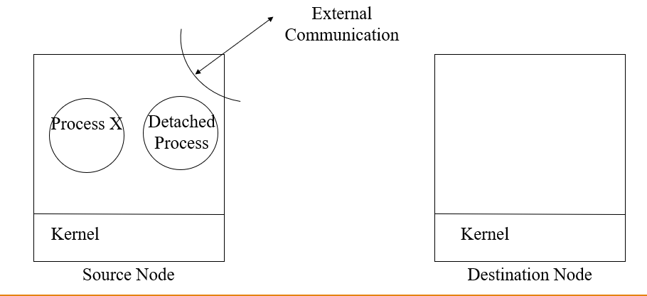
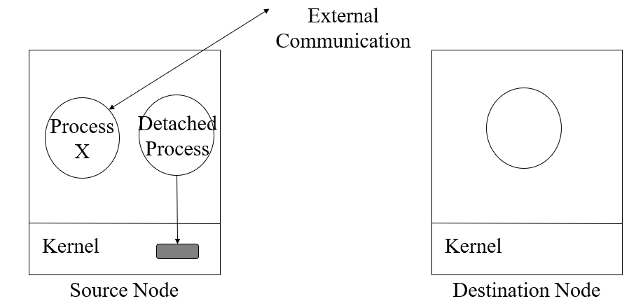
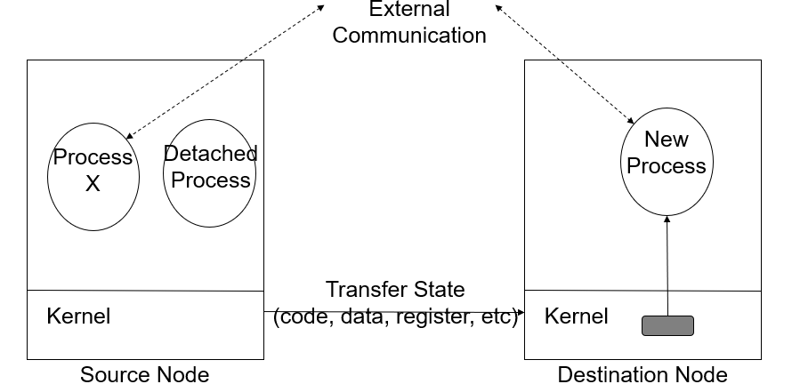
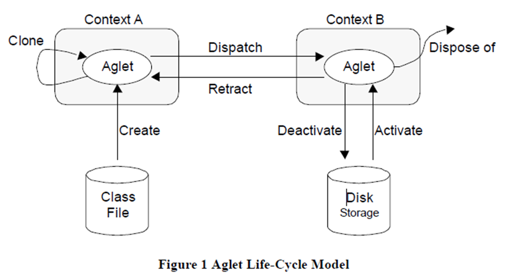

    <a href="https://rishikeshvadodaria.github.io/mkdocs/mobile-computing-unit 1/" class="nav-item mobile-computing" data-title="Unit 1">Unit 1</a>
    <a href="https://rishikeshvadodaria.github.io/mkdocs/mobile-computing-unit 2/" class="nav-item mobile-computing" data-title="Unit 2">Unit 2</a>
    <a href="https://rishikeshvadodaria.github.io/mkdocs/mobile-computing-unit 3/" class="nav-item mobile-computing" data-title="Unit 3">Unit 3</a>
    <a href="https://rishikeshvadodaria.github.io/mkdocs/mobile-computing-unit 4/" class="nav-item mobile-computing" data-title="Unit 4">Unit 4</a>
    <a href="https://rishikeshvadodaria.github.io/mkdocs/mobile-computing-unit 5/" class="nav-item mobile-computing" data-title="Unit 5">Unit 5</a>
    <a href="https://rishikeshvadodaria.github.io/mkdocs/mobile-computing-unit 6/" class="nav-item mobile-computing" data-title="Unit 6">Unit 6</a>
    <a href="https://rishikeshvadodaria.github.io/mkdocs/mobile-computing-unit 7/" class="nav-item mobile-computing" data-title="Unit 7">Unit 7</a>
    <a href="https://rishikeshvadodaria.github.io/mkdocs/mobile-computing-unit 8/" class="nav-item mobile-computing" data-title="Unit 8">Unit 8</a>
    <a href="https://rishikeshvadodaria.github.io/mkdocs/mobile-computing-unit 9/" class="nav-item mobile-computing" data-title="Unit 8">Unit 9</a>

## Logical Mobility

Logical Mobility refers to the ability to transfer software components, code, or computational elements between different systems or devices.

### Types of Logical Mobility
- Software Programs & Applications: Moving entire applications between devices.
- Code Segments & Modules: Transferring scripts or functions dynamically.
- Objects & Data Structures: Migrating serialized objects or database entries.
- Computational Processes: Shifting active processing tasks to another system.

### Examples
- App Downloads: Installing an application from an app store.
- Web Execution: A browser fetching and executing JavaScript from a server.

---

## Process Migration

Process Migration is the transfer of an executing process from one computing system to another while maintaining its state.

### Key Aspects of Process Migration
- Process = Program Under Execution
- State Transfer Includes:
  - Address Space: Memory and allocated resources.
  - Execution Point: CPU register contents.
  - Communication State: Open files, message channels.
  - OS-dependent States: Any system-specific data.

### Migration Process
1. Two Instances Exist: A source and destination process.
2. Final Handoff: The destination instance takes over as the migrated process.
3. Remote Execution: A process running on another machine is called a remote process.

### Example
- Watching a movie on a smart TV, then continuing playback on a tablet while traveling.

---

## Process Migration Steps

### Step 1: Migration Request Issued
- A migration request is sent to a remote node.
- After negotiation, the migration is accepted.

#### Diagram

### Step 2: Process Detachment
- The process is suspended on the source node.
- It is marked as "migrating."
- Communication is temporarily redirected.

#### Diagram

### Step 3: Temporary Communication Redirection
- Incoming messages are queued.
- Messages are delivered after migration.

#### Diagram

### Step 4: Process State Extraction
- The process's memory, registers, communication state, and kernel context are extracted.

#### Diagram

### Step 5: Destination Process Instance Created
- A new process instance is initialized on the remote node.

#### Diagram

### Step 6: State Transfer
- The extracted state is transferred to the destination node.

#### Diagram

### Step 7: Forwarding References
- References (e.g., file descriptors, network sockets) are updated to point to the new process instance.

#### Diagram

### Step 8: Process Resumed
- The new process instance resumes execution on the remote node.

#### Diagram

---

## Advantages of Process Migration

1. Dynamic Load Distribution
   - Balances the load by migrating processes from overloaded nodes to less loaded ones.
2. Fault Resilience
   - Ensures continuity by migrating processes from nodes that have partially failed or are at risk of failure.
3. Improved System Administration
   - Facilitates maintenance by moving processes from nodes that are about to be shut down or become unavailable.
4. Data Access Locality
   - Enhances efficiency by migrating processes closer to the data source, especially useful in mobile environments.
5. Resource Sharing
   - Allows access to specialized hardware by migrating a process to a node equipped with the required resources.
6. Mobile Computing
   - Enables users to continue running applications seamlessly as they move between networks or devices.

---

## Applications of Process Migration

- Parallelizable Applications: Distributing computational tasks across multiple nodes.
- Long-running Applications: Allowing execution across different nodes without interruption.
- Generic Multiuser Workloads: Managing distributed workloads effectively.
- Pre-emptable Applications: Processes that can be temporarily suspended and resumed elsewhere.
- Migration-aware Applications: Applications designed to adapt to migration scenarios.
- Network & Mobile Computing Applications: Ensuring service continuity as devices move across networks.

---

## Alternatives to Process Migration

1. Remote Execution
   - Executes code on a remote node instead of migrating the entire process.
   - Faster than migration due to lower data transfer costs.
2. Cloning
   - Creates a copy of the process on a different node using a remote fork mechanism.
   - Unlike migration, both instances continue running using distributed shared state.
   - Higher complexity but useful when state inheritance is required.
3. Mobile Agents
   - Uses Java, Tcl/Tk, or other technologies to move objects or scripts dynamically.
   - Achieved at the middleware level using frameworks like:
     - Common Object Request Broker Architecture (CORBA)
     - Distributed Objects

---

## Mobile Agents

Mobile Agents are software entities that autonomously move between computers and continue execution on the destination machine.

- Self-driven: Can function independently, even if the user disconnects from the network.
- Transportable: They move dynamically across systems.
- Data-Carriers: Store information and operate without requiring continuous communication.

---

## Types of Mobile Agents

1. Agents with Pre-defined Path
   - Follow a specific, predetermined route across nodes.
2. Agents with Undefined Path (Roamer)
   - Wander freely across the network, dynamically choosing destinations.

---

## Properties of Mobile Agents

A Mobile Agent is a software object that exists within an execution environment and possesses these key traits:

### Mandatory Properties
- Reactive: Responds to environmental changes.
- Autonomous: Controls its own actions.
- Goal-Driven: Works proactively towards objectives.
- Temporally Continuous: Runs indefinitely.

### Optional Properties
- Communicative: Can interact with other agents.
- Mobile: Can migrate between hosts.
- Learning: Adapts based on past experiences.

---

## Life Cycle of Mobile Agents

- Adapts to both home and foreign environments.
- Switches between nodes as needed.
- Focuses on achieving the final objective.
- Operates autonomously without external intervention.

---

## Mobile Agent Platforms

- Specialized Servers: Interpret agent behavior and handle communication.
- Autonomous Navigation: Agents can choose and request migration.
- Platform-Independent Execution: Can run on any machine without pre-installation.
- Java-Based Execution: Uses Java Virtual Machine (JVM) to dynamically load code.

### Types of Mobile Agents
- One-hop Agents: Migrate to a single destination.
- Multi-hop Agents: Roam across multiple locations dynamically.

---

## Components of a Mobile Agent

A Mobile Agent consists of two key components:

1. Code: Instructions defining the agent’s behavior.
2. Execution State: The agent’s progress and memory.

Unlike regular programs where code is stored on disk and execution state is in RAM, mobile agents carry both together when migrating.

### Migration Process
- Agent moves: Carries both its code & execution state.
- Resumes seamlessly at the new host.

---

## Characteristics of Mobile Agents

- Unique Identity: Each agent has a distinct presence.
- Aware of Other Agents: Can detect and interact with other agents.
- Message Handling: Sends & receives structured messages.
- Host Communication: Can communicate with its hosting environment.
- Concurrent Execution: Supports multiple agents running simultaneously.

---

## Agent Architecture

---

## Mobile Agents vs. Process Migration

| Aspect            | Mobile Agents                             | Process Migration                          |
|-------------------|-------------------------------------------|--------------------------------------------|
| Control           | Autonomous decision-making; agents decide when and where to move. | System-controlled; OS or network manager decides movement. |
| Intelligence      | Built-in intelligence to adapt behavior.  | No built-in intelligence; follows system instructions. |
| Decision Basis    | Moves based on programmed objectives and current needs. | Moves based on system load and resource availability. |
| Flexibility       | Can change destinations dynamically; supports multi-hop movement. | Fixed source-to-destination migration; single-hop only. |
| State Management  | Carries both code & state together as a package. | State must be captured, transferred, and reconstructed. |
| Interaction       | Can communicate with other agents and systems. | No inter-process communication during migration. |

---

## Client/Server vs. Mobile Agent Architectures

### Traditional Client/Server Model
- Requires continuous communication between client and server.
- Frequent request/response cycles increase network bandwidth usage.

### Mobile Agent Architecture
- Moves queries/transactions from client to server, reducing repetitive requests.
- Works offline and syncs results when the system is back online.
- Handles intermittent & unreliable networks effectively.

---

## Requirements for Mobile Agent Systems

1. Portability: Must run on different platforms without modifications.
2. Ubiquity: Should be available across multiple network environments.
3. Network Communication: Needs efficient mechanisms for sending/receiving data.
4. Server Security: Must prevent unauthorized agent execution on a host.
5. Agent Security: Protects agents from external threats or modifications.
6. Resource Accounting: Tracks resource consumption for optimization.

---

## Diagram: Mobile Agent vs. Client-Server Communication

---

## Aglets: Java-Based Mobile Agent Platform

Aglets are a Java-based framework for mobile agents, designed by IBM. They allow objects to move between hosts on a network while maintaining their execution state.

---

## How Aglets Work
- An Aglet can pause execution, move to a remote host, and resume execution.
- When an Aglet moves, it carries its code and object states to the new host.
- Multiple Aglets can run on a single node within different contexts.

---

## Aglet Context
An Aglet Context is the workspace where Aglets operate.

- Stationary Object: Provides a uniform execution environment.
- Hosts Multiple Contexts: A single network node can run multiple contexts.

### Aglet Proxy
A proxy is a representative of an Aglet that:
- Shields the Aglet from direct access to its public methods.
- Hides its real location, ensuring location transparency.

---

## Aglet Life Cycle

| Stage            | Description                                                                 |
|------------------|-----------------------------------------------------------------------------|
| Creation         | Aglet is created within a context, assigned an identifier, and initialized. Execution starts immediately. |
| Cloning          | Produces an identical copy of the Aglet in the same context, with a new identifier. |
| Dispatching      | Moves the Aglet to another context, removing it from the current one. Execution restarts at the destination. |
| Retraction       | Pulls the Aglet back to its original context after being dispatched.        |
| Deactivation     | Temporarily removes an Aglet from execution and stores it in secondary storage. |
| Activation       | Restores a deactivated Aglet back into a context.                           |
| Disposal         | Stops execution and removes the Aglet from the context permanently.         |

---

## Aglet Communication

Aglets use messages and events to communicate and interact within their environment.

### Message Communication
- Synchronous: Requires an immediate response.
- Asynchronous: Messages are sent without waiting for an immediate reply.

### Event-Driven Communication
- Used for reactive or proactive agents.
- Example: An Aglet can listen for a stock price change event and act accordingly.

### Aglet API (Java-based)
- `Aglet`: Core agent class.
- `Aglet Proxy`: Ensures security and location transparency.
- `Aglet Context`: Execution environment for Aglets.
- `Message`: Communication mechanism.

---

## Applications of Aglets
- E-commerce: Mobile shopping assistants.
- E-marketplaces: Automated price comparison & negotiation.
- Travel & Tourism: Dynamic air-ticket booking & package tour planning.

---

## Aglet Event Model
Aglets operate in an event-driven programming model. There are three types of listeners that handle different events:

| Listener Type       | Function                                                                 |
|---------------------|--------------------------------------------------------------------------|
| Clone Listener      | Handles events before, during, and after an Aglet is cloned.             |
| Mobility Listener   | Triggers actions before dispatching, during movement, and upon arrival at a new context. |
| Persistence Listener| Manages events before deactivation and after activation of an Aglet.     |

---

## Diagram: Aglet Event Flow

