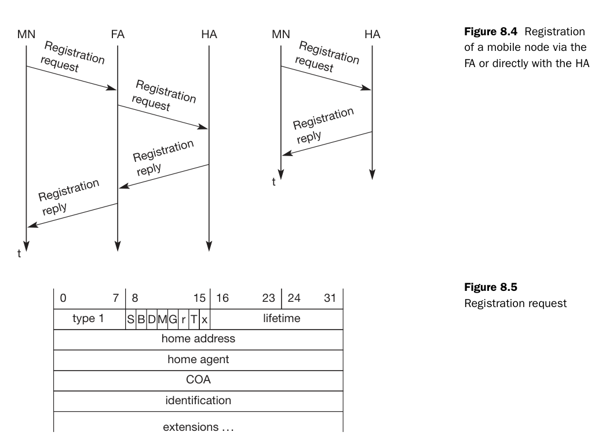
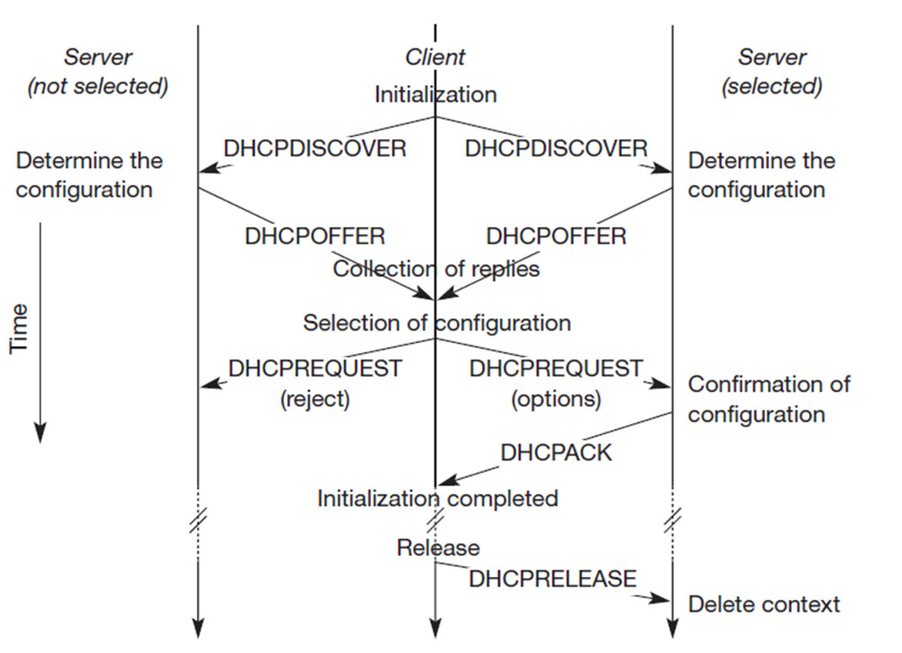
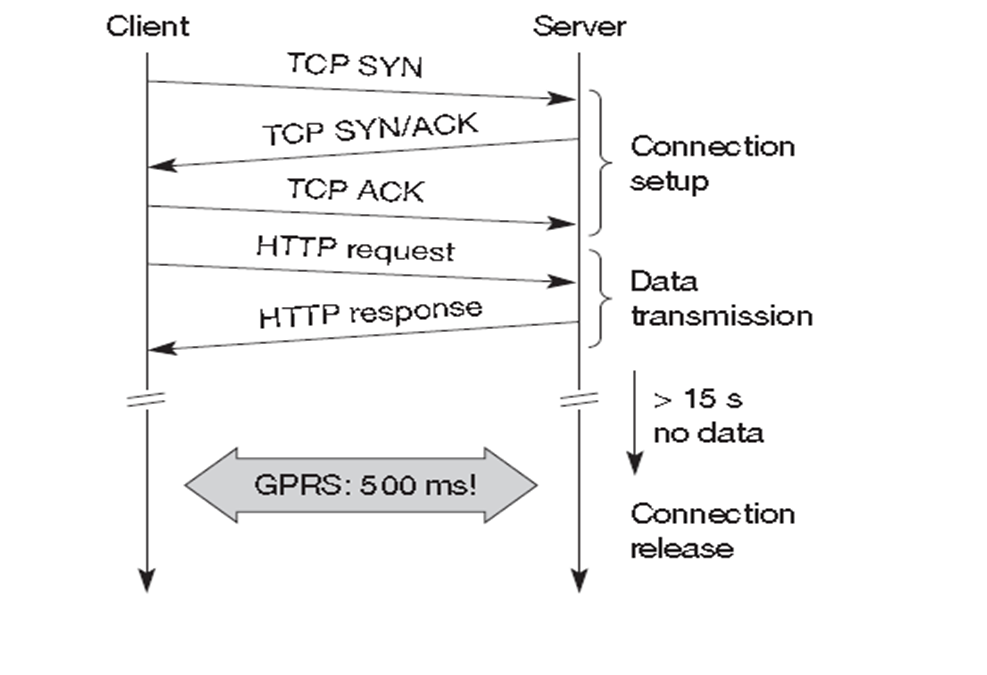

<div class="nav-wrapper">
    <a href="https://rishikeshvadodaria.github.io/mkdocs/mobile-computing-unit 1/" class="nav-item mobile-computing" data-title="Unit 1">Unit 1</a>
    <a href="https://rishikeshvadodaria.github.io/mkdocs/mobile-computing-unit 2/" class="nav-item mobile-computing" data-title="Unit 2">Unit 2</a>
    <a href="https://rishikeshvadodaria.github.io/mkdocs/mobile-computing-unit 3/" class="nav-item mobile-computing" data-title="Unit 3">Unit 3</a>
    <a href="https://rishikeshvadodaria.github.io/mkdocs/mobile-computing-unit 4/" class="nav-item mobile-computing" data-title="Unit 4">Unit 4</a>
    <a href="https://rishikeshvadodaria.github.io/mkdocs/mobile-computing-unit 5/" class="nav-item mobile-computing" data-title="Unit 5">Unit 5</a>
    <a href="https://rishikeshvadodaria.github.io/mkdocs/mobile-computing-unit 6/" class="nav-item mobile-computing" data-title="Unit 6">Unit 6</a>
    <a href="https://rishikeshvadodaria.github.io/mkdocs/mobile-computing-unit 7/" class="nav-item mobile-computing" data-title="Unit 7">Unit 7</a>
    <a href="https://rishikeshvadodaria.github.io/mkdocs/mobile-computing-unit 8/" class="nav-item mobile-computing" data-title="Unit 8">Unit 8</a>
    <a href="https://rishikeshvadodaria.github.io/mkdocs/mobile-computing-unit 9/" class="nav-item mobile-computing" data-title="Unit 8">Unit 9</a>
</div>
## Understanding IPv4

An IP address (Internet Protocol address) is a unique identifier assigned to each device connected to a network using the Internet Protocol. It serves two main purposes:

- Identification: Uniquely identifies a device on a network.
- Location Addressing: Indicates where a device is located within a network, enabling data routing.

!!! note
    IP addresses are essential for devices to communicate over the internet, ensuring proper identification and data transmission.

---

## IPv4 Format

IPv4 (Internet Protocol Version 4) is the most widely used system for identifying devices on a network. It uses a 32-bit addressing scheme, represented as four numbers separated by periods.

### Example
```plaintext
192.168.0.1
```

Each number (octet) can range from 0 to 255.

!!! tip
    IPv4 supports approximately 4.3 billion unique addresses, which is why IPv6 was introduced to handle the growing number of devices.

---

## Mobile IPv4

Mobile IPv4 is a protocol that enables devices to maintain their IP address and network connectivity while moving between different networks.

### Key Benefits
- Ensures continuous network connections when a device changes its network (e.g., switching from Wi-Fi to cellular data).
- Maintains seamless communication for mobile users.

!!! warning
    Without Mobile IPv4, devices would lose their network sessions when changing networks, leading to dropped connections and data loss.

---

## Agent Advertisement

Agent Advertisement is a process where Home Agents (HA) and Foreign Agents (FA) periodically send advertisement messages into their physical subnets.

### How It Works
- HA/FA broadcast advertisement messages (ICMP messages) into the subnet.
- These messages act as beacons to notify Mobile Nodes (MN) of available networks.
- Packet Details:
  - TTL (Time To Live): Set to 1 to prevent forwarding.
  - Destination Address:
    - 224.0.0.1 (Multicast Address) or
    - 255.255.255.255 (Broadcast Address)
- Mobile Node (MN) Actions:
  - Listens for advertisement messages.
  - Detects if it's in a home or foreign network.
  - Reads a Care-of Address (COA) from FA advertisement messages.

| Field               | Value                         |
|---------------------|-------------------------------|
| TTL                 | 1 (Prevents forwarding)       |
| Destination Address | 224.0.0.1 (Multicast)         |
| Destination Address | 255.255.255.255 (Broadcast)   |

!!! note
    The Care-of Address (COA) allows the mobile device to register its new location while roaming, ensuring uninterrupted communication.


---

## Mobile IP: Basic Operation

### Agent Solicitation
If no agent advertisements are present, or if the time between two advertisements is too high, the mobile node must send an Agent Solicitation message.

- The solicitation message should not flood the network.
- A mobile node can send up to three solicitations per second upon entering a foreign network.
- If no response is received, the solicitation rate decreases exponentially to avoid network congestion.
- Agent discovery allows the mobile node to establish a better connection.
- Once an agent is discovered, the mobile node obtains a Care-of Address (COA).

---

## Registration Request

Registration requests use UDP packets with the following structure:

- Source Address: Mobile Node (MN) IP address.
- Destination Address: Home Agent (HA) or Foreign Agent (FA) IP address (depending on COA location).
- Type Field: Set to 1 to indicate a registration request.
- Flags:
  - S – Request Home Agent to retain previous mobility binding.
  - B – Request to receive broadcast packets from the home network.
  - D – Mobile Node will handle decapsulation at the tunnel (if COA is located at MN).
  - M/G – Defines encapsulation type.
  - T – Enables reverse tunneling.
- Lifetime: Defines the validity of the registration (in seconds).
- Home Address: Fixed IP address of the Mobile Node.
- Home Agent: IP address of the Home Agent.
- COA (Care-of Address): Represents the tunnel endpoint.
- Identification: 64-bit identifier generated by MN to match registration requests and replies, preventing replay attacks.



---

## Registration Reply

Once a registration request is processed, a registration reply is sent back using UDP packets:

- Type Field: Set to 3 to indicate a registration reply.
- Code Field: Specifies the result of the registration request.

!!! tip
    Registration replies confirm whether a Mobile Node's registration was successful and provide status codes for troubleshooting.

---

## Types of Encapsulation

Encapsulation is essential in Mobile IP to ensure packets reach the Care-of Address (COA). The Home Agent (HA) takes the original packet (with the Mobile Node (MN) as the destination), places it inside the data portion of a new packet, and sets a new IP header so that it is correctly routed to the COA.

The newly added IP header is called the outer header.

### Encapsulation Methods
There are three primary types of encapsulation:

1. IP-in-IP Encapsulation
2. Minimal Encapsulation
3. Generic Routing Encapsulation (GRE)

---

### IP-in-IP Encapsulation
- Defined in RFC 2003 (Mandatory)
- Creates a tunnel between the Home Agent (HA) and the COA.
- The entire original IP packet is encapsulated within a new IP header.
- Used when the MN is using a foreign agent COA.


---

### Minimal Encapsulation
- Reduces redundancy present in IP-in-IP encapsulation.
- Only essential fields from the original header are included.
- Helps in reducing overhead, improving efficiency.


---

### Generic Routing Encapsulation (GRE)
- Unlike IP-in-IP and Minimal Encapsulation, which work only for IP packets, GRE supports other network layer protocols.
- Allows encapsulation of different protocol suites into the payload portion of a packet.
- Uses an outer IP header, with TTL and TOS values copied from the original header.
- Provides flexibility for non-IP protocols to be transported over an IP network.

!!! note
    GRE is widely used in VPNs and multicast routing to carry non-IP traffic efficiently over an IP-based network.


---

## Mobile IP and IPv6

### Key Features of Mobile IP in IPv6
- Integrated Security: Unlike IPv4, security is built into IPv6 rather than being an add-on. Authentication for registration is included.
- Auto-Configuration of COA:
  - IPv6 supports automatic configuration of the Care-of Address (COA).
  - DHCPv6 can be used for dynamic COA assignment.
  - Every IPv6 node has built-in address auto-configuration.
- No Need for a Foreign Agent (FA):
  - In IPv6, all routers perform router advertisements, eliminating the need for a dedicated Foreign Agent.
- Direct COA Signaling (Route Optimization):
  - The Mobile Node (MN) can directly inform a sender of its COA, bypassing the Home Agent (HA).
  - This enables automatic path optimization, reducing latency.
- Soft Handovers (Seamless Mobility):
  - IPv6 supports smooth handovers without packet loss between subnets.
  - The MN sends its new COA to the old router.
  - The old router encapsulates and forwards packets to the new COA.
  - Authentication remains intact throughout the process.

---

## Dynamic Host Configuration Protocol (DHCP)

### Overview of DHCP
- DHCP is a standardized networking protocol used by servers to dynamically allocate IP addresses to computers in a network.
- Primary Purpose: Automates IP configuration without requiring a network administrator.

### How DHCP Works
1. IP Address Allocation
   - DHCP assigns IP addresses from a predefined range stored in a server database.
   - Each IP is assigned for a lease period, after which the device must renew or acquire a new address.
2. Full Network Integration
   - DHCP provides additional configuration details:
     - DNS Server Address
     - Default Gateway (Router)
     - Subnet Mask
     - Domain Name
     - IP Address

### DHCP Client-Server Model
- DHCP follows a client/server model where clients request IP configurations from servers.
- Clients send broadcast requests using MAC addresses to find available DHCP servers.
- A DHCP relay agent forwards requests if servers are in a different network segment.




### DHCP Process
1. Client broadcasts a DHCPDISCOVER to find available DHCP servers.
2. DHCP servers respond with DHCPOFFER, listing available configurations.
3. Client sends a DHCPREQUEST to accept one configuration and reject others.
4. Selected server sends a DHCPACK, confirming the lease.
5. If the client leaves the subnet, it sends a DHCPRELEASE to free the assigned IP.

### DHCP in Mobile IP
- DHCP is a strong candidate for Care-of Address (COA) assignment in Mobile IP.
- Security Concern: Without authentication, neither the Mobile Node (MN) nor the DHCP server can trust each other.

---

## Mobile Transport Layer

### Why Transport Layer Support is Needed for Mobility
- Mobile networks introduce challenges beyond just network-layer mobility.
- The Transport Layer plays a critical role in:
  - Checksumming over user data.
  - Multiplexing/Demultiplexing data to and from applications.

### UDP (User Datagram Protocol)
- Simple addressing mechanism.
- Connectionless (No established connection).
- No reliability guarantees (No retransmission, no in-order delivery).

### UDP vs. TCP in Mobile Networks
| Feature            | UDP                     | TCP                              |
|--------------------|-------------------------|----------------------------------|
| Connection Type    | Connectionless          | Connection-oriented              |
| Reliability        | No reliability          | Reliable (retransmissions, acknowledgments) |
| Congestion Control | None                    | Reduces speed in case of network congestion |
| Order of Delivery  | No guarantee            | Ensures in-order delivery        |
| Usage in Mobility  | Suitable for real-time applications | Requires adaptation for mobile networks |

### Challenges of TCP in Mobile Networks
- TCP assumes packet loss is due to network congestion, reducing the transmission rate unnecessarily.
- Mobile networks require optimized TCP for 3G, 4G, and 5G environments.

---

## Traditional TCP and Congestion Control

TCP was originally designed for fixed networks with stable end-systems where:

- Hardware introduces minimal transmission errors.
- Packet loss typically occurs due to network congestion.
- Routers drop packets when overloaded.

### How Does the Sender Detect Packet Loss?
- Missing Acknowledgements (ACKs).

#### Incorrect Approach
Simply retransmitting the missing packet without adjusting the transmission rate.

#### Correct Approach
TCP slows down dramatically using congestion control mechanisms.

---

## TCP Slow Start

After detecting congestion, TCP enters Slow Start mode:

- The congestion window (cwnd) begins at 1 segment.
- For every successful ACK, cwnd doubles (exponential growth).
- Growth continues until reaching a threshold (ssthresh).
- After reaching ssthresh, TCP switches to linear increase.

### Conditions for Stopping Growth
1. Time-out due to missing ACK.
2. Multiple ACKs for the same packet (duplicate ACKs).

### TCP Congestion Control Steps
| Condition                      | Action Taken               |
|--------------------------------|----------------------------|
| First packet drop detected     | Reduce ssthresh to half    |
| Restart slow start             | Reset cwnd to 1 segment    |
| Continue with linear increase  | Until new loss occurs      |

---

## Fast Retransmit and Fast Recovery

### Fast Retransmit
- If multiple duplicate ACKs are received before a timeout, the sender immediately retransmits the lost packet.
- Avoids waiting for the retransmission timer.

### Fast Recovery
- Instead of resetting to slow start, TCP continues with the current congestion window.
- This prevents unnecessary performance degradation.

!!! tip
    Fast retransmit helps avoid unnecessary delays and ensures smoother TCP performance.

---

## Implications of TCP on Mobility

TCP performs poorly in mobile environments due to incorrect assumptions.

### Incorrect Assumptions
- Packet loss = Network congestion (but mobile networks lose packets due to handovers).
- Wireless error rates = Wired error rates (wireless links are more error-prone).

### Mobile IP Issue
- Packets in transit to the old Foreign Agent (FA) are lost when the Mobile Node (MN) moves.
- TCP cannot differentiate between congestion-based and mobility-based packet losses.

!!! warning
    TCP uses error control mechanisms to handle network congestion, which is not ideal for mobile networks.

---

## TCP Improvements: Indirect TCP (I-TCP)

### How I-TCP Works
- Keeps standard TCP for fixed networks.
- Uses an optimized TCP for mobile devices.
- Splits the TCP connection at the Foreign Agent (FA) into two separate connections.

### Process
1. Correspondent host sends a packet.
2. Foreign Agent acknowledges and forwards it to the Mobile Node.
3. Any packet loss in the wireless network is handled by the Foreign Agent.
4. If handover occurs, socket state (sequence numbers, ports, etc.) is migrated.

---

## Advantages of I-TCP
- No changes needed in existing TCP implementations.
- Wireless errors don’t affect fixed networks.
- Faster packet loss recovery (shorter wireless delays).
- Allows different transport protocols between FA and MN.

!!! note
    I-TCP enhances TCP performance in wireless environments without altering fixed-network implementations.

---

## Disadvantages of I-TCP
- Loses TCP’s end-to-end reliability if FA crashes.
- Increased handover latency due to buffering at FA.
- Security risks: FA must be trusted, especially for encrypted data.

!!! warning
    If the Foreign Agent crashes, the entire session might fail, causing disruptions.

---

## Summary of TCP Enhancements

| Feature            | Standard= Standard TCP | Fast Retransmit | I-TCP |
|--------------------|---------------|----------------|-------|
| Handles congestion | Yes           | Yes            | Yes   |
| Works in mobile networks | No            | No             | Yes   |
| Requires protocol changes | No            | No             | Yes   |
| Improves packet loss recovery | No            | Yes            | Yes   |
| Preserves end-to-end connection | Yes           | Yes            | No    |

!!! tip
    I-TCP is a powerful improvement for mobile networks, but it compromises end-to-end reliability.

---

## Snooping TCP

One of the drawbacks of I-TCP is the segmentation of the TCP connection, which violates end-to-end TCP semantics. Snooping TCP offers a transparent extension of TCP at the Foreign Agent (FA) to mitigate this issue.

### How Snooping TCP Works
- The Foreign Agent (FA) buffers packets sent to the mobile host (MH) until an ACK is received.
- FA monitors (snoops) the packet flow in both directions.
- If a packet is lost on the wireless link, FA immediately retransmits it (local retransmission).
- The FA filters duplicate ACKs and prevents unnecessary congestion control actions in the fixed network.

### Data Transfer Mechanism
- To the Mobile Host:
  - FA buffers data until it receives an ACK from MH.
  - If a duplicate ACK or timeout occurs, FA quickly retransmits the packet.
- From the Mobile Host:
  - FA detects lost packets via sequence numbers.
  - FA sends a Negative Acknowledgment (NACK) to MH for quick retransmission.

### Integration with MAC Layer
- The MAC layer already detects duplicate packets due to retransmissions.
- This prevents redundant retransmissions by TCP.

### Advantages of Snooping TCP
- Preserves end-to-end semantics (FA does not acknowledge data on behalf of MH).
- Reduces packet loss impact on wireless links.
- No changes required in the fixed network.

---

## Mobile TCP (M-TCP)

### Why M-TCP?
M-TCP improves overall TCP performance in mobile environments by:
- Maintaining end-to-end TCP semantics.
- Reducing delay in case of handovers.
- Enhancing throughput and handling frequent disconnections.

### How M-TCP Works
Like I-TCP, M-TCP splits the TCP connection, but with key differences:
- Uses a Supervisory Host (SH) instead of a Foreign Agent.
- SH does not cache or retransmit packets.
- If disconnection is detected, SH sets sender window size to 0.
- The sender goes into persistent mode, preventing unnecessary retransmissions.
- When connectivity is restored, SH restores the sender window to its original value.

### Advantages of M-TCP
- Preserves end-to-end TCP semantics (SH does not modify ACKs).
- Handles disconnections efficiently without slow starts.
- No buffering at SH, reducing memory usage.

### Disadvantages of M-TCP
- Packet loss on wireless links affects the fixed network.
- Requires modifications to both MH protocol stack and network infrastructure.

---

## Fast Retransmit / Fast Recovery

This approach forces TCP’s Fast Retransmit mechanism to handle handovers efficiently.

### How It Works
- When the mobile host (MH) moves to a new Foreign Agent (FA), it immediately sends duplicate ACKs to the Correspondent Host (CH).
- Sending three duplicate ACKs triggers Fast Retransmit at CH.
- This prevents Slow Start, improving handover performance.

### Advantages
- Simple to implement.
- Faster recovery from handover-related losses.

### Disadvantages
- Retransmitted packets still travel through the entire network.
- If handover takes too long, CH may initiate retransmissions prematurely.
- This approach does not address wireless link issues.

---

## Transmission / Timeout Freezing

TCP performance degrades in long interruptions (e.g., tunnels, no coverage areas). Timeout Freezing prevents unnecessary retransmissions.

### How It Works
- The MAC layer detects connection loss early.
- TCP pauses timers and freezes the congestion window.
- Once connectivity is restored, TCP resumes from the exact point it was stopped.

### Advantages
- Prevents unnecessary retransmissions during long disconnections.
- Maintains TCP state without requiring modifications in the fixed network.
- Works independently of acknowledgments or sequence numbers.

### Disadvantages
- Relies on MAC layer to detect interruptions accurately.
- Encryption mechanisms with time-dependent keys may cause issues.

---

## Selective Retransmission

### Why It’s Needed
Standard TCP cumulatively acknowledges packets. If a single packet is lost, TCP retransmits all subsequent packets, wasting bandwidth.

### How Selective Retransmission Works
- The receiver requests only the lost packets.
- The sender sends the missing packets instead of retransmitting everything.

### Advantages
- Minimizes retransmission overhead, especially in wireless networks.
- Improves efficiency on low-bandwidth connections.

### Disadvantages
- Requires additional buffer space at the receiver.
- More complex implementation compared to standard TCP.

---

## Transaction-Oriented TCP

### Problem with Traditional TCP
For short-lived requests, such as a mobile host sending a single request to a server, TCP’s connection setup overhead is too high.

### Issues with Standard TCP for Transactions
- Three-way handshake for connection setup.
- Multiple packets needed for transmission.
- Three more packets for connection teardown.
- If the data fits in one packet, TCP still requires seven packets.

### Solution: Transaction-Oriented TCP
- Reduces TCP overhead for short transactions.
- Uses minimal packet exchanges.
- T/TCP can combine packets for connection establishment and connection release with user data packets.
- This can reduce the number of packets down to two instead of seven.



### Advantage for Certain Applications
The reduction in the overhead which standard TCP has for connection setup and connection release.

### Disadvantage
T/TCP is not the original TCP anymore, so it requires changes in the mobile host and all correspondent hosts.

---

## TCP Enhancements for Wireless and Mobile Networks

### Introduction
Transmission Control Protocol (TCP) was originally designed for wired networks, where packet loss is primarily due to congestion. However, in wireless and mobile networks, factors such as high latency, jitter, and packet loss due to handovers or signal interference significantly degrade TCP performance. This document explores various TCP improvements tailored for wireless environments.

---

## Snooping TCP

!!! note
    Snooping TCP is a transparent extension of TCP within the foreign agent (FA) to optimize performance in mobile networks.

### How It Works
- The foreign agent (FA) buffers packets destined for the mobile host (MH) until an acknowledgment (ACK) is received.
- If a packet is lost on the wireless link, the FA retransmits it locally instead of relying on the original sender.
- The FA snoops acknowledgments and filters duplicate ACKs, reducing unnecessary retransmissions.

### Advantages
- Preserves end-to-end TCP semantics by acknowledging only when the MH responds.
- Faster retransmissions as lost packets are handled locally.
- Works transparently without modifications to the TCP sender.

### Limitations
- Requires modifications at the foreign agent.
- Does not work with encrypted TCP headers (e.g., IPsec).

---

## Mobile TCP (M-TCP)

!!! tip
    M-TCP improves throughput while maintaining end-to-end TCP semantics and ensuring efficient handovers.

### How It Works
- Supervisory Host (SH) monitors TCP traffic but does not cache or retransmit packets.
- If the mobile host disconnects, the SH sets the sender’s TCP window size to zero, preventing unnecessary retransmissions.
- Once connectivity is restored, the window is reopened at the previous value, resuming normal data transfer.

### Advantages
- Supports long disconnections without breaking connections.
- Prevents slow start by maintaining the sender’s state.
- No buffering at the supervisory host, reducing overhead.

### Limitations
- Packet loss on the wireless link affects the fixed network.
- Requires modifications to the mobile host’s TCP stack.

---

## Fast Retransmit & Fast Recovery

!!! warning
    This method artificially triggers fast retransmission to prevent slow start during handovers.

### How It Works
- When a mobile host moves to a new foreign agent, it sends three duplicate ACKs to the correspondent host.
- This forces the correspondent host into fast retransmit mode without triggering slow start.

### Advantages
- Reduces delay during handovers.
- Simple to implement with minor modifications.

### Limitations
- Inefficient for networks with high latency.
- If the handover is slow, the retransmitted packets may arrive too late.

```plaintext
Example: Mobile host sends 3 duplicate ACKs -> Fast retransmit triggered
```

---

## Transmission Timeout Freezing

!!! note
    When a long disconnection (e.g., moving through a tunnel) is detected, TCP freezes its state to prevent timeouts.

### How It Works
- The MAC layer detects a connection issue before TCP is interrupted.
- TCP pauses timers and stops retransmissions, maintaining the congestion window state.
- Once connectivity is restored, TCP resumes without triggering slow start.

### Advantages
- Ideal for long interruptions (e.g., tunnels, network congestion).
- Independent of TCP mechanisms like sequence numbers and acknowledgments.

### Limitations
- Requires MAC layer awareness of connection issues.
- Does not work with encryption methods that rely on timestamps.

---

## Selective Retransmission

!!! tip
    Instead of retransmitting all unacknowledged packets, TCP resends only the lost ones using Selective Acknowledgment (SACK).

### How It Works
- The receiver informs the sender exactly which packets were lost.
- The sender only retransmits those specific packets.

### Advantages
- Reduces bandwidth consumption, especially on wireless links.
- Speeds up recovery from packet loss.

### Limitations
- Requires more complex receiver logic.
- Buffering overhead for out-of-order packets.

```plaintext
Example: Lost packet #4 detected -> Only #4 is retransmitted
```

---

## TCP Over 2.5G/3G Networks

!!! warning
    TCP performance in 2.5G/3G networks is affected by high latency, jitter, and bandwidth fluctuations.

### Challenges in 2.5G/3G
| Factor                  | Impact on TCP                         | Mitigation                          |
|-------------------------|---------------------------------------|-------------------------------------|
| Latency                 | Increases RTT due to error correction | Use timestamp option for better RTT estimation |
| Jitter                  | Causes random delay spikes            | Enable Explicit Congestion Notification (ECN) |
| Packet Loss             | Occurs during handovers               | Use Selective Acknowledgment (SACK) |
| Bandwidth Oscillations  | Reduces throughput unpredictably      | Use large windows and limited transmit |

### Recommended TCP Optimizations
- Large TCP Window Size to adapt to higher latency.
- Limited Transmit (RFC 3042) to improve performance for small data transmissions.
- Explicit Congestion Notification (ECN) to signal congestion without dropping packets.
- Selective Acknowledgment (SACK) for efficient retransmission.
- Avoid TCP Header Compression (RFC 1144) as it performs poorly with packet loss.

---

## Performance-Enhancing Proxies (PEP)

!!! note
    Proxies are used to improve TCP performance in wireless networks by handling retransmissions locally.

### How It Works
- Splits the connection between sender and mobile host.
- Optimizes data flow by caching and retransmitting lost packets at the proxy level.

### Advantages
- Reduces delay by handling retransmissions locally.
- Improves throughput in high-latency wireless networks.

### Limitations
- Breaks end-to-end TCP semantics.
- Not compatible with IPsec encryption.

---
