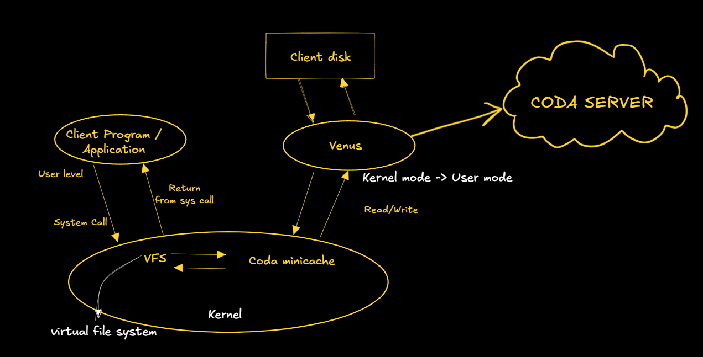

    <a href="https://rishikeshvadodaria.github.io/mkdocs/mobile-computing-unit 1/" class="nav-item mobile-computing" data-title="Unit 1">Unit 1</a>
    <a href="https://rishikeshvadodaria.github.io/mkdocs/mobile-computing-unit 2/" class="nav-item mobile-computing" data-title="Unit 2">Unit 2</a>
    <a href="https://rishikeshvadodaria.github.io/mkdocs/mobile-computing-unit 3/" class="nav-item mobile-computing" data-title="Unit 3">Unit 3</a>
    <a href="https://rishikeshvadodaria.github.io/mkdocs/mobile-computing-unit 4/" class="nav-item mobile-computing" data-title="Unit 4">Unit 4</a>
    <a href="https://rishikeshvadodaria.github.io/mkdocs/mobile-computing-unit 5/" class="nav-item mobile-computing" data-title="Unit 5">Unit 5</a>
    <a href="https://rishikeshvadodaria.github.io/mkdocs/mobile-computing-unit 6/" class="nav-item mobile-computing" data-title="Unit 6">Unit 6</a>
    <a href="https://rishikeshvadodaria.github.io/mkdocs/mobile-computing-unit 7/" class="nav-item mobile-computing" data-title="Unit 7">Unit 7</a>
    <a href="https://rishikeshvadodaria.github.io/mkdocs/mobile-computing-unit 8/" class="nav-item mobile-computing" data-title="Unit 8">Unit 8</a>
    <a href="https://rishikeshvadodaria.github.io/mkdocs/mobile-computing-unit 9/" class="nav-item mobile-computing" data-title="Unit 8">Unit 9</a>

## Mobile Databases

### Introduction to Mobile Databases

Mobile databases are specialized data management systems designed for mobile devices. They address unique challenges such as:

- Limited device resources: Optimizing power and storage usage.
- Intermittent network connectivity: Ensuring seamless synchronization.
- Data distribution: Managing access across multiple locations.

These databases enable:

- Efficient data querying.
- Offline operations.
- Secure data handling.
- Synchronization between mobile devices and central servers.

!!! note
    Mobile databases allow devices to function independently while staying connected to a broader data ecosystem.

---

### Need for Mobile Databases

Users require seamless access to their data and the ability to perform transactions securely on mobile devices.

#### Key Requirements
- Transaction handling: Making secure payments, updating records.
- Everyday convenience: Sending money, booking seats, trading stocks.
- Continuous access: Uninterrupted availability of information.

!!! tip
    The demand for "anytime, anywhere" access makes mobile databases essential in modern applications.

---

### Uses of Mobile Databases

Mobile databases empower developers to build and deploy applications for handheld devices.

#### Common Use Cases
- Corporate Access:
  - Employees connect to their company's network.
  - Data is downloaded for offline work.
  - Updates sync back when connected.
- Real-world Example:
  A food delivery app rider using mobile databases can:
  - Accept new orders while on the move.
  - Track delivery locations and customer details offline.
  - Update delivery status in real-time.
  - Sync all completed deliveries to the restaurant’s system.

!!! note
    Mobile databases ensure real-time tracking and offline functionality for critical applications.

---

### Mobile Databases: Design Issues

Mobile databases must be built for mobility rather than adapted from traditional database systems.

#### Key Challenges
| Challenge              | Description                                                                 |
|------------------------|-----------------------------------------------------------------------------|
| Query Optimization     | Users move constantly, making it hard to determine the best way to process data requests. |
| Time Management        | Mobile networks often charge based on connection time and data usage, requiring efficient retrieval. |
| Power Efficiency       | Limited battery life demands minimal energy consumption for database operations. |

!!! warning
    Poor optimization can lead to high costs, battery drain, and slow performance.

---

### Problems in Mobile Databases

#### Routing
One of the biggest costs in wireless communication is connection time. Efficient routing reduces this expense.

#### Query Processing
- Mobile devices often disconnect for extended periods.
- Users may issue queries or updates on cached data while offline.

#### Recoverability
- If a disconnected device fails, all locally stored updates may be lost permanently.

#### Consistency
- Cached data can become outdated, and devices won’t detect inconsistencies until they reconnect.
- No updates can sync until the device is back online.

!!! tip
    Using synchronization mechanisms and conflict resolution strategies can mitigate these issues.

---

### Introduction to CODA

CODA is a distributed file system designed for high availability, scalability, and fault tolerance. It was developed as an extension of the Andrew File System (AFS) at Carnegie Mellon University. CODA ensures continuous data access even in the presence of network failures or server disconnections by using client-side caching, replication, and disconnected operation.

---

### Mechanisms of the CODA File System

#### Server Replication
Server replication ensures that data remains accessible by storing multiple read-write replicas across different servers.

- Volumes have read-write replicas stored on multiple servers, forming a Volume Storage Group (VSG).
- Clients track available servers through an Accessible Volume Storage Group (AVSG).
- Venus (cache manager) ensures consistency by implementing a coherence protocol.
- Servers notify clients whenever cached copies become stale or invalid.
- Modifications are propagated simultaneously across all AVSG sites and later synced to missing VSG sites.

#### Disconnected Operation
CODA supports offline access by allowing clients to function independently when the network is unavailable.

- Venus handles all file system requests using local cache data.
- When the client reconnects, Venus syncs modifications to the server and returns to replication mode.
- Ensures uninterrupted access for mobile users.

#### Client-Side Caching
- Uses Venus, the CODA client module, to cache frequently accessed files locally.
- Improves performance by reducing the need for frequent server requests.
- Cached files allow users to work offline and sync changes later.

#### Conflict Resolution
- Automatic resolution for simple conflicts (e.g., appending to logs).
- Manual intervention required for complex conflicts where two users modify the same file.
- Uses resolution tools to merge conflicting versions.

#### Scalability and Performance
- Efficient handling of large-scale distributed systems.
- Supports large numbers of clients with minimal performance degradation.
- Balances workload using adaptive caching and replication strategies.

#### Security
- Uses Kerberos authentication for secure access control.
- Encrypts data transmissions to protect sensitive information.
- Access control lists (ACLs) manage user permissions.

---

### Venus States in CODA

Venus operates in three distinct states, depending on the network connection status.

#### Hoarding (Preparation Phase)
- Venus proactively caches essential data before disconnection.
- Frequently accessed files are prefetched while online.
- Uses Least Recently Used (LRU) strategy to manage cache content efficiently.

#### Emulation (Disconnected Operation)
- When disconnected, Venus operates as a pseudo-server, providing local file access.
- Applications access cached files without needing server connectivity.
- Venus tracks all changes and assigns temporary file IDs for new objects.
- Conflict detection: After reconnection, file versions are compared, and conflicts are flagged for manual resolution.

#### Reintegration (Reconnection & Syncing)
- Venus propagates all changes made during disconnection back to the server.
- The system updates cached files to reflect server changes.
- Reintegration occurs automatically upon network reconnection.
- If conflicting updates exist, files are stored as separate copies for manual integration.

---

### Client Structure in CODA

CODA's client-side architecture is designed for flexibility and efficiency.

- Venus runs at the user level, not the kernel level, allowing easier updates and flexibility.
- A mini-cache inside the kernel filters frequent Venus-kernel interactions, improving performance.
- File access process:
  1. Applications request files via the Vnode interface.
  2. If the mini-cache contains the file, the request is processed instantly.
  3. If not, Venus fetches the file from the server and updates the cache.
  4. After processing, control returns to the application.
- Venus periodically updates the mini-cache to maintain consistency.

---

### Design Rationale of CODA File System

CODA was designed with specific goals in mind to support mobile and distributed computing.

- Standard Hardware Compatibility: Works on commercial systems without requiring special equipment.
- Transparency: Users do not need to know where files are stored.
- Scalability: Handles growing networks and large data volumes efficiently.
- Mobile Computing Support: Built for portable workstations and remote access.
- High Availability: Ensures continuous access even during network failures.
- Strong Consistency: Synchronizes data accurately across all replicas.

