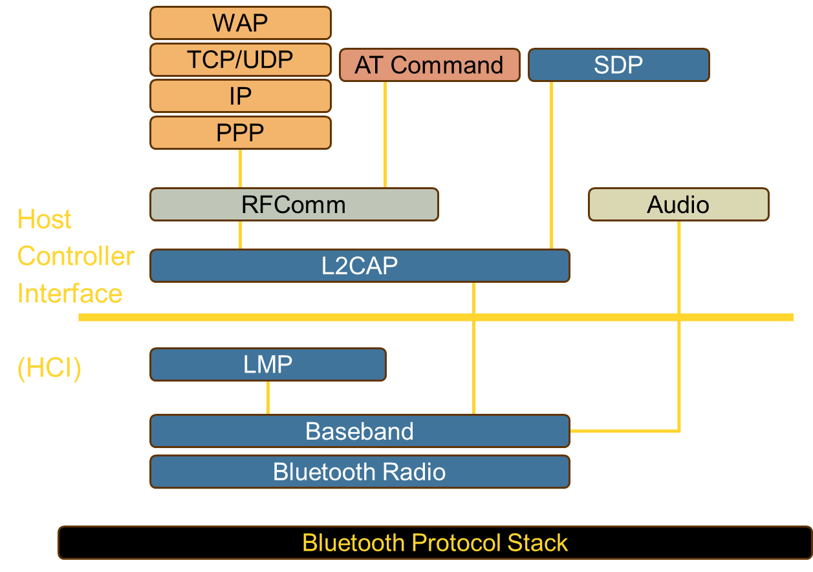

    <a href="https://rishikeshvadodaria.github.io/mkdocs/mobile-computing-unit 1/" class="nav-item mobile-computing" data-title="Unit 1">Unit 1</a>
    <a href="https://rishikeshvadodaria.github.io/mkdocs/mobile-computing-unit 2/" class="nav-item mobile-computing" data-title="Unit 2">Unit 2</a>
    <a href="https://rishikeshvadodaria.github.io/mkdocs/mobile-computing-unit 3/" class="nav-item mobile-computing" data-title="Unit 3">Unit 3</a>
    <a href="https://rishikeshvadodaria.github.io/mkdocs/mobile-computing-unit 4/" class="nav-item mobile-computing" data-title="Unit 4">Unit 4</a>
    <a href="https://rishikeshvadodaria.github.io/mkdocs/mobile-computing-unit 5/" class="nav-item mobile-computing" data-title="Unit 5">Unit 5</a>
    <a href="https://rishikeshvadodaria.github.io/mkdocs/mobile-computing-unit 6/" class="nav-item mobile-computing" data-title="Unit 6">Unit 6</a>
    <a href="https://rishikeshvadodaria.github.io/mkdocs/mobile-computing-unit 7/" class="nav-item mobile-computing" data-title="Unit 7">Unit 7</a>
    <a href="https://rishikeshvadodaria.github.io/mkdocs/mobile-computing-unit 8/" class="nav-item mobile-computing" data-title="Unit 8">Unit 8</a>
    <a href="https://rishikeshvadodaria.github.io/mkdocs/mobile-computing-unit 9/" class="nav-item mobile-computing" data-title="Unit 8">Unit 9</a>

## Wireless Communication

### Introduction

Wireless communication refers to the transfer of information between two or more devices without physical cables or wires. It uses electromagnetic waves to transmit data over the airwaves.

Some common wireless communication technologies include:

- Wi-Fi: Uses radio waves to provide high-speed internet and network connections.
- Bluetooth: Short-range wireless technology for connecting devices like smartphones, laptops, and headphones.
- Cellular Networks: Enables voice and data communication using mobile devices.
- Satellite Communication: Uses satellites to transmit data over long distances.
- RFID (Radio Frequency Identification): Employs radio waves to identify and track objects.

Wireless communication has revolutionized connectivity and has enabled technologies like the Internet of Things (IoT), which relies on wireless networks to link devices and sensors.

---

### Components of Wireless Communication Systems

#### Transmitters
A transmitter encodes information into a modulated radio frequency signal and transmits it via an antenna. It generates an alternating current that is applied to the antenna, which then radiates radio waves.

#### Receivers
A receiver detects transmitted signals using an antenna and demodulates them to extract the original information.

#### Antennas
An antenna is responsible for transmitting and receiving radio frequency signals.

- Converts electrical energy into electromagnetic waves (and vice versa).
- Enhances signal quality and reduces interference.
- High-gain antennas extend the range of communication.

#### Filters
Filters eliminate unwanted signals, reducing noise and interference to ensure that the transmitted or received signal is within the desired frequency range.

#### Amplifiers
Amplifiers increase signal strength, allowing transmission over longer distances while maintaining quality. They also enhance receiver sensitivity.

#### Mixers
Mixers convert signal frequency by combining two signals to produce a new signal with a frequency that is the sum or difference of the two input frequencies. This is essential in radio communication.

!!! tip
    High-gain antennas and amplifiers can significantly extend the communication range in wireless systems.

---

### Bluetooth Technology

Bluetooth is a short-range wireless technology that connects devices to form a Personal Area Network (PAN). It operates in the 2.4 GHz to 2.485 GHz range using ultra-high frequency (UHF) radio waves.

#### Bluetooth Applications
- Wireless laptops and PCs
- Mobile phones and PDAs
- Printers
- Wireless headsets
- Personal and Local Area Networks (PANs & LANs)
- Data transfer (files, videos, images, music)
- Wireless peripheral devices (mouse, keyboards)

#### Bluetooth Protocol Stack

| Protocol Layer                              | Description                                                                 |
|---------------------------------------------|-----------------------------------------------------------------------------|
| Radio                                       | Defines air interface, frequency bands, and modulation techniques.           |
| Baseband                                    | Defines addressing, packet format, and power control algorithms.             |
| LMP (Link Manager Protocol)                 | Establishes and maintains logical links, handles authentication and encryption. |
| L2CAP (Logical Link Control and Adaptation Protocol) | Provides adaptation between upper-layer frames and baseband format. |
| SDP (Service Discovery Protocol)            | Handles service-related queries for device connections.                      |

!!! warning
    Bluetooth operates on shared frequency bands, making it susceptible to interference from other wireless devices.

---

### Protocols in the Bluetooth Protocol Stack

#### Core Protocols
Includes essential Bluetooth layers:
- Bluetooth Radio
- Baseband
- Link Manager Protocol (LMP)
- Logical Link Control and Adaptation Protocol (L2CAP)
- Service Discovery Protocol (SDP)

#### Cable Replacement Protocol
- RFComm (Radio Frequency Communications Protocol): Provides a serial interface for replacing wired connections.

#### Adopted Protocols
Bluetooth integrates several standard networking protocols:
- Point-to-Point Protocol (PPP)
- Internet Protocol (IP)
- User Datagram Protocol (UDP)
- Transmission Control Protocol (TCP)
- Wireless Application Protocol (WAP)

#### Additional Protocols
- AT Commands: Command set for controlling Bluetooth devices.
- Audio Protocol: Handles voice and sound transmission over Bluetooth.

---

### Bluetooth Frame Structure

Bluetooth packets consist of three main components: Access Code, Packet Header, and Payload. Each field plays a crucial role in ensuring reliable communication within a Bluetooth network.

| Field          | Size (bits) | Description                                                                 |
|----------------|-------------|-----------------------------------------------------------------------------|
| Access Code   | 72          | Used for timing synchronization, piconet identification, and error detection. |
| Packet Header | 54          | Contains essential control information such as device address, type of packet, flow control, acknowledgment, sequence numbers, and error detection. |
| Payload       | 0-2744      | Carries actual data or voice, depending on the type of communication.        |

---

#### Access Code (72 bits)
The Access Code field is the first part of a Bluetooth packet and is primarily used for device identification and synchronization.

| Subfield          | Size (bits) | Description                                                                 |
|-------------------|-------------|-----------------------------------------------------------------------------|
| Preamble         | 4           | Helps receivers synchronize with the incoming packet. It consists of alternating bits (1010 or 0101). |
| Synchronization   | 64          | Uniquely identifies the piconet and is derived from the master's Bluetooth address. It allows a slave to recognize packets from its master. |
| Trailer          | 4           | Ensures correct signal detection and packet alignment.                      |

!!! note
    - The Synchronization field is crucial for filtering out unwanted Bluetooth signals from other nearby piconets.
    - The Access Code helps maintain collision avoidance and packet integrity.

---

#### Packet Header (54 bits)
The Packet Header carries control and management information necessary for maintaining Bluetooth connections. It contains six subfields:

| Subfield                          | Size (bits) | Description                                                                 |
|-----------------------------------|-------------|-----------------------------------------------------------------------------|
| AM_ADDR (Active Member Address)   | 3           | Identifies one of the seven active slaves in a piconet (0 is reserved for broadcast). |
| Type                              | 4           | Specifies the type of Bluetooth packet (e.g., data, control, or voice packet). |
| Flow                              | 1           | Flow control bit used for managing buffer overflow conditions.               |
| ARQN (Acknowledgment Number)      | 1           | Acknowledges successful receipt of the last packet (1 = ACK, 0 = NACK).     |
| SEQN (Sequence Number)            | 1           | Ensures correct packet order and detects duplicates in retransmission.       |
| HEC (Header Error Check)          | 8           | Provides error detection for the header. It helps in identifying corrupt headers. |

!!! tip
    - The SEQN and ARQN fields work together to enable Bluetooth’s Automatic Repeat reQuest (ARQ) mechanism for reliable transmission.
    - The HEC ensures that header corruption is detected before processing further.

---

#### Payload (0-2744 bits)
The Payload is the data-carrying part of the packet. Its size varies based on the type of packet:

| Payload Type                  | Size (bits) | Purpose                                                                     |
|-------------------------------|-------------|-----------------------------------------------------------------------------|
| Voice Data                   | Fixed 240   | Used for real-time audio communication. No retransmission occurs.            |
| Asynchronous Data (ACL)       | 0-2744      | Used for file transfer and general data communication. Supports error correction and retransmission. |
| Synchronous Data (SCO/eSCO)   | 0-240       | Used for streaming applications like audio calls, with limited retransmission. |

!!! warning
    - Voice packets (SCO) have no retransmission due to real-time constraints.
    - Data packets (ACL) support error correction and retransmission for reliability.

---

#### Error Handling in Bluetooth Packets
Bluetooth implements several error detection and correction mechanisms:

1. Header Error Check (HEC): Detects corruption in the packet header.
2. Cyclic Redundancy Check (CRC): Applied to payload data for error detection.
3. Forward Error Correction (FEC): Helps correct errors in weak signals (1/3 and 2/3 FEC schemes).
4. Automatic Repeat reQuest (ARQ): Retransmits packets when errors are detected.

!!! tip
    Bluetooth’s robust error correction techniques ensure a balance between reliability and efficiency, making it suitable for both voice and data applications.

---

### Wi-Fi Standards (IEEE 802.11 Family)

#### Introduction
Wi-Fi standards (IEEE 802.11) define wireless communication protocols, improving speed, frequency bands, and features over time.

---

#### Major Wi-Fi Standards and Their Features
| Standard           | Year | Frequency Band    | Max Speed     | Key Features                                                       | Also Known As         |
|--------------------|------|-------------------|---------------|--------------------------------------------------------------------|-----------------------|
| 802.11 (Original)  | 1997 | 2.4 GHz           | 1-2 Mbps      | First wireless LAN standard using FHSS or DSSS                     | -                     |
| 802.11a            | 1999 | 5 GHz             | 54 Mbps       | Uses OFDM encoding scheme                                          | -                     |
| 802.11b            | 1999 | 2.4 GHz           | 11 Mbps       | Uses DSSS, widely adopted first-gen Wi-Fi                          | Wi-Fi (Original)      |
| 802.11g            | 2003 | 2.4 GHz           | 54 Mbps       | Combines features of 802.11a/b, backward compatible                | -                     |
| 802.11e            | 2005 | 2.4 GHz & 5 GHz   | Up to 54 Mbps | Quality of Service (QoS) for better multimedia & VoIP support      | WMM (Wi-Fi Multimedia) |
| 802.11n            | 2009 | 2.4 GHz & 5 GHz   | 600 Mbps      | Introduced MIMO for better speed & range                           | -                     |
| 802.11ac           | 2013 | 5 GHz only        | 3.5 Gbps      | Improved 802.11n with wider channels & better performance           | Wi-Fi 5               |
| 802.11ac Wave 2    | ~2016 | 5 GHz only       | 6.93 Gbps     | Added MU-MIMO technology & enhancements                            | -                     |
| 802.11ad           | 2012 | 60 GHz            | 7 Gbps        | High-speed, short-range (WiGig)                                    | WiGig                 |
| 802.11ah           | 2017 | Below 900 MHz     | Lower         | Extended range, better wall penetration                            | Wi-Fi HaLow           |
| 802.11r            | -    | -                 | -             | Fast BSS transition for VoIP handoff between access points         | Fast Roaming          |
| 802.1X             | -    | -                 | -             | Security standard for network access control                       | -                     |

---

#### Key Takeaways
- Higher Frequencies (5 GHz, 60 GHz): Higher speeds but shorter range.
- Lower Frequencies (2.4 GHz, Below 900 MHz): Better range and penetration but lower speed.
- Newer Standards (802.11ac, 802.11ax, etc.): Improved speed, efficiency, and multi-device support.
- Wi-Fi 5 (802.11ac): Popular high-speed standard used today.
- Wi-Fi 6 (802.11ax - Not in table): Next-gen standard improving speed, efficiency, and congestion handling.

---

### Wireless LAN (WLAN)

#### What is WLAN?
- WLAN (Wireless Local Area Network) allows mobile users to connect to a Local Area Network (LAN) wirelessly.
- Also known as LAWN (Local Area Wireless Network).
- Defined by IEEE 802.11 standards.
- Uses Ethernet protocol and CSMA/CA (Carrier Sense Multiple Access with Collision Avoidance) for communication.
- Implements WEP (Wired Equivalent Privacy) encryption for security.
- Provides high-speed data communication in small areas (offices, buildings, etc.).
- Used to reduce costs and avoid cable installation, especially in public areas.

---

#### Advantages of WLANs
1. Flexibility
   - Devices can communicate without physical connections.
   - Radio waves penetrate walls, allowing hidden placements.
2. Easy Planning
   - Wireless ad-hoc networks do not require pre-planning like wired networks.
3. Compact Design
   - Allows development of small, portable devices (laptops, tablets, PDAs).
4. Disaster Resilience
   - Works even in natural disasters where wired infrastructure might fail.
5. Cost Efficiency
   - Cheaper installation and maintenance than traditional wired LANs.
   - No extra cost for adding users after initial setup.
6. Ease of Use
   - Simple setup for users, requiring minimal technical knowledge.

---

#### Disadvantages of WLANs
1. Quality of Service (QoS) Issues
   - Lower bandwidth due to radio transmission limitations.
   - Higher error rates from interference.
   - Increased latency due to error correction.
2. Proprietary Solutions
   - Slow standardization leads to different vendor-specific solutions.
   - Most systems adhere to IEEE 802.11a/b.
3. Regulatory Restrictions
   - Governments impose frequency restrictions to avoid interference.
4. Global Operation Issues
   - Frequency regulations differ across countries.
   - Devices must comply with international standards.
5. High Power Consumption
   - Wireless devices consume more power than wired ones.
   - Requires power-saving modes for efficiency.
6. Licensing Requirements
   - Operators prefer license-free bands like 2.4 GHz ISM band for easier deployment.

---

#### Conclusion
- WLANs provide mobility, flexibility, and cost-effectiveness.
- They suffer from QoS issues, power constraints, and regulatory challenges.
- IEEE 802.11 continues to evolve, improving performance and security.
