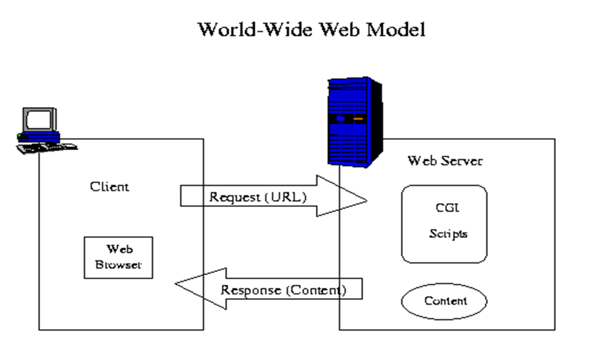
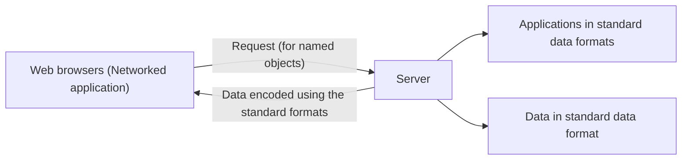
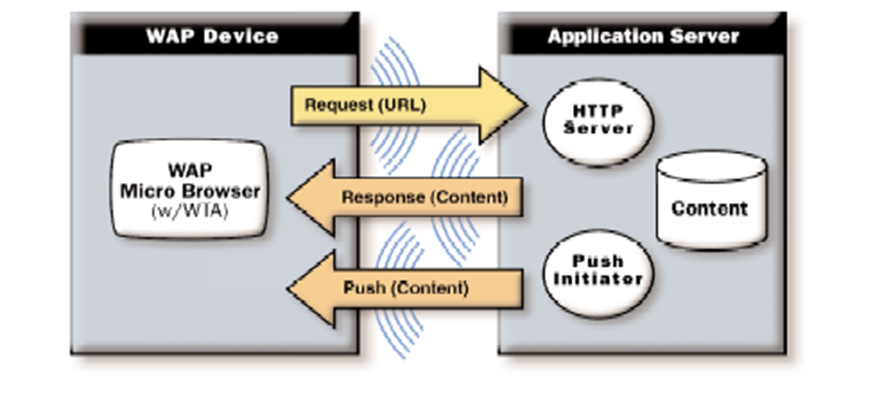
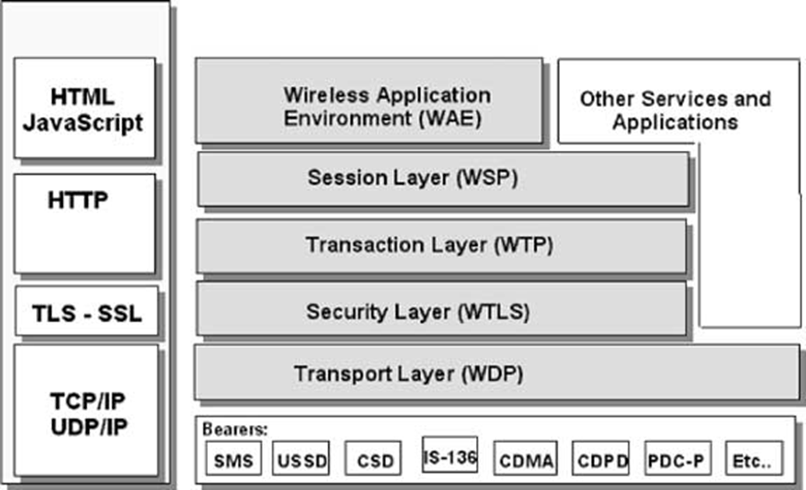
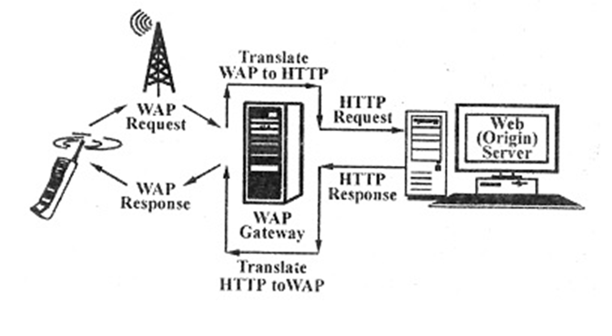
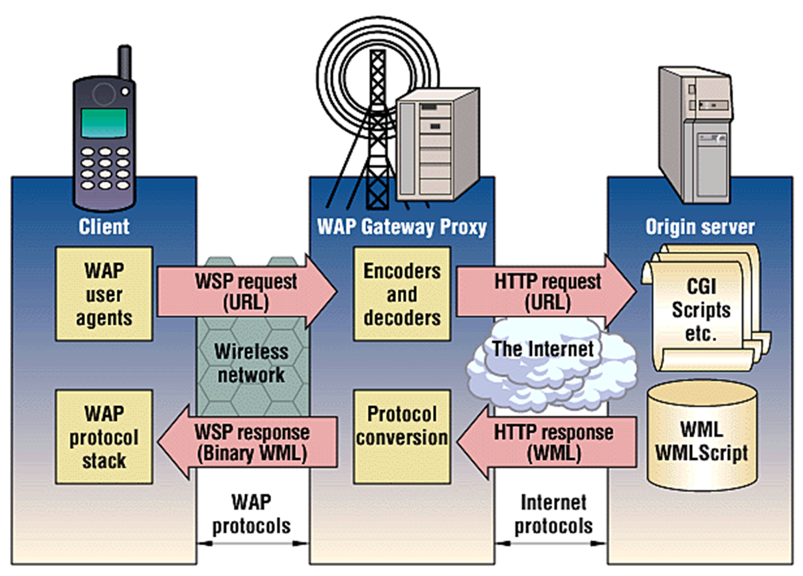
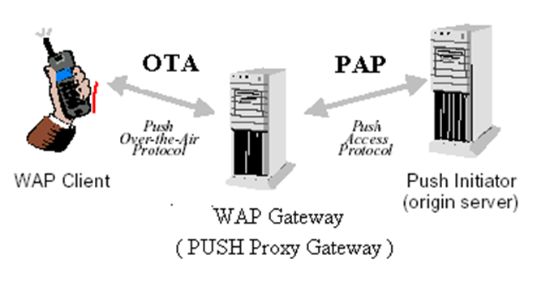
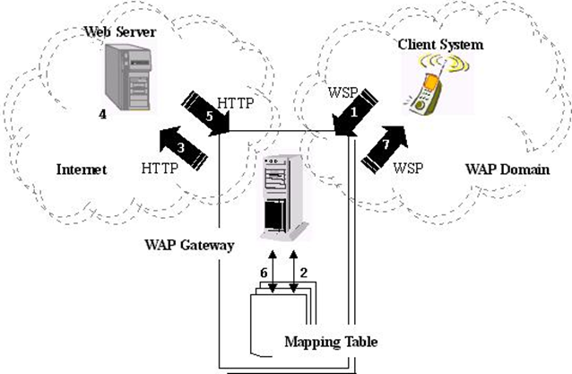

    <a href="https://rishikeshvadodaria.github.io/mkdocs/mobile-computing-unit 1/" class="nav-item mobile-computing" data-title="Unit 1">Unit 1</a>
    <a href="https://rishikeshvadodaria.github.io/mkdocs/mobile-computing-unit 2/" class="nav-item mobile-computing" data-title="Unit 2">Unit 2</a>
    <a href="https://rishikeshvadodaria.github.io/mkdocs/mobile-computing-unit 3/" class="nav-item mobile-computing" data-title="Unit 3">Unit 3</a>
    <a href="https://rishikeshvadodaria.github.io/mkdocs/mobile-computing-unit 4/" class="nav-item mobile-computing" data-title="Unit 4">Unit 4</a>
    <a href="https://rishikeshvadodaria.github.io/mkdocs/mobile-computing-unit 5/" class="nav-item mobile-computing" data-title="Unit 5">Unit 5</a>
    <a href="https://rishikeshvadodaria.github.io/mkdocs/mobile-computing-unit 6/" class="nav-item mobile-computing" data-title="Unit 6">Unit 6</a>
    <a href="https://rishikeshvadodaria.github.io/mkdocs/mobile-computing-unit 7/" class="nav-item mobile-computing" data-title="Unit 7">Unit 7</a>
    <a href="https://rishikeshvadodaria.github.io/mkdocs/mobile-computing-unit 8/" class="nav-item mobile-computing" data-title="Unit 8">Unit 8</a>
    <a href="https://rishikeshvadodaria.github.io/mkdocs/mobile-computing-unit 9/" class="nav-item mobile-computing" data-title="Unit 8">Unit 9</a>

## Evolution of Internet Access and Display Technology

## Early Internet Era
- Connectivity via 2 Mbps cable modems 
- Remote access from workplace or residence 
- Content delivered to high-resolution displays through HTTP/HTML protocols 

## Early 2000s Transition
- Significant emergence of compact mobile and handheld technologies 
- Web accessibility through wireless technologies including GPRS (2.5G at 38.4kbps) and GSM (2G/3G reaching 6kbps) 
- Industry focus shifted toward miniature 96×64 pixel displays, delivering content in 24×7×365 availability 

## Current Technology Landscape
- Evolution from HD (1280×720 pixels) to Full HD (1920×1080 pixels) and beyond 
- Premium smartphones featuring Quad HD (2560×1440 pixels) or 4K Ultra HD (3840×2160 pixels) resolution 
- These advanced display technologies deliver exceptionally crisp and detailed visual reproduction

## Wireless Application Protocol (WAP)
- Open Global Standard: The Wireless Application Protocol is an open global specification that enables mobile users with wireless devices to access information and services instantly.
- Industry-Wide Adoption: By 2002, over 500 companies across the technology sector had joined the WAP Forum, including network operators, device manufacturers, service providers, and software vendors.
- Rapid Evolution: WAP technology progressed quickly, launching with version 1.0 in 1999 and advancing to WAP 2.0 by 2002.

## The Web Programming Model

The Internet World-Wide-Web (WWW) architecture provides a very flexible and powerful programming model

### Abstract Data Exchange Model:

The WWW standards specify many of the mechanisms necessary to build a general-purpose application environment, including the following:

- Standard naming model: All servers and content on the WWW are named with an Internet standard Uniform Resource Locator (URL) .
- Content type: All content on the WWW is given a specific type, thereby allowing web browsers to correctly process the content, based on its type.
- Standard content formats: All web browsers support a set of standard content formats.  These include the HyperText Markup Language (HTML) , scripting languages like Javascript and a large number of other formats.
- Standard protocols: Standard networking protocols allow any web browser to communicate with any web server.  The most commonly used protocol on the WWW is the HyperText Transport Protocol (HTTP), operating on top of the TCP/IP protocol suite.

## The WAP Programming Model
The WAP programming Model, shown in Figure , is similar to the Web programming Model, with certain enhancements and extensions to match the characteristics and constraints of the wireless environment. 
Characteristics like – slow CPU, low-bandwidth, small memory, small screens

The most significant enhancements that WAP has added to the programming model are
- Push
  - With Push Telephony Support, service providers can deliver various types of information to users' phones, such as call alerts, voicemail notifications, and updates on service subscriptions
- Telephony support (WTA)
  - WTA services, which include features like call forwarding, call waiting, and call holding, rely on Push Telephony Support to provide users with a more seamless and integrated telephony experience

Request-response mechanism ➔ referred to as pull, in contrast with the push mechanism.  

Client pulls data from the server, where the server pushes data to the client.

WAP content and applications are specified in a set of well-known content formats, based on the familiar WWW content formats.  

Content is transported using a set of standard communication protocols based on the WWW communication protocols.

The WAP microbrowser in the wireless terminal, coordinates the user-interface and is analogous to a standard web browser.  

WAP defines a set of standard components that enable communication between mobile terminals and network servers, including the following:

- Standard naming model: WWW standard URLs are used to identify WAP content on origin servers.  
- Content typing: All WAP content is given a specific type consistent with WWW typing, thereby allowing WAP user agents to correctly process the content, based on its type.
- Standard content formats: All WAP content formats are based on WWW technology and include display markup, calendar information, electronic business card objects, images and scripting languages like and a large number of formats.
- Standard protocols: WAP communication protocols enable the communication of browser requests from the mobile terminal to the web server.  The WAP content types and protocols have been optimized for mass market, handheld wireless devices.

## Accessing a Web Site Using a WAP-Enabled Device
Here's what happens when you access a Web site using a WAP-enabled device:
- You turn on the device and open the minibrowser.
- The device sends out a radio signal, searching for service.
- A connection is made with your service provider.
- You select a Web site that you wish to view.
- A request is sent to a gateway server using WAP.
- The gateway server retrieves the information via HTTP from the Web site.
- The gateway server encodes the HTTP data as WML.
- The WML-encoded data is sent to your device.
- You see the wireless Internet version of the Web page you selected.

## WAP Protocol Stack
The WAP 1.1 protocol stack is shown in Figure.  It is derived and inherits most of its characteristics from the ISO OSI Reference Model and has 5 different layers

- WAE : Wireless Application Environment
  - holds the tools that wireless Internet content developers use. 
  - These include WML and WMLScript.
- WSP: Wireless Session protocol:
  - determines whether a session between the device and the network will be connection-oriented or connectionless.
  - In a connection-oriented session, data is passed both ways between the device and the network; WSP then sends the packet to the Wireless Transaction Protocol layer.
  - If the session is connectionless, then WSP redirects the packet to the Wireless Datagram Protocol layer 
- WTP - The Wireless Transaction Protocol
  - It also determines how to classify each transaction request: Reliable two-way Reliable one-way Unreliable one-way 
  - The WSP and WTP layers correspond to Hypertext Transfer Protocol (HTTP) in the TCP/IP protocol suite.
- Wireless Transport Layer Security (WTLS): This component provides robust security features similar to Transport Layer Security (TLS) in TCP/IP protocols, ensuring data integrity through encryption while managing client and server authentication processes.
- Wireless Datagram Protocol (WDP): Operating in conjunction with the network carrier layer, WDP functions similarly to UDP and maintains a consistent interface for upper protocol layers despite communication occurring via bearer services.
- Bearer Services: These network carriers support various mobile phone systems including GSM and CDMA technologies, serving as the fundamental transport mechanism for WAP communications.

## I-Mode
In 1999, the Japanese NTT DoCoMo company launched the Information-mode or I-Mode for wireless access to the web, using special handsets. 
In fact the I-Mode system has a new transmission system, a new handset and a new language. 
The i-mode handsets are basically wireless terminals are not user programmable. 
The language used in the I-Mode is a compact version or subset of HTML, called cHTML. 
cHTML browser does not support Javascript, frames, style sheets, JPEG images, etc. 
the i-mode server is a full-blown system supporting CGI, Perl, PHP, JSP, ASP etc and everything else that web servers normally support.

## WAP 2.0
The second generation wireless web, symbolized by WAP 2.0, uses packet switching, for example, GPRS.  It has some new features, the most significant of which are:
- Push as well as pull model
- Support for integrating telephony into applications.
- Multimedia messaging
- Inclusion of 264 pictograms
- Interface to a storage device : FLASH ROM is supported as a storage device. A WAP enabled wireless camera could use it for temporary image storage, before sending it to the internet.
- Support for plug-ins in the browser : support for scripting languages

Various technical differences are also present between WAP 1.1 and 2.0.  

Firstly, WAP 2.0 continues to support the WAP1.1 stack, but also supports the standard Internet stack with TCP and HTTP/1.1.  However, four minor but compatible changes to TCP were made to simplify the code:
- use of a fixed 64-KB window
- no slow start
- maximum MTU of 1500bytes, (payload of Wi-fi) and
- a slightly different retransmission algorithm

Secondly, WAP2.0 supports XHTML Basic, a markup language intended for small wireless devices, like mobile phones, televisions, PDAs, vending machines, pagers, cars, game machines, watches, etc.  It therefore does not support style sheets, scripts or frames but most of the standard tags are there, which are defined in XML.

WAP 2.0 runs at 384 Kbps, which is still very slow, as compared to the 11Mbps or 54Mbps data rates offered by IEEE Standard 802.11, which is giving it huge competition.

## WAP Gateway
A gateway is an intermediary element, usually used to connect two different types of networks.
Gateway receives requests from clients as if it were an origin server. 
Clients are usually not aware that they are speaking to the Gateway.

WAP uses coded binary data to improve transmission efficiency.
The header and content are compactly compiled.
Traditional HTTP network – header is in string format.
To adapt to WAP network –encoding and decoding is required.
Gateway provides coder\decoder functionality.

The key benefits:
- Uses less data by compressing information
- Makes websites accessible on limited mobile devices
- Handles all the complex translation automatically

In general, a WAP gateway is expected to complete three tasks: 
- Header translation 
- Push operation: Which allows server to send right information to the client.
- Content compilation : compaction of data for low bandwidth networks.

## Push Operation
A push operation in WAP is accomplished by allowing a Push Initiator (PI) to transmit push content and delivery instructions to a Push Proxy Gateway (PPG), which then delivers the push content to the WAP client according to the delivery instructions. The PI is typically an application that runs on an ordinary web server. It communicates with the PPG using the Push Access Protocol (PAP). The PPG uses the Push Over-The-Air (OTA) Protocol to deliver the push content to the client.

## Push Message Type
a) Service Indication :
- SI sends notification to end users in asynchronous manner. 
- SI messages are used to indicate new WAP content is available.
- For example: new emails, changes in stock price, news headlines, advertising, reminders, low prepaid balance etc.

b) Service Loading : ask user agent on a mobile client to load and execute a service that can be in form of a WML deck. SL messages forces the phone to go directly to the content without user intervention.

Examples of SL
- Automatic updates - When a critical software update needs to be installed on your mobile device immediately 
- Emergency alerts - During emergencies like natural disasters, the system could automatically load evacuation maps or safety instructions 
- Time-sensitive content - Financial applications might automatically load trading screens when market conditions meet certain thresholds 
- Subscription services - A news service you subscribed to might automatically load the full article when breaking news occurs 
- Mobile banking - Your bank might automatically load a security verification page when suspicious activity is detected on your account 

## Basic Steps Involved in Push Operation
- The Push Initiator (Web server or Email provider) instructs the WAP (Push Proxy) Gateway to push an SI to the mobile client using the Push Access Protocol (PAP). The Push Initiator sends the SI message with an appropriate header and a URL to the e-mail service.
- The Push Proxy/Gateway sends the SI to the mobile client using the Push OTA Protocol. 
- The mobile client receives the push containing the SI, and the message is presented to the end-user.

## Push Message Format (PAP)
The Push message contains three entities: 
- a control entity: XML document, contains delivery instructions for the PPG.
- a content entity: contains content to be delivered
- capability entity. (optional)

These are bundled together in a multipart/related message, which is sent from the PI to the PPG.

## Pull Operation
- User agent (Mobile) sends a uniform resource locator (URL) request to a WAP gateway following the WSP protocol. 
- The WAP gateway decodes the request massage and translates the request line and request header (in binary format) to HTTP format by a mapping table. 
- The WAP gateway creates a connection to the web server and sends an HTTP request to it. 
- The HTTP request is processed by the web server. 
- The Web server returns an HTTP reply message, which contains data.
- The WAP gateway encodes the reply and translates the well-known HTTP formatted reply line and reply header into WSP binary format using the mapping table. 
- The WAP gateway creates WSP response containing the wireless markup language (WML) and returns it to the client system.

## XHTML-M
XHTML-MP (XHTML Mobile Profile) is an XML-based markup language designed specifically for mobile devices with limited capabilities. It represents a key adaptation of standard web technologies for the mobile environment.
XHTML-MP emerged as a successor to WML (Wireless Markup Language) and serves as a bridge between full HTML/XHTML and the constrained resources of mobile devices. It includes a subset of XHTML features optimized for small screens, limited processing power, and bandwidth constraints typical of mobile phones in the early 2000s.
The "Mobile Profile" designation indicates its specialized focus on mobile applications, providing essential formatting capabilities while eliminating resource-intensive elements that would be impractical on mobile devices of that era. This standard was particularly important during the transition from basic WAP services to more sophisticated mobile web browsing experiences.