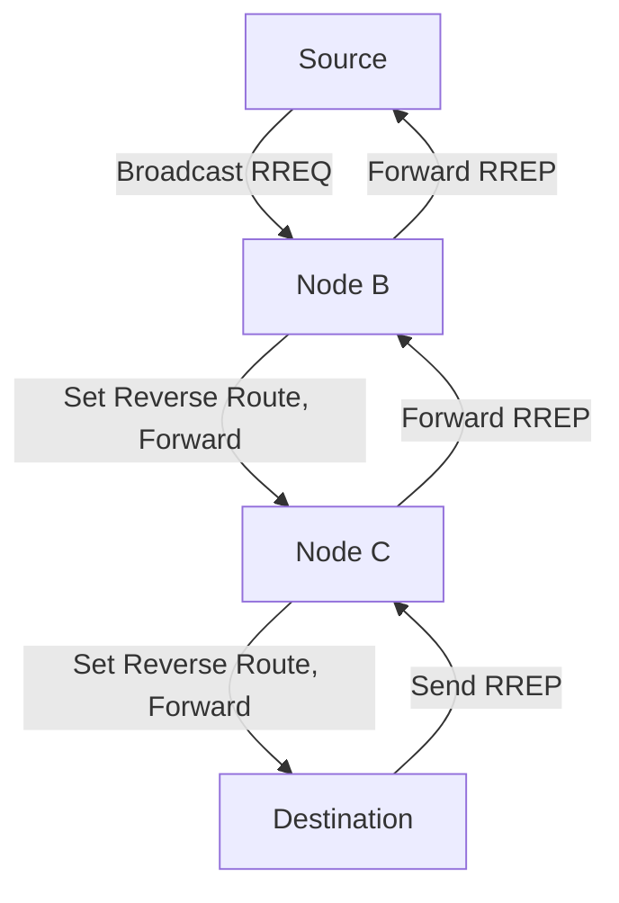

    <a href="https://rishikeshvadodaria.github.io/mkdocs/mobile-computing-unit 1/" class="nav-item mobile-computing" data-title="Unit 1">Unit 1</a>
    <a href="https://rishikeshvadodaria.github.io/mkdocs/mobile-computing-unit 2/" class="nav-item mobile-computing" data-title="Unit 2">Unit 2</a>
    <a href="https://rishikeshvadodaria.github.io/mkdocs/mobile-computing-unit 3/" class="nav-item mobile-computing" data-title="Unit 3">Unit 3</a>
    <a href="https://rishikeshvadodaria.github.io/mkdocs/mobile-computing-unit 4/" class="nav-item mobile-computing" data-title="Unit 4">Unit 4</a>
    <a href="https://rishikeshvadodaria.github.io/mkdocs/mobile-computing-unit 5/" class="nav-item mobile-computing" data-title="Unit 5">Unit 5</a>
    <a href="https://rishikeshvadodaria.github.io/mkdocs/mobile-computing-unit 6/" class="nav-item mobile-computing" data-title="Unit 6">Unit 6</a>
    <a href="https://rishikeshvadodaria.github.io/mkdocs/mobile-computing-unit 7/" class="nav-item mobile-computing" data-title="Unit 7">Unit 7</a>
    <a href="https://rishikeshvadodaria.github.io/mkdocs/mobile-computing-unit 8/" class="nav-item mobile-computing" data-title="Unit 8">Unit 8</a>
    <a href="https://rishikeshvadodaria.github.io/mkdocs/mobile-computing-unit 9/" class="nav-item mobile-computing" data-title="Unit 8">Unit 9</a>

## Mobile Ad-hoc Networks

### Wireless Networks - Mobile Connectivity Challenges

Wireless networks connect mobile users to services, but face challenges when infrastructure is limited.

- **Infrastructure-Based Issues**:
  - **Mobile IP**: Needs home agents, tunnels, and default routers to work.
  - **DHCP**: Requires dedicated servers and broadcast-capable networks.
  - **Cellular Networks**: Depend on costly base stations.
- **Challenges**: High costs or lack of infrastructure in some areas make deployment tough.
- **Example**: Setting up a cellular tower in a remote village is too expensive.

!!! note "Simple Idea"
    Wireless networks struggle without infrastructure, like trying to call without a phone tower.

### Mobile Ad-Hoc Networks (MANETs)

**MANETs** are self-configuring wireless networks that work without fixed infrastructure.

- **Key Features**:
  - Provide connectivity where traditional networks are unavailable or impractical.
  - Excel in scenarios like military communications, disaster relief, temporary events, or home networks.
  - Operate without centralized control, making them resilient.
- **Example**: Rescue teams using MANETs to communicate after an earthquake destroys cell towers.

!!! note "Simple Idea"
    MANETs are like a group of radios linking up without a central station.

### Ad-Hoc Network Applications

MANETs support various scenarios where infrastructure is absent or slow to deploy.

- **Instant Infrastructure**:
  - Used for unplanned meetings where infrastructure isn’t ready.
  - Faster than setting up fixed networks, which need planning.
  - Example: A pop-up network for a spontaneous conference.
- **Disaster Relief**:
  - Infrastructure fails in disasters (e.g., hurricanes cut power lines, floods ruin base stations).
  - MANETs allow quick setup for emergency teams.
  - Example: Firefighters coordinating via MANETs during a wildfire.
- **Remote Areas**:
  - Too costly to build infrastructure in sparsely populated areas.
  - MANETs or satellites are more practical based on usage.
  - Example: Farmers in a remote valley sharing data via MANETs.
- **Effectiveness**:
  - Cheaper than cellular for small, infrequent data (e.g., status updates every few minutes).
  - Example: Sensors in a forest sending rare alerts via MANETs.
- **Other Uses**:
  - **Personal**: Connecting phone, laptop, earphone, smartwatch.
  - **Military**: Linking soldiers, tanks, planes.
  - **Civilian**: Taxi networks, meeting rooms, stadiums, boats, small aircraft.
  - **Emergency**: Search-and-rescue, policing, firefighting.

!!! note "Simple Idea"
    MANETs are quick, cheap networks for emergencies, remote spots, or small data needs.

### MANET Characteristics and Dynamics

MANETs have unique traits due to their mobile, infrastructure-free nature.

- **Highly Mobile Nodes**: Devices move, constantly changing network connections.
- **Dynamic Connections**: Links form and break as devices shift.
- **No Infrastructure**: No need for cellular towers or base stations.
- **Multi-Hop**: Data passes through multiple devices to reach its destination.
- **Dual Role**: Each device is both a user (sending/receiving) and a router (forwarding).
- **Example**: Drones relaying messages to each other as they fly, adjusting as they move.

!!! note "Simple Idea"
    MANETs are like a chain of people passing notes, rearranging as they walk.

### Multi-Hop Wireless

MANETs rely on multi-hop communication due to limited device range.

- **How It Works**:
  - Data travels through several devices to reach the destination.
  - Each device has a short transmission range, so others relay the signal.
  - Paths change as devices move in or out of range.
  - Routing protocols adapt to these changes to find and maintain paths.
- **Example**: A message from one camper to another going through other campers’ radios.

!!! note "Simple Idea"
    Multi-hop is like passing a letter through friends to reach someone far away.

### Why Ad-Hoc Networks?

Ad-hoc networks are ideal when fixed infrastructure isn’t feasible.

- **Reasons**:
  - No infrastructure in disaster zones or war areas.
  - Impractical for short-range devices like Bluetooth (10m range).
  - Quick to deploy without backbone support.
- **Example**: Soldiers in a jungle setting up a MANET to communicate without towers.

!!! note "Simple Idea"
    Ad-hoc networks are like setting up a temporary phone line when there’s no service.

### MANET and Mobile IP

MANETs differ from Mobile IP, which relies on infrastructure.

- **MANET Nodes**: Combine routing and user functions, unlike Mobile IP’s dependence on home agents.
- **Example**: In a MANET, a soldier’s radio both sends messages and forwards others’ messages.

!!! note "Simple Idea"
    MANET devices are like team players handling both their tasks and passing messages.

### Routing in Ad-Hoc Networks

Routing in MANETs is complex due to mobility and lack of infrastructure.

- **Challenges**:
  - Unlike cellular networks where base stations reach all devices, MANETs need each device to forward data.
  - Links vary (e.g., strong one way, weak the other) due to antenna or power differences.
  - Topology changes fast as devices move.
- **Example**: A drone’s signal to another might weaken as it flies, requiring a new path.

!!! note "Simple Idea"
    Routing in MANETs is like finding a new path through a moving crowd.

### Differences in Routing: Wired vs. Ad-Hoc Networks

MANET routing differs from wired networks due to unique challenges.

- **Asymmetric Links**:
  - A device may receive clearly but send weakly (or vice versa).
  - Wired networks assume equal link quality both ways.
  - Example: One radio hears another well, but its reply is faint.
- **Redundant Links**:
  - MANETs have many possible paths, increasing routing complexity.
  - Wired networks have fewer, planned redundant links.
  - Example: Multiple drones can relay a message, complicating path choice.
- **Interference**:
  - Wireless signals clash if devices are too close, unlike wired cables.
  - Overhearing can help (learning topology) or hurt (interference).
  - Example: Two nearby radios disrupt each other’s signals.
- **Dynamic Topology**:
  - MANETs change constantly as devices move or signals vary.
  - Wired networks update slowly (e.g., every 30 seconds), unsuitable for MANETs.
  - Example: A moving car network reshuffles connections every few seconds.
- **Impact on Protocols**:
  - Traditional routing assumes stable links and global knowledge.
  - MANETs need frequent updates, considering battery and bandwidth limits.
  - Example: A wired network’s routing table updates leisurely; a MANET’s must be instant.

!!! note "Simple Idea"
    MANET routing is like navigating a maze where walls move and paths vary.

### Problems with Ad-Hoc Networks

MANETs face issues that make routing tricky.

- **Dynamic Topology**: Constant movement means paths change often.
- **Incomplete Knowledge**: Devices don’t know the full network layout, traffic, link quality, or device power.
- **Resource Constraints**: Periodic updates waste battery and bandwidth, which are scarce.
- **Traditional Protocol Failure**:
  - Wired protocols can’t handle dynamic topology, asymmetric links, or interference.
  - Centralized routing is too slow; topology changes before updates finish.
  - Flooding (sending data everywhere) works but is inefficient, needing hop limits.
- **Example**: A robot swarm struggles to route data as robots move and signals fade.

!!! note "Simple Idea"
    MANETs are hard to manage because everything keeps changing and resources are tight.

### Distance-Vector and Link-State Routing

Traditional routing methods inform MANET protocols but need adaptation.

- **Distance-Vector**:
  - Each device knows the cost (hops) to reach others.
  - Shares distance lists with neighbors, updating paths if shorter ones are found.
  - Tracks which neighbor offers the best path for forwarding.
  - Example: A device says, “I can reach X in 2 hops via Y,” and neighbors update.
- **Link-State**:
  - Devices know the entire network map and calculate shortest paths.
  - Share link status with neighbors to build the map.
  - Example: Devices share a full network diagram to plan routes.
- **Assumptions**: Both assume devices know neighbors’ addresses and link costs (infinite if broken).

!!! note "Simple Idea"
    Distance-vector is like sharing travel times; link-state is like sharing a full map.

### Routing and Mobility

Mobility in MANETs complicates routing.

- **Frequent Route Changes**: Device movement creates unpredictable network layouts.
- **Power Limits**: Battery constraints affect routing choices.
- **Goals**:
  - Reduce routing overhead.
  - Find short, stable paths despite mobility.
- **Example**: A moving vehicle network must keep finding new paths as cars shift.

!!! note "Simple Idea"
    Routing in MANETs is like planning a route in a city where roads keep changing.

### Routing Protocols in MANETs

MANET routing protocols are designed for dynamic, infrastructure-less networks.

- **Proactive Protocols**:
  - Maintain routes to all devices at all times via periodic updates.
  - Example: DSDV, GSR (Global State Routing).
- **Reactive Protocols**:
  - Find routes only when needed, reducing overhead.
  - Example: DSR, AODV.
- **Hybrid Protocols**:
  - Combine proactive (local) and reactive (distant) routing.
  - Example: ZRP.

!!! note "Simple Idea"
    Proactive keeps all routes ready; reactive finds them as needed; hybrid mixes both.

### Proactive Routing: Destination Sequenced Distance Vector (DSDV)

**DSDV** is a proactive protocol enhancing distance-vector routing for MANETs.

- **How It Works**:
  - Each device maintains a table with paths to all destinations, including:
    - Destination, next hop, hop count, sequence number, install time, stability data.
  - Shares tables with neighbors periodically.
  - Sequence numbers (set by destination) ensure fresh routes and prevent loops.
  - Immediate updates for new routes, broken links, or metric changes.
  - Full updates send all table data; incremental updates send only changes.
- **Count-to-Infinity Fix**:
  - In traditional distance-vector, a broken link causes endless updates (e.g., A thinks it can reach E via B, B via A).
  - DSDV uses sequence numbers to mark newer routes, avoiding this.
- **Example**: Hikers share maps with version numbers; a higher number means a fresher path.
- **Pros**:
  - Fast route access; loop-free with sequence numbers.
  - Quick response to topology changes.
- **Cons**:
  - High overhead from constant updates.
  - Maintains unused routes, draining battery.

!!! note "Simple Idea"
    DSDV is like always updating a group GPS with versioned paths, even for unused routes.

### Reactive Routing: Dynamic Source Routing (DSR)

**DSR** is a reactive protocol finding routes only when needed.

- **How It Works**:
  - **Route Discovery**:
    - Device broadcasts a Route Request (RREQ) with a unique ID and destination address.
    - Nodes add their address and forward, dropping duplicates.
    - Destination receives RREQ, picks the best path, and sends a Route Reply (RREP) back via the reverse path.
  - **Route Maintenance**:
    - Checks paths during use; finds new ones if broken.
  - **Source Routing**: Data packets carry the full path in the header.
  - **Caching**: Nodes save learned paths to avoid rediscovery.
  - **Optimizations**:
    - Limits broadcasts with a counter (drops after max hops).
    - Nodes cache routes from RREQs, RREPs, or overheard data.
- **Example**: Passing a note through friends to find a path, then using it to send messages.
- **Pros**:
  - Low overhead; only active routes maintained.
  - Caching reduces discovery needs.
  - Single discovery yields multiple routes.
- **Cons**:
  - Large packet headers for long paths.
  - Flooding RREQs congests networks.
  - Collisions from simultaneous broadcasts.
  - Reply storms from cached replies.
  - Stale caches cause route failures.

!!! note "Simple Idea"
    DSR is like asking for a delivery route only when sending a package, saving the path for later.

### Reactive Routing: Ad-Hoc On-Demand Distance Vector (AODV)

**AODV** is a reactive protocol using distance vectors on demand.

- **How It Works**:
  - **Route Discovery**:
    - Source broadcasts RREQ with ID, source/destination addresses, sequence numbers, and Time-to-Live (TTL).
    - Nodes set reverse route entries (source address, hop count, sequence number, lifetime).
    - Destination or a node with a fresh route sends RREP via reverse path.
    - TTL increases if no reply, expanding the search.
  - **Route Maintenance**:
    - “Hello” messages check neighbor links.
    - Route Error (RERR) packets notify broken links, propagated to affected nodes.
  - **Tables**: Store next-hop info, destination address, sequence number, lifetime; entries expire if unused.
  - **Sequence Numbers**: Each node increases its number when topology changes, ensuring fresh routes.
- **Example**: Shouting for a path, setting breadcrumbs back, and checking if neighbors are reachable.
- **Pros**:
  - Low overhead; only active routes kept.
  - Smaller tables than DSR (next-hop only).
  - Adapts to topology changes.
- **Cons**:
  - Delay for route discovery.
  - Flooding RREQs can clog networks.
  - Hello messages add some overhead.

!!! note "Simple Idea"
    AODV is like calling out for a route when needed, remembering just the next step.

### Hybrid Routing: Zone Routing Protocol (ZRP)

**ZRP** combines proactive and reactive routing for efficiency.

- **How It Works**:
  - Each device has a zone (nodes within a set hop limit, e.g., 2 hops).
  - **Intra-Zone Routing (IARP)**: Proactive, maintains paths within the zone using link-state methods.
  - **Inter-Zone Routing (IERP)**: Reactive, finds paths outside the zone like DSR.
  - Zones are hop-based, not physical distance.
- **Example**: Knowing all nearby streets proactively but asking for directions to a distant city reactively.
- **Pros**:
  - Fast routing within zones; efficient for distant nodes.
  - Scales well for large networks.
  - Reduces overhead compared to fully proactive protocols.
- **Cons**:
  - Complex to manage zone boundaries.
  - Performance depends on zone size.

!!! note "Simple Idea"
    ZRP is like keeping a local map updated but asking for help to reach far places.

### Hierarchical State Routing Protocol (HSR)

**HSR** organizes MANETs into clusters for scalable routing.

- **How It Works**:
  - Devices form clusters, each with a cluster head.
  - Heads form higher-level clusters, creating a hierarchy.
  - Proactive routing within clusters; reactive or hierarchical routing between clusters.
  - Uses logical addresses (e.g., cluster IDs) to simplify routing.
- **Example**: Schools divided into classes (clusters), with teachers (heads) linking classes.
- **Pros**:
  - Scales well for large networks.
  - Reduces routing overhead with hierarchy.
  - Efficient for structured networks.
- **Cons**:
  - Complex to set up clusters.
  - Cluster head failures disrupt routing.

!!! note "Simple Idea"
    HSR is like organizing a big group into teams, with leaders coordinating between them.

### Power-Aware Routing Metrics

**Power-aware routing** optimizes paths to save energy in MANETs.

- **Metrics**:
  - **Energy Consumption**: Chooses paths using less total energy.
  - **Link Quality**: Picks strong links needing less power to transmit.
  - **Distance**: Prefers shorter paths to reduce power needs.
  - **Traffic Load**: Avoids busy devices that drain more power.
  - **Battery Life**: Favors devices with more battery to extend network life.
- **Uses**: Common in ZigBee, Bluetooth Low Energy, and Wireless Sensor Networks.
- **Example**: Routing through a drone with a full battery over a short, clear path.
- **Pros**:
  - Saves energy, prolongs device and network life.
  - Adapts to battery and link conditions.
- **Cons**:
  - May choose longer routes to save power, increasing delay.
  - Adds complexity to routing decisions.

!!! note "Simple Idea"
    Power-aware routing is like picking an easy bike path to save energy.

## Comparison Table

| **Protocol** | **Type** | **Route Maintenance** | **Speed** | **Overhead** | **Best For** |
| --- | --- | --- | --- | --- | --- |
| **DSDV** | Proactive | Always updated | Fast | High | Small, stable networks |
| **DSR** | Reactive | On-demand | Slower | Low | Dynamic, sparse networks |
| **AODV** | Reactive | On-demand | Slower | Low | Dynamic, frequent routing |
| **ZRP** | Hybrid | Local proactive, distant reactive | Medium | Medium | Large networks |
| **HSR** | Hierarchical | Cluster-based | Medium | Medium | Large, scalable networks |

## Process Flow (AODV Route Discovery)

