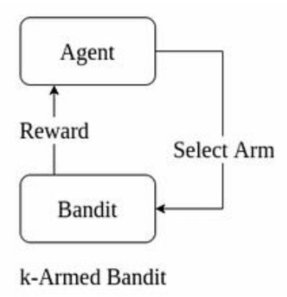

# Unit 2: Multi-Arm Bandits

Multi-Arm Bandit (MAB) problems are a cornerstone of reinforcement learning (RL), modeling decision-making under uncertainty. They focus on the **exploration vs. exploitation** trade-off, where an agent must choose between trying new options (exploration) to learn their value or selecting known high-reward options (exploitation) to maximize cumulative rewards. This unit provides an in-depth exploration of the k-armed bandit problem, key algorithms (ε-greedy, Upper Confidence Bound), action-value methods, non-stationary tracking, and comparative analyses, enriched with detailed examples and conceptual insights.

## What Is the K-Armed Bandit Problem?

The **k-armed bandit problem** is a fundamental RL problem inspired by a gambler facing \( k \) slot machines ("bandits"), each with an unknown reward probability distribution. The agent’s goal is to maximize total rewards over a series of trials by strategically choosing which arm to pull, balancing the need to explore unknown arms and exploit known high-reward ones.

### Formal Definition
- **Setup**:
  - At each time step \( t = 1, 2, \dots, T \), the agent selects one of \( k \) arms, denoted \( A_t \in \{1, 2, \dots, k\} \).
  - The environment returns a reward \( R_t \), drawn from the arm’s unknown probability distribution.
  - Each arm \( a \) has a **true expected reward** (action value) \( q_*(a) = E[R_t | A_t = a] \), which is stationary (unchanging) in the classic setting.
- **Objective**: Maximize the cumulative reward:

\[  \sum_{t=1}^T R_t  \]

- **Regret**: The difference between the optimal reward (always choosing the best arm) and the actual reward:

\[  \text{Regret} = T \cdot \max_a q_*(a) - \sum_{t=1}^T R_t\]

- **Key Characteristics**:
  - **Single-state problem**: No state transitions, unlike general RL.
  - **Unknown distributions**: The agent estimates \( q_*(a) \) via observed rewards.
  - **Exploration vs. Exploitation**: Trying new arms risks low rewards but improves estimates; sticking to the best-known arm maximizes short-term gains but may miss better options.

### Example: Restaurant Choice
- **Scenario**: You’re in a town with 4 restaurants (arms) for 1000 days. Each restaurant has an unknown probability of a "happy" meal: \( P(M_1) = 0.6 \), \( P(M_2) = 0.4 \), \( P(M_3) = 0.7 \), \( P(M_4) = 0.9 \). Reward = 1 for a happy meal, 0 otherwise.
- **Strategies**:
  - **Exploit Only**: Always choose restaurant 1 (assuming it seems best initially). Expected reward: \( 1000 \times 0.6 = 600 \). Regret: \( 1000 \times 0.9 - 600 = 300 \).
  - **Explore Only**: Choose each restaurant 250 times. Expected reward: \( 250 \times (0.6 + 0.4 + 0.7 + 0.9) = 650 \). Regret: \( 900 - 650 = 250 \).
  - **Optimal**: Always choose restaurant 4 (if probabilities were known). Expected reward: \( 1000 \times 0.9 = 900 \).
- **Challenge**: Without knowing probabilities, the agent must balance trying all restaurants to find the best (exploration) with repeatedly visiting the best-known one (exploitation).

### Real-World Analogies
- **Clinical Trials**: Test different drugs (arms) to find the most effective, balancing patient outcomes (exploitation) with learning about new treatments (exploration).
- **Online Advertising**: Choose between ad campaigns to maximize clicks, testing new ads (exploration) vs. showing high-performing ads (exploitation).
- **Game Playing**: In chess, play known strong moves (exploitation) or experimental moves to learn their effectiveness (exploration).

### Process Flow
The k-armed bandit interaction is a simple feedback loop, as shown below:

!!! note "Definition: K-Armed Bandit"
    A k-armed bandit problem involves selecting one of \( k \) actions with unknown reward distributions to maximize cumulative rewards, formalized as a single-state Markov Decision Process (MDP).

!!! danger "Key Challenge"
    Over-exploration wastes trials on poor arms; over-exploitation risks missing the optimal arm, leading to high regret.

## What Is the ε-Greedy Algorithm?

The **ε-greedy algorithm** is a widely used method to balance exploration and exploitation in k-armed bandit problems. It predominantly selects the arm with the highest estimated reward (greedy action) but occasionally chooses a random arm to explore, controlled by a parameter \( \epsilon \).

### Detailed Algorithm
1. **Initialization**:
   - For each arm \( a = 1, 2, \dots, k \):
     - Set initial action-value estimate \( Q_1(a) = 0 \) (or an optimistic value, e.g., 5).
     - Set selection count \( N_1(a) = 0 \).
   - Choose exploration probability \( \epsilon \in [0, 1] \).
2. **For each time step \( t = 1, 2, \dots, T \)**:
   - Generate a random number \( x \sim \text{Uniform}[0, 1] \).
   - **Action Selection**:
     - If \( x > \epsilon \) (probability \( 1 - \epsilon \)):
       - **Exploit**: Choose the greedy action \( A_t = \arg\max_a Q_t(a) \). Break ties randomly.
     - Else (probability \( \epsilon \)):
       - **Explore**: Choose a random arm \( A_t \) with probability \( 1/k \).
   - **Receive Reward**: Pull arm \( A_t \), get reward \( R_t \).
   - **Update Counts**: \( N_{t+1}(A_t) = N_t(A_t) + 1 \).
   - **Update Action-Value**:
   
\[      Q_{t+1}(A_t) = Q_t(A_t) + \frac{1}{N_t(A_t)} [R_t - Q_t(A_t)]   \]

For other arms \( a \neq A_t \), \( Q_{t+1}(a) = Q_t(a) \), \( N_{t+1}(a) = N_t(a) \).

### Numerical Example
- **Setup**: 4-arm bandit with true win probabilities \( P(M_1) = 0.6 \), \( P(M_2) = 0.4 \), \( P(M_3) = 0.7 \), \( P(M_4) = 0.9 \). Use \( \epsilon = 0.2 \), run for 5 steps.
- **Input**:
  - Random numbers for action selection: [0.68, 0.55, 0.23, 0.95, 0.8].
  - Random numbers for rewards: [0.6, 0.2, 0.3, 0.4, 0.9].
  - Reward rule: If random number \( \leq P(M_i) \), \( R_t = 1 \); else \( R_t = 0 \).
- **Initialization**: \( Q_1(a) = 0 \), \( N_1(a) = 0 \) for all arms.

#### Step-by-Step Execution
**Step 1**:

   - \( x = 0.68 > 0.2 \), greedy. All \( Q_1(a) = 0 \), pick \( M_1 \) (random tie-break).
   - Reward: \( 0.6 \leq 0.6 \), \( R_1 = 1 \).
   - Update: \( N_2(M_1) = 1 \), \( Q_2(M_1) = 0 + \frac{1}{1} (1 - 0) = 1 \).

**Step 2**:

   - \( x = 0.55 > 0.2 \), greedy. \( Q_2(M_1) = 1 \), others 0, pick \( M_1 \).
   - Reward: \( 0.2 \leq 0.6 \), \( R_2 = 1 \).
   - Update: \( N_3(M_1) = 2 \), \( Q_3(M_1) = 1 + \frac{1}{2} (1 - 1) = 1 \).

**Step 3**:

   - \( x = 0.23 > 0.2 \), greedy. Pick \( M_1 \).
   - Reward: \( 0.3 \leq 0.6 \), \( R_3 = 1 \).
   - Update: \( N_4(M_1) = 3 \), \( Q_4(M_1) = 1 + \frac{1}{3} (1 - 1) = 1 \).

**Step 4**:

   - \( x = 0.95 > 0.2 \), greedy. Pick \( M_1 \).
   - Reward: \( 0.4 \leq 0.6 \), \( R_4 = 1 \).
   - Update: \( N_5(M_1) = 4 \), \( Q_5(M_1) = 1 + \frac{1}{4} (1 - 1) = 1 \).

**Step 5**:

   - \( x = 0.8 > 0.2 \), greedy. Pick \( M_1 \).
   - Reward: \( 0.9 > 0.6 \), \( R_5 = 0 \).
   - Update: \( N_6(M_1) = 5 \), \( Q_6(M_1) = 1 + \frac{1}{5} (0 - 1) = \frac{4}{5} = 0.8 \).

#### Results
- **Total Reward**: \( 1 + 1 + 1 + 1 + 0 = 4 \).
- **Optimal Reward**: Always pick \( M_4 \): \( 0.9 \times 5 = 4.5 \).
- **Regret**: \( 4.5 - 4 = 0.5 \).
- **Analysis**: The algorithm was unlucky, as no exploration (\( x < 0.2 \)) occurred, missing \( M_4 \).

### Advantages and Limitations
- **Advantages**:
  - Simple to implement and understand.
  - Guarantees exploration of all arms with \( \epsilon > 0 \), ensuring \( Q_t(a) \to q_*(a) \) as \( t \to \infty \).
  - Effective in stationary environments with proper \( \epsilon \).
- **Limitations**:
  - Fixed \( \epsilon \) leads to unnecessary exploration in later steps, increasing regret.
  - Random exploration may repeatedly select poor arms.
  - Requires tuning \( \epsilon \), which is problem-dependent.

!!! danger "Pitfall"
    A high \( \epsilon \) (e.g., 0.5) wastes trials on suboptimal arms, while \( \epsilon = 0 \) (pure greedy) risks getting stuck on a suboptimal arm.

## What Is Epsilon Decay, and Why Is It Used?

**Epsilon decay** is an enhancement to the ε-greedy algorithm where the exploration probability \( \epsilon \) decreases over time, shifting focus from exploration to exploitation as the agent gains confidence in its action-value estimates.

### Detailed Mechanism
- **Initial \( \epsilon \)**: Start with a high \( \epsilon_0 \) (e.g., 0.5) to encourage exploration.
- **Decay Strategies**:
  - **Linear Decay**: \( \epsilon_t = \epsilon_0 - \delta \cdot t \), where \( \delta \) is a small constant (e.g., \( \delta = 0.0001 \)).
  - **Exponential Decay**: \( \epsilon_t = \epsilon_0 \cdot \gamma^t \), where \( 0 < \gamma < 1 \) (e.g., \( \gamma = 0.999 \)).
  - **Inverse Decay**: \( \epsilon_t = \frac{\epsilon_0}{1 + \kappa \cdot t} \), where \( \kappa \) controls decay speed.
- **Minimum \( \epsilon \)**: Set a floor \( \epsilon_{\text{min}} \) (e.g., 0.01) to ensure some exploration persists.
- **Implementation**:
  - Update \( \epsilon_t \) after each step or episode.
  - Example: \( \epsilon_t = \max(0.01, 0.5 \cdot 0.999^t) \).

### Why It’s Used
1. **Early Exploration**: High initial \( \epsilon \) ensures all arms are sampled, reducing the risk of missing the optimal arm.
2. **Late Exploitation**: As \( Q_t(a) \) becomes reliable, lower \( \epsilon \) focuses on the best arm, maximizing rewards.
3. **Reduced Regret**: Decreasing exploration minimizes trials wasted on suboptimal arms.
4. **Adaptability**: Matches the learning process, where uncertainty decreases over time.
5. **Practicality**: Avoids manual tuning of a fixed \( \epsilon \).

### Example: Exponential Decay
- **Setup**: \( \epsilon_0 = 0.5 \), \( \gamma = 0.995 \), \( \epsilon_{\text{min}} = 0.01 \), \( T = 1000 \).
- **Calculation**:
  - Step 100: \( \epsilon_{100} = 0.5 \cdot 0.995^{100} \approx 0.303 \).
  - Step 500: \( \epsilon_{500} \approx 0.036 \).
  - Step 1000: \( \epsilon_{1000} \approx 0.01 \) (hits minimum).
- **Impact**: Early steps explore ~50% of the time; by step 1000, exploration drops to ~1%, prioritizing the best arm.

### Derivation: Why Decay Works
- **Early Phase**: High \( \epsilon \) increases \( N_t(a) \) for all arms, improving \( Q_t(a) \) accuracy.
- **Late Phase**: As \( Q_t(a) \to q_*(a) \), the optimal arm’s \( Q_t(a) \) dominates, and exploration becomes less necessary.
- **Regret Analysis**:
  - Fixed \( \epsilon \): Linear regret (\( O(T) \)), as exploration continues indefinitely.
  - Decaying \( \epsilon \): Sublinear regret (e.g., \( O(\sqrt{T}) \)) with proper decay (e.g., \( \epsilon_t \propto 1/t \)).

!!! note "Formula: Exponential Decay"
    \[
    \epsilon_t = \max(\epsilon_{\text{min}}, \epsilon_0 \cdot \gamma^t)
    \]
!!! danger "Tuning Challenge"
    Too fast a decay (large \( \gamma \)) may stop exploration prematurely; too slow a decay wastes trials. Tune \( \gamma \) based on problem horizon \( T \).

## What Are Action-Value Methods?

**Action-value methods** are techniques that estimate the expected reward (action value) of each arm based on observed rewards and use these estimates to guide action selection. They form the foundation of bandit algorithms like ε-greedy, UCB, and optimistic initial values.

### Core Components

**Expected Value \( q_*(a) \)**:

   - The true mean reward for arm \( a \): \( q_*(a) = E[R_t | A_t = a] \).
   - Example: For a Bernoulli bandit, \( q_*(a) = P(\text{win}) \).
   - Unknown to the agent, it’s estimated empirically.

**Estimated Value \( Q_t(a) \)**:
   - The agent’s approximation of \( q_*(a) \) at time \( t \).
   - Computed via **sample-average method**:

\[      Q_t(a) = \frac{\sum_{i=1}^{t-1} R_i \cdot \mathbb{1}_{A_i=a}}{N_t(a)}    \]

   - \( N_t(a) \): Number of times arm \( a \) was chosen.
   - \( \mathbb{1}_{A_i=a} \): Indicator (1 if \( A_i = a \), 0 otherwise).
   - If \( N_t(a) = 0 \), set \( Q_t(a) = 0 \) or a default (e.g., optimistic value).
**Incremental Update**:
      - To avoid storing all rewards, update \( Q_t(a) \) incrementally:

\[ Q_{t+1}(a) = Q_t(a) + \frac{1}{N_t(a)} [R_t - Q_t(a)]  \]

   - Derivation:

\[  Q_{t+1}(a) = \frac{\sum_{i=1}^t R_i \cdot \mathbb{1}_{A_i=a}}{N_t(a)} = \frac{(N_t(a) - 1) Q_t(a) + R_t}{N_t(a)}   \]

\[  = Q_t(a) + \frac{R_t - Q_t(a)}{N_t(a)}   \]

   - Requires storing only \( Q_t(a) \) and \( N_t(a) \), making it memory-efficient.

**Action Selection**:
   - Use \( Q_t(a) \) to choose arms, e.g.:
     - Greedy: \( A_t = \arg\max_a Q_t(a) \).
     - ε-Greedy: Mix greedy with random exploration.
     - UCB: Incorporate uncertainty (see later).

### Example: Incremental Update
- **Setup**: Arm \( a \) chosen 3 times, rewards: [1, 0, 1]. Initial \( Q_1(a) = 0 \), \( N_1(a) = 0 \).
- **Updates**:
  - After \( R_1 = 1 \): \( Q_2(a) = 0 + \frac{1}{1} (1 - 0) = 1 \), \( N_2(a) = 1 \).
  - After \( R_2 = 0 \): \( Q_3(a) = 1 + \frac{1}{2} (0 - 1) = 0.5 \), \( N_3(a) = 2 \).
  - After \( R_3 = 1 \): \( Q_4(a) = 0.5 + \frac{1}{3} (1 - 0.5) \approx 0.667 \), \( N_4(a) = 3 \).
- **Verification**: Sample-average: \( Q_4(a) = \frac{1 + 0 + 1}{3} = \frac{2}{3} \approx 0.667 \).

### General Form
- The incremental update follows:

\[ \text{NewEstimate} = \text{OldEstimate} + \text{StepSize} \cdot [\text{Target} - \text{OldEstimate}]  \]

  - **Target**: The new reward \( R_t \).
  - **StepSize**: \( \frac{1}{N_t(a)} \), which decreases as \( N_t(a) \) grows.
  - **Error**: \( R_t - Q_t(a) \), reduced by moving toward the target.

### Why It Matters
- **Convergence**: By the **Law of Small Numbers**, \( Q_t(a) \to q_*(a) \) as \( N_t(a) \to \infty \).
- **Efficiency**: Incremental updates minimize computational and memory costs.
- **Flexibility**: Forms the basis for various algorithms (ε-greedy, UCB, etc.).

!!! note "Law of Large Numbers"
    As the number of samples \( N_t(a) \) increases, the sample average \( Q_t(a) \) converges to the true expected value \( q_*(a) \).

!!! danger "Exploration Dependency"
    Accurate \( Q_t(a) \) requires sufficient exploration; if \( N_t(a) \) is low, estimates are noisy, necessitating algorithms like ε-greedy or UCB.

## How Do We Track a Non-Stationary Problem in Bandit Settings?

In **non-stationary** bandit problems, the reward distributions (\( q_*(a) \)) change over time, rendering traditional sample-average methods ineffective. Tracking these changes requires prioritizing recent rewards to adapt to evolving environments.

### Non-Stationary Challenges
- **Stationary Limitation**: Sample-average methods assume \( q_*(a) \) is fixed, so \( Q_t(a) \) converges to a constant, ignoring shifts.
- **Real-World Examples**:
  - A restaurant’s quality changes due to a new chef.
  - A slot machine’s payout rate adjusts due to casino updates.
  - Ad click-through rates shift with user trends.
- **Need for Adaptability**: Old rewards become irrelevant, and the agent must track the current \( q_*(a) \).

### Solution: Constant Step-Size Update
- **Modification**: Replace the decreasing step-size \( \frac{1}{N_t(a)} \) with a **constant step-size** \( \alpha \in (0, 1] \):

\[
Q_{t+1}(a) = Q_t(a) + \alpha [R_t - Q_t(a)]
\]

- **Alternative Form**:

\[
Q_{t+1}(a) = (1 - \alpha) Q_t(a) + \alpha R_t
\]

- **Weighted Average**:
  - After \( n \) selections of arm \( a \), the estimate is:
  
\[
Q_{n+1}(a) = \alpha \sum_{i=1}^n (1 - \alpha)^{n-i} R_i + (1 - \alpha)^n Q_1(a)
\]

  - **Weights**: \( \alpha (1 - \alpha)^{n-i} \) for reward \( R_i \), decaying exponentially with time since observation.
  - **Sum of Weights**: \( \sum_{i=1}^n \alpha (1 - \alpha)^{n-i} + (1 - \alpha)^n = 1 \), forming a weighted average.

### Example: Tracking Changing Rewards
- **Setup**: Arm \( a \), initial \( Q_1(a) = 0 \), \( \alpha = 0.1 \). Rewards: [1, 1, 0, 2, 2] (assume \( q_*(a) \) shifts from 1 to 2 after step 3).
- **Updates**:
  - Step 1: \( R_1 = 1 \), \( Q_2(a) = 0 + 0.1 (1 - 0) = 0.1 \).
  - Step 2: \( R_2 = 1 \), \( Q_3(a) = 0.1 + 0.1 (1 - 0.1) = 0.19 \).
  - Step 3: \( R_3 = 0 \), \( Q_4(a) = 0.19 + 0.1 (0 - 0.19) = 0.171 \).
  - Step 4: \( R_4 = 2 \), \( Q_5(a) = 0.171 + 0.1 (2 - 0.171) = 0.354 \).
  - Step 5: \( R_5 = 2 \), \( Q_6(a) = 0.354 + 0.1 (2 - 0.354) = 0.499 \).
- **Analysis**: \( Q_t(a) \) starts near 1, then gradually tracks toward 2, reflecting the shift in \( q_*(a) \).

### Why It Works
- **Recency Bias**: \( \alpha \) emphasizes recent rewards, with \( (1 - \alpha)^{n-i} \) reducing the influence of older rewards.
- **Exponential Decay**: The weight \( \alpha (1 - \alpha)^{n-i} \) decreases exponentially, ensuring adaptability.
- **Tunable \( \alpha \)**:
  - High \( \alpha \) (e.g., 0.5): Fast adaptation, but noisy estimates.
  - Low \( \alpha \) (e.g., 0.01): Smooth estimates, but slow to adapt.
- **Applications**: Non-stationary bandits are common in online advertising, recommendation systems, and dynamic pricing.

!!! note "Exponentially Weighted Average"
    The constant \( \alpha \) creates an **exponentially recency-weighted average**, ideal for tracking non-stationary reward distributions.

!!! tip "Mnemonic: Non-Stationary"
    **"ADAPT"**: **A**lways **D**iscount **A**ncient rewards, **P**rioritize **T**oday’s.

!!! danger "Balancing Act"
    Choosing \( \alpha \) is critical: too high causes instability; too low lags behind changes. Test multiple \( \alpha \) values for optimal performance.

## What Is the Upper Confidence Bound (UCB) Approach?

The **Upper Confidence Bound (UCB)** approach is a sophisticated method for action selection in bandit problems, selecting arms by combining their estimated rewards with an uncertainty term to prioritize those with high potential (either due to high estimates or insufficient exploration).

### Algorithm Details
- **Action Selection**:
  \[
  A_t = \arg\max_a \left[ Q_t(a) + c \sqrt{\frac{\ln t}{N_t(a)}} \right]
  \]
  - \( Q_t(a) \): Estimated action value.
  - \( c > 0 \): Exploration parameter (typically \( c = 2 \)) controls the trade-off between exploration and exploitation.
  - \( \sqrt{\frac{\ln t}{N_t(a)}} \): Uncertainty term, high when \( N_t(a) \) is small (few selections) or \( t \) is large (many steps).
  - If \( N_t(a) = 0 \), assume infinite UCB (select the arm).
- **Update**:
  - Pull arm \( A_t \), receive \( R_t \).
  - Update: \( N_{t+1}(A_t) = N_t(A_t) + 1 \), \( Q_{t+1}(A_t) = Q_t(A_t) + \frac{1}{N_t(A_t)} [R_t - Q_t(A_t)] \).

### Intuition
- The UCB value \( Q_t(a) + c \sqrt{\frac{\ln t}{N_t(a)}} \) estimates an **upper bound** on the true \( q_*(a) \), assuming optimism in uncertainty.
- **High \( Q_t(a) \)**: Indicates a promising arm (exploitation).
- **High \( \sqrt{\frac{\ln t}{N_t(a)}} \)**: Indicates an under-explored arm (exploration).
- **Dynamic Balance**:
  - Choosing an arm increases \( N_t(a) \), reducing its uncertainty term.
  - Not choosing an arm increases \( t \), raising its uncertainty term.
- **Logarithmic Term**: \( \ln t \) ensures exploration diminishes over time but never stops.

### Numerical Example
- **Setup**: 3 machines at \( t = 1000 \), \( c = 2 \). Current estimates:
  - \( M_1 \): \( Q_t(M_1) = 0.8 \), \( N_t(M_1) = 250 \).
  - \( M_2 \): \( Q_t(M_2) = 1.0 \), \( N_t(M_2) = 350 \).
  - \( M_3 \): \( Q_t(M_3) = 1.2 \), \( N_t(M_3) = 400 \).
- **Calculate UCB**:
  - \( \ln 1000 \approx 6.908 \).
  - \( M_1 \): \( 0.8 + 2 \sqrt{\frac{6.908}{250}} = 0.8 + 2 \sqrt{0.027632} \approx 0.8 + 0.332 = 1.132 \).
  - \( M_2 \): \( 1.0 + 2 \sqrt{\frac{6.908}{350}} \approx 1.0 + 0.281 = 1.281 \).
  - \( M_3 \): \( 1.2 + 2 \sqrt{\frac{6.908}{400}} \approx 1.2 + 0.263 = 1.463 \).
- **Choice**: Select \( M_3 \) (UCB = 1.463).
- **Update**: If \( R_t = 1 \):
  - \( N_{t+1}(M_3) = 401 \).
  - \( Q_{t+1}(M_3) = 1.2 + \frac{1}{401} (1 - 1.2) \approx 1.2 - 0.0005 = 1.1995 \).

### Additional Example: Early Steps
- **Setup**: 2 arms, \( t = 3 \), \( c = 2 \), \( Q_1(a) = 0 \), \( N_1(a) = 0 \).
- **Step 1**: All \( N_1(a) = 0 \), pick \( M_1 \). Reward \( R_1 = 1 \). Update: \( Q_2(M_1) = 1 \), \( N_2(M_1) = 1 \).
- **Step 2**: \( \ln 2 \approx 0.693 \).
  - \( M_1 \): \( 1 + 2 \sqrt{\frac{0.693}{1}} \approx 1 + 1.665 = 2.665 \).
  - \( M_2 \): \( 0 + \infty = \infty \).
  - Pick \( M_2 \). Reward \( R_2 = 0 \). Update: \( Q_3(M_2) = 0 \), \( N_3(M_2) = 1 \).
- **Step 3**: \( \ln 3 \approx 1.099 \).
  - \( M_1 \): \( 1 + 2 \sqrt{\frac{1.099}{1}} \approx 1 + 2.098 = 3.098 \).
  - \( M_2 \): \( 0 + 2 \sqrt{\frac{1.099}{1}} \approx 2.098 \).
  - Pick \( M_1 \).

!!! note "UCB Principle"
    UCB follows **optimism in the face of uncertainty**, assuming untested arms could be optimal, thus encouraging targeted exploration.

!!! tip "Mnemonic: UCB"
    **"UNCAP"**: **U**ncertainty **N**udges **C**hoice, **A**iming for **P**otential.

!!! danger "Stationarity Assumption"
    UCB assumes stationary rewards; non-stationary settings require variants like discounted UCB or sliding-window UCB.

## Compare UCB with ε-Greedy: Which Balances Exploration Better?

### Detailed Comparison

| **Aspect**               | **ε-Greedy**                               | **UCB**                                    |
|--------------------------|--------------------------------------------|--------------------------------------------|
| **Action Selection**     | Greedy (\( \arg\max Q_t(a) \)) with probability \( 1 - \epsilon \); random with \( \epsilon \) | \( \arg\max \left[ Q_t(a) + c \sqrt{\frac{\ln t}{N_t(a)}} \right] \) |
| **Exploration Mechanism**| Random exploration with fixed or decaying \( \epsilon \) | Uncertainty-driven; prioritizes arms with low \( N_t(a) \) or high potential |
| **Exploration Control**  | \( \epsilon \) (fixed or decaying) controls exploration frequency | \( c \) scales uncertainty term, balancing exploration intensity |
| **Exploration Pattern**  | Uniform random exploration, may oversample poor arms | Targeted exploration, favors near-optimal or under-explored arms |
| **Convergence**          | All arms sampled infinitely (\( \epsilon > 0 \)), \( Q_t(a) \to q_*(a) \) | All arms sampled, with suboptimal arms selected less over time |
| **Regret**               | Linear regret (\( O(T) \)) with fixed \( \epsilon \); sublinear with decay | Logarithmic regret (\( O(\ln T) \)), theoretically optimal |
| **Computational Cost**   | Low; simple random choice and updates | Moderate; requires computing \( \ln t \) and \( \sqrt{\frac{\ln t}{N_t(a)}} \) |
| **Implementation Ease**  | Very simple, minimal tuning | More complex, requires tuning \( c \) |
| **Suitability**          | Stationary problems, quick prototypes | Stationary problems, long-term optimization |
| **Non-Stationary**      | Poor; needs decay or other adaptations | Poor; needs variants like discounted UCB |

### Which Balances Exploration Better?
- **UCB** is superior for balancing exploration and exploitation in most stationary bandit problems because:
  - **Targeted Exploration**: UCB selects arms based on their potential to be optimal, considering both \( Q_t(a) \) and uncertainty. This avoids wasting trials on clearly suboptimal arms, unlike ε-greedy’s random exploration.
  - **Theoretical Optimality**: UCB achieves logarithmic regret (\( O(\ln T) \)), meaning regret grows slowly, compared to ε-greedy’s linear regret (\( O(T) \)) with fixed \( \epsilon \) or sublinear regret with decay.
  - **Dynamic Adjustment**: The uncertainty term \( \sqrt{\frac{\ln t}{N_t(a)}} \) naturally reduces exploration for well-tested arms and increases it for under-explored ones, without manual tuning.
  - **Empirical Evidence**: On the 10-armed testbed (Sutton & Barto, 2020), UCB outperformed ε-greedy (\( \epsilon = 0.1, 0.01 \)) in average reward (~1.4 vs. ~1.2) and optimal arm selection (~80% vs. ~60%) after 1000 steps.
- **ε-Greedy Strengths**:
  - **Simplicity**: Easier to implement and understand, ideal for quick prototypes or small-scale problems.
  - **Flexibility with Decay**: Epsilon decay improves performance, though it requires careful tuning.
  - **Robustness**: Performs adequately in noisy environments where UCB’s uncertainty estimates may be less reliable.
- **ε-Greedy Weaknesses**:
  - Random exploration can repeatedly select poor arms, increasing regret.
  - Fixed \( \epsilon \) causes excessive exploration in later steps.
  - Tuning \( \epsilon \) or decay parameters is problem-specific and error-prone.

### 10-Armed Testbed Insights
- **Setup**: 2000 random 10-armed bandit problems, \( q_*(a) \sim N(0, 1) \), rewards \( R_t \sim N(q_*(a), 1) \).
- **Results** (Sutton & Barto, 2020):
  - **Greedy (\( \epsilon = 0 \))**: ~1.0 reward, ~33% optimal arm selection (gets stuck on suboptimal arms).
  - **ε-Greedy (\( \epsilon = 0.1 \))**: ~1.2 reward, ~60% optimal arm selection.
  - **ε-Greedy (\( \epsilon = 0.01 \))**: Slightly better early but plateaus lower than UCB.
  - **UCB (\( c = 2 \))**: ~1.4 reward, ~80% optimal arm selection, excelling after initial exploration.

### When to Choose Each
- **UCB**: Preferred for stationary problems with many trials, where low regret and targeted exploration are critical (e.g., ad optimization, clinical trials).
- **ε-Greedy**: Suitable for quick implementations, noisy environments, or when computational simplicity is prioritized (e.g., educational settings, small-scale tests).

!!! note "Winner: UCB"
    UCB’s uncertainty-driven exploration provides better regret bounds and efficiency, making it the go-to for stationary bandit problems.

!!! danger "Non-Stationary Limitation"
    Both algorithms struggle with non-stationary rewards. UCB requires adaptations like discounted UCB; ε-greedy needs decay or step-size adjustments.

## Conceptual/Logical Questions

### What Is the ε-Greedy Algorithm?
- **Answer**: The ε-greedy algorithm is a bandit strategy that balances exploration and exploitation. It selects the arm with the highest estimated reward (\( \arg\max Q_t(a) \)) with probability \( 1 - \epsilon \) (exploitation) and a random arm with probability \( \epsilon \) (exploration). Action values are updated incrementally using sample averages. It’s simple but may explore inefficiently with fixed \( \epsilon \), often improved with epsilon decay.

### Which Parameter Should Be Reduced to Prevent Inefficient Exploration? Why?
- **Answer**: The **epsilon (\( \epsilon \))** parameter should be reduced, typically via decay (e.g., \( \epsilon_t = \epsilon_0 \cdot \gamma^t \)). High \( \epsilon \) causes excessive random exploration, selecting suboptimal arms even when \( Q_t(a) \) is reliable, increasing regret. Reducing \( \epsilon \) over time shifts focus to exploitation, leveraging accurate estimates to maximize rewards.

### Define Exploration vs. Exploitation
- **Answer**:
  - **Exploration**: Choosing arms to learn their reward distributions, improving \( Q_t(a) \) estimates. It risks short-term losses but enhances long-term performance by identifying the best arm. Example: Trying a new restaurant to assess its quality.
  - **Exploitation**: Selecting the arm with the highest \( Q_t(a) \) to maximize immediate rewards based on current knowledge. It ensures short-term gains but may miss better arms. Example: Repeatedly visiting your favorite restaurant.
  - **Conflict**: Exploration sacrifices immediate rewards for knowledge; exploitation prioritizes immediate rewards but risks suboptimal long-term choices.

### Does a Higher UCB Value Indicate Exploration or Exploitation?
- **Answer**: A higher UCB value (\( Q_t(a) + c \sqrt{\frac{\ln t}{N_t(a)}} \)) can indicate **exploration** if driven by a large uncertainty term (high \( \frac{\ln t}{N_t(a)} \)) for under-explored arms, or **exploitation** if driven by a high \( Q_t(a) \) for well-tested arms. UCB dynamically balances both, favoring arms with high potential to be optimal.

## Revision Checklist

- [ ] Explain the k-armed bandit problem, including its definition, objective, regret, and a detailed restaurant example.
- [ ] Describe the ε-greedy algorithm step-by-step and solve a 4-arm numerical example with random numbers.
- [ ] Define epsilon decay, explain its necessity, and provide a numerical example with exponential decay.
- [ ] Detail action-value methods, including expected vs. estimated values, incremental updates, and a sample calculation.
- [ ] Explain tracking non-stationary problems using constant step-size updates, with a numerical example and derivation.
- [ ] Describe the UCB approach, its formula, intuition, and solve a 3-arm numerical example at \( t = 1000 \).
- [ ] Compare UCB and ε-greedy across action selection, regret, and exploration efficiency, citing testbed results.
- [ ] Answer conceptual questions on ε-greedy, parameter tuning, exploration vs. exploitation, and UCB values.
- [ ] Understand the 10-armed testbed and its implications for algorithm performance.
