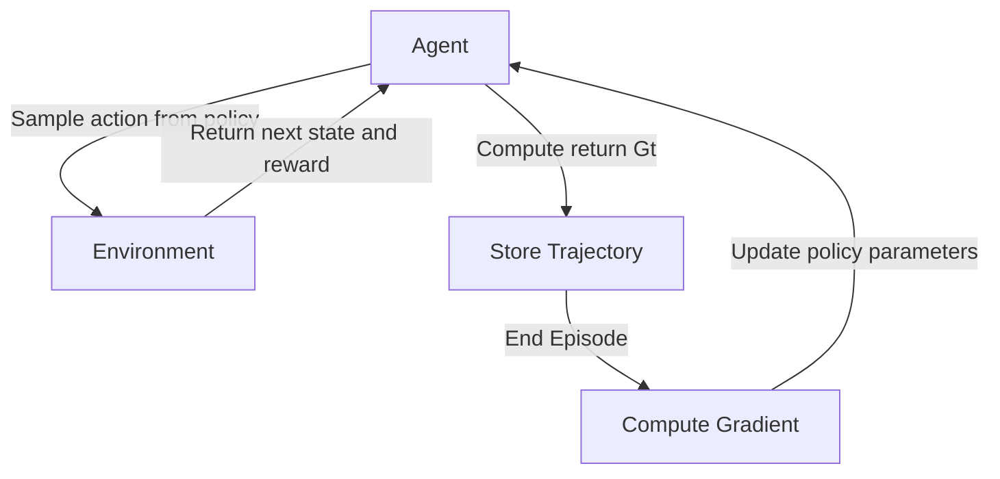
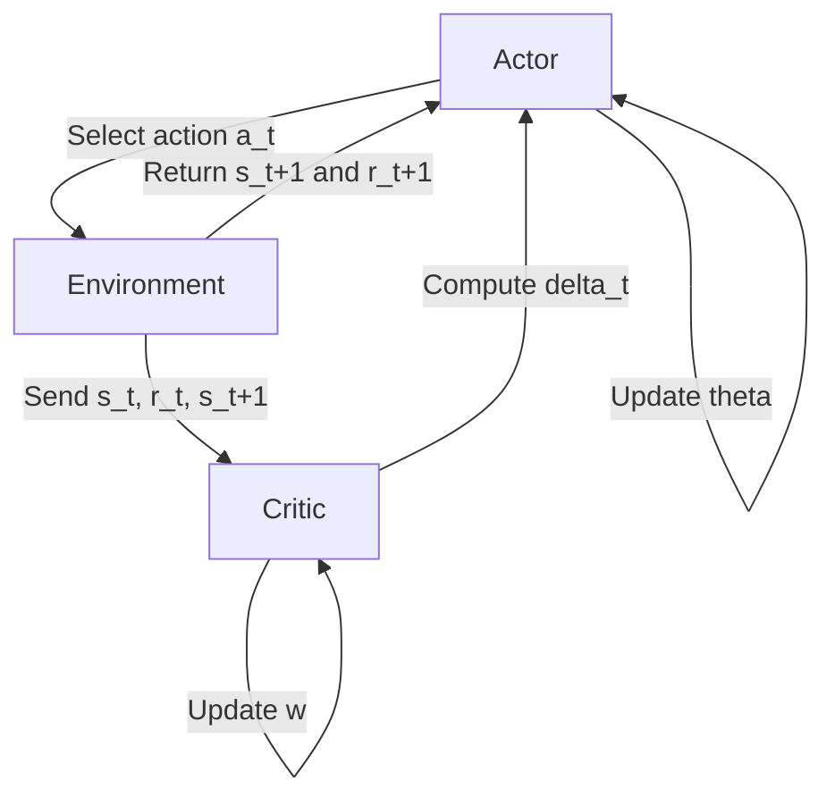

# Policy Approximation in Reinforcement Learning

Policy approximation is a critical technique in reinforcement learning (RL) for handling large or continuous state and action spaces. It involves representing the policy function—mapping states to actions—using parameterized models like neural networks, rather than storing explicit policies for every state. This set of notes covers policy approximation, the Naive REINFORCE algorithm, REINFORCE with baselines, Actor-Critic methods, RL methods combining policy and value learning, and the essential elements of Naive RL, with detailed explanations, examples, and comparisons.

## What Is Policy Approximation?

**Policy approximation** refers to representing an RL agent's policy using a parameterized function, such as a neural network or linear model, instead of explicitly defining actions for every possible state. This is essential for scalability and generalization in complex environments with large or continuous state spaces.

### Background: What Is a Policy?
- A **policy** \( \pi \) defines the agent’s behavior, mapping states to actions:
  - **Deterministic Policy**: \( \pi(s) = a \), where \( a \) is the action taken in state \( s \).
  - **Stochastic Policy**: \( \pi(a|s) = P(a|s) \), the probability of taking action \( a \) in state \( s \).
- **Objective**: Find a policy \( \pi \) that maximizes the expected cumulative reward:

\[
J(\pi) = E_{\pi} \left[ \sum_{t=0}^\infty \gamma^t r_t \right]
\]

  where \( \gamma \in [0, 1) \) is the discount factor, and \( r_t \) is the reward at time \( t \).

### Why Approximate a Policy?
**Scalability**:

   - In real-world problems (e.g., robotics, games, autonomous driving), state spaces are vast or continuous (e.g., \( 10^{10} \) states or \( \mathbb{R}^n \)).
   - Storing a tabular policy (one entry per state) is infeasible due to memory and computation constraints.

**Generalization**:

   - A parameterized policy \( \pi_\theta(s) \) generalizes to unseen states by learning patterns in the state space.
   - Example: In a driving simulator, a neural network policy can handle new road configurations based on learned features.

**Continuous Spaces**:
   - Approximation enables policies for continuous state or action spaces, where tabular methods fail.

**Efficiency**:
   - Parameterized models (e.g., neural networks with thousands of parameters) are compact compared to millions of state-action pairs.

### Types of Policy Approximations

**Parametric Approximation**:
   - Represent the policy as a function \( \pi_\theta(s) \) or \( \pi_\theta(a|s) \) with parameters \( \theta \).
   - Examples:
     - **Linear Model**: \( \pi_\theta(s) = \theta^T \phi(s) \), where \( \phi(s) \) is a feature vector (e.g., state coordinates).
     - **Neural Network (Deep RL)**: \( \pi_\theta(s) = \text{NN}_\theta(s) \), outputting actions or action probabilities.
     - **Radial Basis Functions (RBF)**: Use localized basis functions for smooth approximations.
   - The policy is updated by optimizing \( \theta \) to maximize expected rewards.

 **Non-Parametric Approximation**:
   - Use methods like kernel-based models or decision trees, less common in deep RL.

### Approaches to RL with Policy Approximation
| **Approach**       | **Learns**                          | **Uses Approximation?** | **Example Algorithms**         |
|--------------------|-------------------------------------|-------------------------|--------------------------------|
| **Value-Based**    | Optimal value function \( V^*(s) \) or \( Q^*(s,a) \) | Yes (for \( V \) or \( Q \)) | Q-Learning, DQN               |
| **Policy-Based**   | Optimal policy                      | Yes (for \( \pi \))     | REINFORCE, TRPO, PPO          |
| **Actor-Critic**   | Both policy and value function      | Yes (for both)          | A2C, A3C, DDPG, SAC           |

### How Policy Approximation Works
- **Goal**: Optimize parameters \( \theta \) to maximize the expected return:

\[
J(\theta) = E_{\pi_\theta} \left[ \sum_{t=0}^\infty \gamma^t r_t \right]
\]

- **Methods**:
  1. **Policy Gradient Methods**:
     - Use gradient ascent to update \( \theta \):

\[
\theta \leftarrow \theta + \alpha \nabla_\theta J(\theta)
\]

     - Algorithms: REINFORCE, PPO, TRPO.
  2. **Imitation Learning/Behavior Cloning**:
     - Train \( \pi_\theta(a|s) \) to mimic expert demonstrations using supervised learning.
     - Example: Train a self-driving car policy using human driver data.
  3. **Value-Based Policy Derivation**:
     - Approximate \( Q_\theta(s,a) \), then derive \( \pi(s) = \arg\max_a Q_\theta(s,a) \).
     - Example: DQN uses a neural network for \( Q \).

### Policy Approximation Techniques
| **Technique**            | **Description**                              | **Suitable For**                     |
|--------------------------|----------------------------------------------|--------------------------------------|
| **Linear Models**        | Simple, low-capacity, \( \pi_\theta = \theta^T \phi(s) \) | Simple problems, low-dimensional states |
| **Neural Networks**      | High expressiveness, handles complex patterns | High-dimensional, continuous spaces |
| **Radial Basis Functions** | Local generalization, smooth approximations | Medium-complexity problems          |
| **Decision Trees/Boosting** | Structured, interpretable approximations   | Discrete or structured actions      |

### Trade-Offs
- **Advantages**:
  - Generalizes to unseen states, reducing memory needs.
  - Handles continuous state/action spaces.
  - Compact representation (e.g., \( 10^5 \) parameters vs. \( 10^{10} \) states).
- **Challenges**:
  - **Overfitting/Underfitting**: Poor generalization if the model is too complex or simple.
  - **Training Stability**: Gradient-based optimization can be unstable.
  - **Tuning**: Requires careful selection of architecture, learning rates, and regularization.

!!! note "Key Idea"
    Policy approximation replaces tabular policies with parameterized functions to scale RL to large, continuous, or complex environments.

!!! tip "Mnemonic: Policy Approximation"
    **"APPROX"**: **A**daptable, **P**arameterized **P**olicy **R**epresentation **O**ptimizes **X**pected rewards.

!!! danger "Challenge"
    Poorly designed approximators (e.g., insufficient capacity or noisy gradients) can lead to suboptimal policies or instability.

## Naive REINFORCE Algorithm

The **Naive REINFORCE algorithm** is a policy gradient method that directly optimizes a stochastic policy \( \pi_\theta(a|s) \) by maximizing the expected return using gradient ascent. It is a foundational algorithm in policy-based RL.

### Core Idea
- **Objective**: Maximize \( J(\theta) = E_{\pi_\theta} \left[ \sum_{t=0}^\infty \gamma^t r_t \right] \).
- **Approach**: Sample trajectories under \( \pi_\theta \), compute returns, and update \( \theta \) to increase the likelihood of high-reward actions.
- **Policy Gradient Theorem**: The gradient of the objective is:

\[
\nabla_\theta J(\theta) = E_{\pi_\theta} \left[ \sum_{t=0}^T \nabla_\theta \log \pi_\theta(a_t|s_t) \cdot G_t \right]
\]

where \( G_t = \sum_{k=t}^T \gamma^{k-t} r_k \) is the return from time \( t \).

### Algorithm

**Initialize**: Policy parameters \( \theta \), learning rate \( \alpha \).

**For each episode**:
   - Generate a trajectory: \( s_0, a_0, r_1, s_1, a_1, \dots, s_T \), sampling \( a_t \sim \pi_\theta(a_t|s_t) \).
   - Compute returns: \( G_t = \sum_{k=t}^T \gamma^{k-t} r_k \) for each \( t \).
   - Compute gradient: \( \sum_{t=0}^T \nabla_\theta \log \pi_\theta(a_t|s_t) \cdot G_t \).
   - Update: \( \theta \leftarrow \theta + \alpha \sum_{t=0}^T \nabla_\theta \log \pi_\theta(a_t|s_t) \cdot G_t \).

### Numerical Example
- **Setup**: 2 states (\( s_1, s_2 \)), 2 actions (\( a_1, a_2 \)), policy \( \pi_\theta(a|s) = \text{softmax}(\theta^T \phi(s,a)) \), \( \gamma = 0.9 \), \( \alpha = 0.1 \).
- **Trajectory**: \( s_1, a_1, r_1=1, s_2, a_2, r_2=2, s_1 \).
- **Returns**:
  - \( G_1 = r_1 + \gamma r_2 = 1 + 0.9 \cdot 2 = 2.8 \).
  - \( G_2 = r_2 = 2 \).
- **Gradient**: Assume \( \nabla_\theta \log \pi_\theta(a_1|s_1) = [1, 0] \), \( \nabla_\theta \log \pi_\theta(a_2|s_2) = [0, 1] \).
  - Total gradient: \( [1, 0] \cdot 2.8 + [0, 1] \cdot 2 = [2.8, 2] \).
- **Update**: \( \theta = \theta + 0.1 \cdot [2.8, 2] = \theta + [0.28, 0.2] \).

### Characteristics
- **Model-Free**: No environment model needed.
- **On-Policy**: Learns from trajectories generated by \( \pi_\theta \).
- **Monte Carlo**: Uses full episode returns \( G_t \).
- **High Variance**: \( G_t \) varies across episodes, making updates noisy.
- **No Bias**: Gradient is unbiased but slow to converge.

### Process Flow

!!! note "Policy Gradient Theorem"
    The gradient \( \nabla_\theta J(\theta) \propto E[\nabla_\theta \log \pi_\theta(a_t|s_t) \cdot G_t] \) weights actions by their returns, increasing the probability of high-reward actions.

!!! tip "Mnemonic: Naive REINFORCE"
    **"FORCE"**: **F**ollow **O**ptimal **R**eturns, **C**ompute **E**xpected gradients.

!!! danger "High Variance"
    The reliance on full returns \( G_t \) causes noisy gradients, slowing convergence, especially in long episodes.

## REINFORCE with Baselines

**REINFORCE with Baselines** improves the Naive REINFORCE algorithm by subtracting a baseline from the return to reduce gradient variance, stabilizing learning without introducing bias.

### Core Idea
- **Problem**: In Naive REINFORCE, \( G_t \) varies widely, leading to high-variance gradients.
- **Solution**: Subtract a state-dependent baseline \( b(s_t) \) (e.g., the value function \( V(s_t) \)) from \( G_t \):

\[
\nabla_\theta J(\theta) = E_{\pi_\theta} \left[ \sum_{t=0}^T \nabla_\theta \log \pi_\theta(a_t|s_t) \cdot (G_t - b(s_t)) \right]
\]

- **Effect**: Centers the advantage \( G_t - b(s_t) \), reducing variance while keeping the gradient unbiased.

### Update Rule

\[
\theta \leftarrow \theta + \alpha \sum_{t=0}^T \nabla_\theta \log \pi_\theta(a_t|s_t) \cdot (G_t - b(s_t))
\]

- **Common Baseline**: \( b(s_t) = V(s_t) \), the expected return from state \( s_t \).
- **Learning \( V(s_t) \)**: Use a separate parameterized model \( V_w(s) \), updated via regression:

\[
w \leftarrow w - \beta \cdot \nabla_w (V_w(s_t) - G_t)^2
\]

### Numerical Example
- **Setup**: Same as Naive REINFORCE example, with baseline \( V_w(s_1) = 2 \), \( V_w(s_2) = 1 \).
- **Trajectory**: \( s_1, a_1, r_1=1, s_2, a_2, r_2=2 \).
- **Returns**: \( G_1 = 2.8 \), \( G_2 = 2 \).
- **Advantages**:
  - \( t=1 \): \( G_1 - V_w(s_1) = 2.8 - 2 = 0.8 \).
  - \( t=2 \): \( G_2 - V_w(s_2) = 2 - 1 = 1 \).
- **Gradient**: \( [1, 0] \cdot 0.8 + [0, 1] \cdot 1 = [0.8, 1] \).
- **Update**: \( \theta = \theta + 0.1 \cdot [0.8, 1] = \theta + [0.08, 0.1] \).
- **Critic Update**: For \( s_1 \), minimize \( (V_w(s_1) - 2.8)^2 \), adjust \( w \).

### Benefits
- **Lower Variance**: \( G_t - b(s_t) \) has smaller magnitude than \( G_t \), reducing gradient fluctuations.
- **Unbiased**: The baseline does not affect the expected gradient.
- **Faster Convergence**: Stabilizes learning, especially in noisy environments.

!!! note "Why Baseline Works"
    The baseline \( b(s_t) \) centers the advantage, reducing the magnitude of gradient updates without altering their direction.

!!! tip "Mnemonic: REINFORCE with Baseline"
    **"BASE"**: **B**alance **A**dvantage, **S**tabilize **E**xpectations.

!!! danger "Baseline Choice"
    An inaccurate baseline (e.g., poorly trained \( V_w(s) \)) can increase variance or slow learning.

## REINFORCE with Baselines + Actor-Critic Methods

**Actor-Critic methods** combine policy-based (actor) and value-based (critic) learning, using a learned value function as a baseline to reduce variance and enable online updates. They extend REINFORCE with baselines by integrating temporal-difference (TD) learning.

### Core Idea
- **Actor**: A policy \( \pi_\theta(a|s) \) that selects actions.
- **Critic**: A value function \( V_w(s) \) or \( Q_w(s,a) \) that estimates expected returns, serving as a baseline.
- **Interaction**: The critic evaluates the actor’s actions, guiding policy updates with lower-variance advantages.

### Update Rules
1. **Actor Update** (Policy Optimization):
\[
\theta \leftarrow \theta + \alpha \cdot \nabla_\theta \log \pi_\theta(a_t|s_t) \cdot (G_t - V_w(s_t))
\]

- Or, using TD error for online updates:

\[
\theta \leftarrow \theta + \alpha \cdot \nabla_\theta \log \pi_\theta(a_t|s_t) \cdot \delta_t
\]

where \( \delta_t = r_t + \gamma V_w(s_{t+1}) - V_w(s_t) \) is the TD error.

2. **Critic Update** (Value Learning):

\[
w \leftarrow w - \beta \cdot \nabla_w (V_w(s_t) - (r_t + \gamma V_w(s_{t+1})))^2
\]

   - Minimizes the TD error to improve \( V_w(s) \).

### Numerical Example
- **Setup**: Same trajectory: \( s_1, a_1, r_1=1, s_2, a_2, r_2=2 \). \( \gamma = 0.9 \), \( \alpha = 0.1 \), \( \beta = 0.05 \).
- **Critic**: \( V_w(s_1) = 2 \), \( V_w(s_2) = 1 \), \( V_w(s_3) = 0 \).
- **Step 1**:
  - TD error: \( \delta_1 = r_1 + \gamma V_w(s_2) - V_w(s_1) = 1 + 0.9 \cdot 1 - 2 = 0.9 - 2 = -1.1 \).
  - Actor: \( \nabla_\theta \log \pi_\theta(a_1|s_1) = [1, 0] \), update: \( \theta + 0.1 \cdot [1, 0] \cdot (-1.1) = \theta + [-0.11, 0] \).
  - Critic: Update \( V_w(s_1) \) to minimize \( (V_w(s_1) - (r_1 + \gamma V_w(s_2)))^2 \).
- **Step 2**:
  - TD error: \( \delta_2 = r_2 + \gamma V_w(s_3) - V_w(s_2) = 2 + 0.9 \cdot 0 - 1 = 1 \).
  - Actor: \( \nabla_\theta \log \pi_\theta(a_2|s_2) = [0, 1] \), update: \( \theta + 0.1 \cdot [0, 1] \cdot 1 = \theta + [0, 0.1] \).

### Benefits
- **Online Learning**: TD-based updates allow learning within an episode, unlike Monte Carlo.
- **Lower Variance**: TD error or value-based baseline reduces noise compared to raw returns.
- **Flexibility**: Supports both discrete and continuous action spaces (e.g., DDPG for continuous control).

### Process Flow

!!! note "Actor-Critic Advantage"
    The critic provides a dynamic baseline, enabling faster and more stable learning than REINFORCE.

!!! tip "Mnemonic: Actor-Critic"
    **"ACT"**: **A**ctor **C**hooses, **T**eacher (Critic) evaluates.

!!! danger "Complexity"
    Training two models (actor and critic) requires careful tuning of learning rates and network architectures.

## Which RL Methods Combine Policy and Value Learning?

**Actor-Critic methods** are the primary RL approaches that combine **policy optimization** (learning \( \pi_\theta(a|s) \)) and **value estimation** (learning \( V_w(s) \) or \( Q_w(s,a) \)). Examples include:

- **A2C (Advantage Actor-Critic)**: Uses advantage function \( A(s,a) = Q(s,a) - V(s) \).
- **A3C (Asynchronous A2C)**: Parallelizes learning for efficiency.
- **PPO (Proximal Policy Optimization)**: Stabilizes policy updates with clipped objectives.
- **DDPG (Deep Deterministic Policy Gradient)**: Handles continuous actions.
- **SAC (Soft Actor-Critic)**: Incorporates entropy for exploration.

### Why Combine Both?
- **Policy Learning**: Directly optimizes actions, suitable for continuous or complex spaces.
- **Value Learning**: Provides baselines or TD errors, reducing variance and enabling online updates.
- **Synergy**: The critic guides the actor, improving sample efficiency and stability.

!!! note "Key Feature"
    Actor-Critic methods leverage the strengths of policy-based (direct optimization) and value-based (stable estimation) approaches.

## Essential Elements of Naive Reinforcement Learning

Naive RL, exemplified by the **Naive REINFORCE algorithm**, is characterized by the following elements:

1. **Stochastic Policy \( \pi_\theta(a|s) \)**:
   - Outputs probabilities over actions, enabling exploration.
   - Parameterized (e.g., neural network) for approximation.
2. **Episode-Based Learning (Monte Carlo)**:
   - Collects full trajectories before updating.
   - Uses complete returns \( G_t \), not TD estimates.
3. **Return Estimation**:
   - Computes \( G_t = \sum_{k=t}^T \gamma^{k-t} r_k \) for each timestep.
   - Measures the quality of actions taken.
4. **Gradient Ascent**:
   - Updates \( \theta \) to increase \( J(\theta) \) using:

\[
\theta \leftarrow \theta + \alpha \sum_{t=0}^T \nabla_\theta \log \pi_\theta(a_t|s_t) \cdot G_t
\]

5. **No Baselines or Critics**:
   - Relies on raw returns, leading to high variance.
   - No separate value function to stabilize learning.

### Limitations
- **High Variance**: \( G_t \) fluctuates, slowing convergence.
- **Sample Inefficiency**: Requires full episodes, unsuitable for online learning.
- **Scalability Issues**: Struggles with long horizons or complex environments.

!!! note "Naive RL Simplicity"
    Naive RL is a pure policy-based approach, ideal for understanding policy gradients but impractical for large-scale problems.

## Comparison Table

| **Method**                  | **Learns Policy?** | **Learns Value?** | **Variance** | **Bias** | **Stability** | **Online Learning?** |
|-----------------------------|--------------------|-------------------|--------------|----------|---------------|----------------------|
| **Naive REINFORCE**         | ✅ Yes             | ❌ No              | 🔺 High      | ❌ No     | ❌ Low         | ❌ No                 |
| **REINFORCE + Baseline**    | ✅ Yes             | ✅ Yes (Baseline)  | 🔻 Medium    | ❌ No     | ✅ Medium      | ❌ No                 |
| **Actor-Critic**            | ✅ Yes             | ✅ Yes            | 🔻 Low       | 🔺 Some   | ✅ High        | ✅ Yes                |

## Revision Checklist

- [ ] Explain policy approximation, its necessity, types (parametric, value-based, policy-based), and trade-offs.
- [ ] Describe the Naive REINFORCE algorithm, including the policy gradient theorem, update rule, and a numerical example.
- [ ] Detail REINFORCE with baselines, how it reduces variance, and provide a numerical example.
- [ ] Explain Actor-Critic methods, their actor and critic components, TD-based updates, and a numerical example.
- [ ] Identify RL methods combining policy and value learning (e.g., A2C, PPO, DDPG, SAC).
- [ ] List the essential elements of Naive RL and their limitations.
- [ ] Compare Naive REINFORCE, REINFORCE with baselines, and Actor-Critic in terms of variance, bias, and stability.
- [ ] Understand the process flows for REINFORCE and Actor-Critic using Mermaid diagrams.
- [ ] Memorize mnemonics: APPROX, FORCE, BASE, ACT.