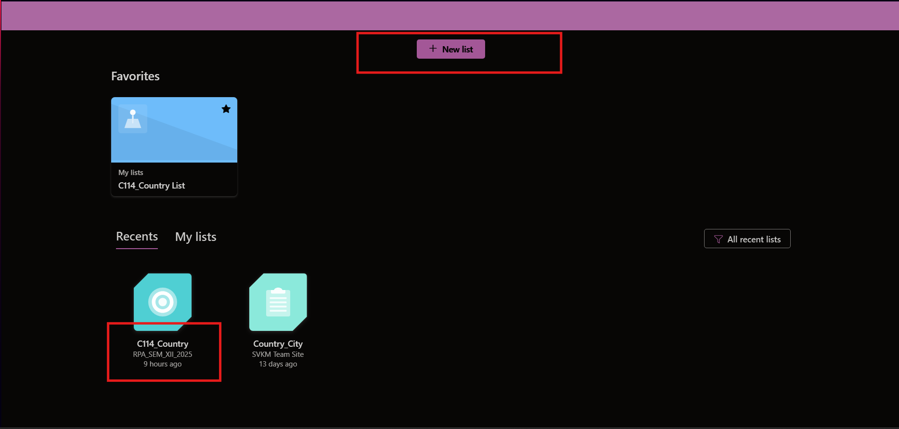
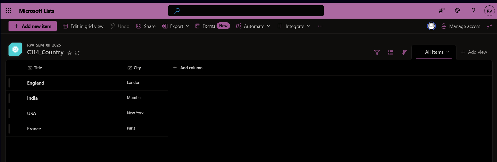
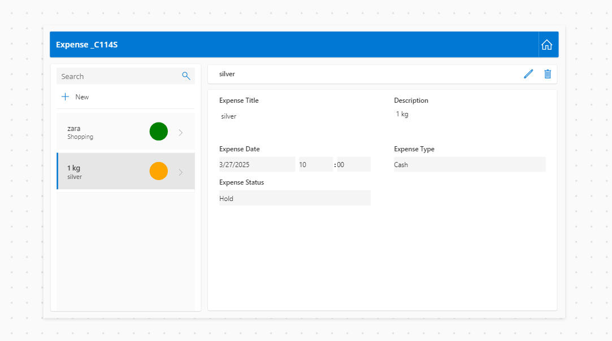

## Create a Power Apps application showcasing login functionality with validation. 


[login-screen-1.txt](txt-files/m2/login-1.txt)  
[login-screen-2.txt](txt-files/m2/login-2.txt)

<div class="bright-line"></div>

## Create a SharePoint List and Implement Cascading Dropdowns in Power Apps  

Create a new list in SharePoint under the team **RPA Sem 12**  

📌 **Code Reference:**  
[cascading-dropdown.txt](txt-files/m2/cascading-dropdown.txt)  

  

The list should look similar to this:  

  

### **Power Apps Configuration**  

1. **Connect the SharePoint List**  
   - Open **Power Apps** → Create a **Canvas App**  
   - Connect to the **"LocationData"** SharePoint list  

2. **Add Cascading Dropdowns**  
   - **Country Dropdown (`ddlCountry`)**  
     ```powerapps
     Distinct(LocationData, Country)
     ```  
   - **City Dropdown (`ddlCity`)**  
     ```powerapps
     Filter(LocationData, Country = ddlCountry.Selected.Result).City
     ```  

3. **Add Personalization (Bottom-Left Corner)**  
   - Add a **Label**  
   - Set `Text` to:  
     ```powerapps
     "Welcome, " & User().FullName
     ```  

<div class="bright-line"></div>

## Create a Canvas app that demonstrates how to use local and global variables.

[local-variable.txt](txt-files/m2/local-variable.txt)


[global-variable.txt](txt-files/m2/global-variable.txt)


[calculator.txt](txt-files/m2/calculator.txt)


<div class="bright-line"></div>

## Create an expense tracker app for Microsoft teams and publish it in the team channel



1. **Set Up Data**  
    - Use **Microsoft Lists, SharePoint, or Dataverse**.  
    - Add columns: **Expense Name, Amount, Category, Date, Status (Hold/Approved/Rejected), Submitted By**.  

2. **Create the App in Power Apps**  
    - Connect to your data source.  
    - Power Apps will auto-generate the form.  

3. **Customize the Form**  
    - Modify fields for better usability.  
    - Use this formula for status color coding:  
      ```PowerApps
      Switch(
          ThisItem.'Expense Status',
          "Hold", Color.Orange,
          "Approved", Color.Green,
          "Rejected", Color.Red
      )
      ```  


[expense-tracker.txt](txt-files/m2/expense-tracker.txt)

<div class="bright-line"></div>

## Search and Filter 

[search.txt](txt-files/m2/search.txt)


[filter.txt](txt-files/m2/filter.txt)